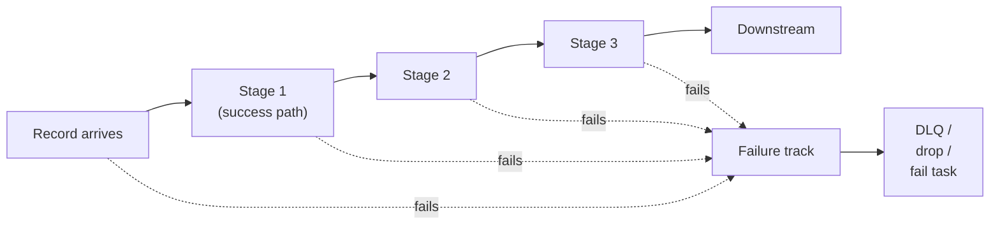
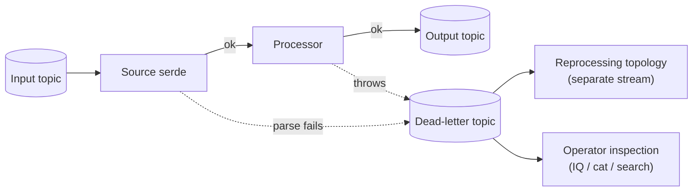

If you've done functional programming you've probably hit
**railway-oriented programming** (ROP) — Scott Wlaschin's
[two-track metaphor](https://fsharpforfunandprofit.com/rop/) for
pipelines of fallible operations. A function takes a value, does
its work, and routes the result onto either the **success track**
or the **failure track**. Adjacent functions compose so the
failure track flows around them; only success values reach the
next operation.

Kafka Streams isn't *labelled* ROP, but it's structurally a
near-perfect fit. This page maps the metaphor onto the library
and shows where every failure-handling surface in the API is a
"track switch" you can think of as a ROP combinator.

:::tip[Unfamiliar terms?]
Kafka, Streams, and Riffle terminology is defined in the [Glossary](../glossary/).
:::

:::note[TL;DR]
- A streams topology *is* a two-track pipeline: success records flow downstream; failed records flow into the dead-letter or fail-task track.
- Track switches sit at four surfaces: source deserialisation, processor exceptions, sink production, and async-I/O / 2PC outcomes.
- The `Kafka.Streams.Pipeline` newtype has an `ArrowChoice` instance — the `(|||)` and `(+++)` operators are textbook ROP combinators over `Either`.
- The Riffle async-I/O `AsyncFailurePolicy` and `TwoPhaseSink` `SinkOutcome` types are both ROP-shaped: explicit `OK / Retryable / Fatal` results.
- The DLQ pattern (KIP-1033) is the "failure track materialised as a Kafka topic" — a second stream you can process independently.
:::

## The metaphor in 30 seconds



ROP's rules:

- **Two tracks.** Every operation either advances the value on the
  success track or routes it to the failure track.
- **Failure is sticky.** Once a value is on the failure track, no
  subsequent operation runs on it; it flows straight to the end.
- **Composition is free.** You write each stage as
  `a -> Either e b`. The framework wires up the bypass.

The mathematical version is `Either e a` (or any monad with a
short-circuiting bind). The Kafka Streams version is the same
shape, with one wrinkle: the framework owns the dispatcher, so
your *operators* stay focused on the success path.

## Where the track switches live

A streams topology has four explicit switch points where a value
can be diverted off the success track. The first three are
classic JVM-Kafka-Streams surfaces; the fourth is Riffle.

| Switch | Type | When it fires |
| ------ | ---- | ------------- |
| **Deserialisation handler** | `DeserializationHandler` | Source-side serde fails to parse a record |
| **Processing exception handler** | `ProcessingExceptionHandler` (KIP-1033) | A `Processor` throws |
| **Production handler** | `ProductionHandler` | The producer fails to publish a sink record |
| **Async-I/O failure policy** | `AsyncFailurePolicy` | An async-I/O user `IO` action throws or times out |
| **2PC sink outcome** | `SinkOutcome` | A two-phase-commit sink reports prepare/commit/abort status |

Every one of these is a *user-supplied callback* that decides
what to do: continue (skip the bad record), fail-fast (kill the
task), or route somewhere (DLQ, custom callback). Each is one of
ROP's "junction switches" lifted from the type level to the
config level.

### The 30-second handler vocabulary

```haskell
-- Deserialisation (source side)
data DeserializationResponse = DeserContinueProcessing | DeserFailFast
newtype DeserializationHandler =
  DeserializationHandler (DeserializationException -> IO DeserializationResponse)

-- Processing (per-record processor exceptions, KIP-1033)
data ProcessingResponse = ProcessingContinue | ProcessingFail
newtype ProcessingExceptionHandler =
  ProcessingExceptionHandler (ProcessingException -> IO ProcessingResponse)

-- Production (sink side)
data ProductionResponse = ProdContinueProcessing | ProdFailFast
newtype ProductionHandler =
  ProductionHandler (ProductionException -> IO ProductionResponse)
```

Three handlers, three trichotomies (`Exception, Continue, Fail`),
all identical in shape. That's the ROP signature.

The shipped helpers are `logAndContinue` / `logAndFail` /
`logAndContinueProduction` / `logAndFailProduction` /
`logAndContinueProcessing` / `logAndFailProcessing`. Each one
just picks an arm; for anything fancier (e.g., DLQ routing) you
write your own that uses the input exception to decide.

## The Riffle additions are explicit two-track types

Where parity Streams gives you two-arm continuations, Riffle adds
**three-arm** result types that mirror ROP literature more
directly.

### Async I/O

```haskell
data AsyncFailurePolicy
  = FailTask                              -- failure track → fail task
  | DropAndContinue                       -- failure track → drop
  | LogAndContinue                        -- failure track → log + drop
  | CustomFailure (SomeException -> IO ()) -- failure track → your handler
```

Each enum arm is a route off the success track. `FailTask`
propagates the exception to the engine's uncaught handler;
`DropAndContinue` quietly absorbs it; `LogAndContinue` logs it
first; `CustomFailure` lets you do anything — typically write to
a DLQ topic via a side `produce` call.

### Two-phase commit sinks

```haskell
data SinkOutcome
  = SinkOK                          -- success track
  | SinkRetryable Text              -- transient: failure track, but
                                    -- the commit cycle aborts and retries
  | SinkFatal Text                  -- permanent: failure track,
                                    -- promoted to CommitFatal
```

This is ROP done right. The sink reports its outcome on every
operation (`tpsPrepare`, `tpsCommit`, `tpsAbort`); the runtime
walks the appropriate path based on the variant. `SinkRetryable`
is the railway switch that loops the train back; `SinkFatal` is
the one that derails it.

## The DLQ pattern: failure track as a topic

The classic ROP picture stops at "route to failure handler." In
Kafka Streams the failure track can itself be a **Kafka topic**
you write to, materialising the failure stream as first-class data.



Once you treat the DLQ as just another Kafka topic, the failure
track gets all the same superpowers as the success track:

- **Persistence and replay.** Bad records aren't dropped on the
  floor; they wait until you fix the bug and reprocess them.
- **Independent throughput.** A flood of bad records does not
  block the success topology.
- **Inspection.** You can `kafka-console-consumer` the DLQ to
  see exactly what failed and why.
- **Reprocessing topology.** Another streams app can consume the
  DLQ, apply a fix, and re-publish to the original input.

The KIP-1033 `ProcessingExceptionHandler` is the canonical hook
for this: build a handler that wraps a producer and writes the
failing record + the exception to a DLQ topic, then returns
`ProcessingContinue`. Same shape for `DeserializationHandler` and
`ProductionHandler`.

## The Pipeline newtype is a textbook ROP arrow

`Kafka.Streams.Pipeline` exposes a `Pipeline a b` newtype with
`Category`, `Arrow`, and — critically — **`ArrowChoice`**
instances:

```haskell
newtype Pipeline a b = Pipeline { runPipeline :: a -> IO b }

instance ArrowChoice Pipeline where
  -- Apply on the left branch only
  left  :: Pipeline a b -> Pipeline (Either a c) (Either b c)

  -- Apply on the right branch only
  right :: Pipeline a b -> Pipeline (Either c a) (Either c b)

  -- Parallel: two pipelines on the two arms
  (+++) :: Pipeline a b -> Pipeline c d -> Pipeline (Either a c) (Either b d)

  -- Merge: two pipelines whose outputs land on the same track
  (|||) :: Pipeline a c -> Pipeline b c -> Pipeline (Either a b) c
```

The last two are *literally* the ROP `>>` (apply-on-success) and
"merge tracks back together" combinators. If you've written F#
ROP, the equivalence is exact.

A pipeline that does ROP in the shape Scott Wlaschin would
recognise:

```haskell
import Control.Arrow (arr, (>>>), (|||))
import Kafka.Streams.Pipeline

-- A stage that may fail. Either Text a is the two-track value.
parseOrder :: Pipeline RawRecord (Either Text Order)
parseOrder = arr parseRaw   -- pure function lifted into Pipeline

-- Two downstream branches: one for valid orders, one for errors.
processValid :: Pipeline Order EnrichedOrder
processValid = pmapValues enrich >>> pmapValues authorise

handleError :: Pipeline Text EnrichedOrder
handleError = pmapValues toDLQRecord

-- Wire them together with ArrowChoice.
fullPipeline :: Pipeline RawRecord EnrichedOrder
fullPipeline =
  parseOrder
    >>> (handleError ||| processValid)
```

The `(|||)` merges the two tracks back into a single output
stream. Replace `handleError` with `psink "dlq" ...` and you have
the DLQ pattern in three lines.

## Stage-level ROP inside a single processor

Sometimes you want ROP *inside* a single operator — multiple
validation steps that can each fail, with the failure short-
circuiting cleanly. `Either` (or `Validation` for accumulating
errors) inside a `mapValues` is the idiomatic way:

```haskell
import qualified Data.Text as T

validateOrder :: Order -> Either Text Order
validateOrder o = do
  o1 <- checkCustomer o
  o2 <- checkInventory o1
  o3 <- checkPaymentMethod o2
  pure o3
  where
    checkCustomer  o = if customerId o == "" then Left "missing customer" else Right o
    checkInventory o = if quantity o <= 0     then Left "bad quantity"     else Right o
    checkPaymentMethod o = case payment o of
      Just _  -> Right o
      Nothing -> Left "no payment method"

-- And then in the topology:
F.source "orders" textSerde orderSerde
  >>> F.mapValues validateOrder         -- KStream k (Either Text Order)
  >>> F.split                            -- branch: lefts to DLQ, rights downstream
        [ \r -> isLeft  (recordValue r)
        , \r -> isRight (recordValue r)
        ]
```

`Data.Either` short-circuits inside `do`-notation — that's the
"failure track is sticky" rule from the metaphor.

For **accumulating** errors (a record might fail multiple
validations and you want all the reasons, not just the first),
swap `Either` for `Validation` from `validation` /
`validation-selective`. The wire shape stays the same.

## Compose your handlers, don't pick the default

The shipped `logAndContinue` and friends are fine for quick
prototypes. For production, write a handler that does the ROP
*explicitly*:

```haskell
import qualified Kafka.Client.Producer as P
import Kafka.Streams.Errors

dlqProcessingHandler
  :: P.Producer            -- a producer wired to your DLQ topic
  -> Text                  -- DLQ topic name
  -> ProcessingExceptionHandler
dlqProcessingHandler producer dlq = ProcessingExceptionHandler $ \pe -> do
  -- Track switch: route this record to the failure track.
  let envelope = encodeDLQEnvelope pe   -- topic, partition, offset, reason
  P.send producer (P.record (topicName dlq) Nothing envelope)
  -- Continue running on the success track.
  pure ProcessingContinue
```

That's the **entire** ROP implementation, in a Streams app: one
handler per surface, each one a single `if/else` that decides
where the value goes next. The library's job is to call the
handlers at the right point.

## Why this lens helps

Three concrete payoffs of thinking in ROP terms while you write
Kafka Streams code:

1. **You stop conflating "exception thrown" with "task dies."**
   In parity Streams, an unhandled exception in a processor
   *does* kill the task. Once you set up a `ProcessingExceptionHandler`
   that routes to a DLQ, you're explicitly declaring "this is a
   data-quality error, not a code error — keep going." That
   distinction is much harder to make if you're thinking
   imperatively about try/catch.
2. **You stop using `mapValues` for fallible work.** A pure
   `mapValues` has no failure track. The moment you have
   `mapValues f` where `f` might throw, you've smuggled the
   failure into the engine's exception path. Make it
   `mapValues (toEither . f)` and route the `Either` explicitly,
   or use `mapValuesM` if you genuinely need `IO` (and then
   accept that the handler will fire).
3. **You design your DLQ envelope up front.** ROP says "a value
   on the failure track is just as much a value as one on the
   success track." That means your DLQ records deserve schema,
   keys, and timestamps the same as your output topic. Plan for
   the reprocessing topology when you design the DLQ envelope.

## Related reading

- [Enrichment via external systems](../guides/enrichment/) — async
  I/O's failure policies in operator-facing terms; the
  `idempotency-token` pattern from the
  [enrichment](../guides/enrichment/#pattern-6-idempotency-tokens-in-a-state-store)
  page is itself a railway-style retry safeguard.
- [Exactly-once across Kafka and other systems](../operating/exactly-once/) —
  the `TwoPhaseSink` `SinkOutcome` trichotomy and the commit-cycle
  failure flowchart are the most explicit ROP surface in the
  library.
- [Visibility versus ACID databases](../operating/visibility/) —
  the replay-on-failure section explains why idempotency
  matters: replay is the failure-track "loop back" arrow in the
  ROP picture.
- The original [F# ROP article by Scott Wlaschin](https://fsharpforfunandprofit.com/rop/)
  if you want the canonical write-up of the pattern.
