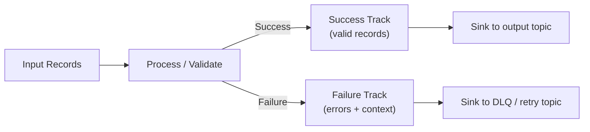

**Why this pattern matters:** Stream processing involves continuous data flow where individual records can fail for many reasons (bad format, missing lookup key, validation errors). Without a systematic approach to handling these failures, you either silently drop data (bad) or crash your entire pipeline on every error (also bad). Railway-oriented programming gives you a structured way to handle failures without losing either records or your sanity.

## The core idea

Imagine a railway track that splits into two parallel lines: one for successfully processed records, one for failures. Your topology can switch records between these tracks based on validation results, then handle each track appropriately at the end.



**The key insight:** Don't handle errors where they occur. Route them to a separate track and decide what to do with them at a well-defined boundary (typically the commit cycle or the sink).

## When you need this pattern

**Use railway-oriented programming when:**
- Individual records can fail validation but the stream must continue
- You need to route failures to a dead-letter queue for later inspection
- You want to track failure rates separately from success rates
- Some failures are retryable (transient) while others are permanent (poison pills)
- You need to preserve the original record context for debugging failures

**Don't use it when:**
- Any failure is truly catastrophic (use fail-fast instead)
- You can fix errors inline without losing semantics
- The processing is inherently all-or-nothing

## The three components

A railway-oriented pipeline has three parts: splitting, routing, and reconciling.

### 1. Splitting: Create the two-track structure

Use `Either` or a custom result type to represent success/failure:

```haskell
-- A validation result that carries success or error details
data ValidationResult a = Valid a | Invalid Text RecordContext

-- RecordContext preserves the original record for debugging
data RecordContext = RecordContext
  { rcKey       :: Maybe ByteString
  , rcValue     :: ByteString
  , rcTopic     :: TopicName
  , rcPartition :: Partition
  , rcOffset    :: Offset
  }
```

**Why preserve context:** When a record fails processing six months from now, you need to know exactly what input caused the failure. The original key, value, and position are essential for debugging.

### 2. Routing: Process each track separately

Transform your topology to handle both tracks:

```haskell
-- Start with a KStream of raw records
rawStream :: KStream k ByteString

-- Parse and validate, creating the split
validated :: KStream k (ValidationResult ParsedRecord)
validated = rawStream |>> mapValues parseAndValidate

-- Split into two streams using flatMap
okRecords :: KStream k ParsedRecord
okRecords = validated |>> flatMap (\case
  Valid r -> [r]
  Invalid _ _ -> []
  )

errorRecords :: KStream k (Text, RecordContext)
errorRecords = validated |>> flatMap (\case
  Valid _ -> []
  Invalid err ctx -> [(err, ctx)]
  )
```

**Why flatMap for splitting:** Kafka Streams doesn't have a native "split" operation. `flatMap` with pattern matching lets you route records to zero or one output tracks based on your result type.

### 3. Reconciling: Handle each track at sinks

Send success records to your main output and failures to a dead-letter queue:

```haskell
-- Success track: process normally and sink
okPipeline :: KStream k ProcessedRecord
okPipeline = okRecords |>> mapValues process |>> sink "output" serde serde

-- Failure track: enrich with metadata and sink to DLQ
errorPipeline :: KStream k (Text, RecordContext)
errorPipeline = errorRecords
  |>> mapValues enrichWithProcessingMetadata
  |>> sink "errors-dlq" errorSerde errorSerde
```

**Why separate DLQ topics:** Errors need different handling than success records. They may need manual review, automated retry, or special retention policies. A separate topic lets you apply different processing logic without complicating your main pipeline.

## Practical example: Enrichment with validation

A common use case: enriching records from an external API, where some lookups fail:

```haskell
-- Input: user events with IDs to enrich
events :: KStream UserId Event
events = source "user-events" userIdSerde eventSerde

-- Enrich, tracking failures
enriched :: KStream UserId (Either EnrichmentError EnrichedEvent)
enriched = events |>> mapValuesM (\event -> do
  result <- lookupUserProfile (eventUserId event)
  case result of
    Just profile -> Right (mergeEventWithProfile event profile)
    Nothing -> Left (UserNotFound (eventUserId event) event)
  )

-- Split the results
okEvents :: KStream UserId EnrichedEvent
okEvents = enriched |>> flatMap (\case
  Right e -> [e]
  Left _ -> []
  )

errorEvents :: KStream UserId EnrichmentError
errorEvents = enriched |>> flatMap (\case
  Right _ -> []
  Left err -> [err]
  )

-- Route each track
okPipeline :: Topology Void ()
okPipeline = okEvents |>> sink "enriched-events" serde serde

errorPipeline :: Topology Void ()
errorPipeline = errorEvents
  |>> mapValues serializeError
  |>> sink "enrichment-failures" serde serde
```

**What this buys you:** Your main pipeline continues processing even when enrichment fails for some records. Failed enrichments go to a separate topic where you can retry them later, investigate the missing data, or adjust your processing logic.

## Error classification: Retryable vs permanent

Not all errors are equal. Classify them to handle each type appropriately:

```haskell
data ProcessingError
  = RetryableError Text RecordContext  -- Transient: network blip, timeout
  | PermanentError Text RecordContext  -- Poison pill: bad format, invariant violation
  deriving (Eq, Show)

-- Check if an error is retryable
isRetryable :: ProcessingError -> Bool
isRetryable (RetryableError _ _) = True
isRetryable (PermanentError _ _) = False

-- Route based on error type
routeByErrorType :: KStream k ProcessingError -> (KStream k ProcessingError, KStream k ProcessingError)
routeByErrorType errors =
  let retryable = errors |>> filter isRetryable
      permanent = errors |>> filter (not . isRetryable)
  in (retryable, permanent)
```

**Why classify:** Retryable errors might succeed on a second attempt. Permanent errors will fail forever and need manual intervention or schema fixes. Treating them differently prevents infinite retry loops and alert fatigue.

## Integration with exactly-once semantics

Under EOS, both tracks must participate in the same transaction:

```haskell
-- Both sinks use the same transactional producer
-- If either fails, the entire commit aborts
-- This prevents partial writes (some to output, some to DLQ missing)

combinedPipeline :: Topology Void ()
combinedPipeline =
  mergeStreams
    (okEvents |>> sink "output" serde serde)
    (errorEvents |>> sink "dlq" serde serde)
```

**Why atomicity matters:** Without transactional guarantees, a failure between the two sinks could send a record to the output topic without its corresponding error going to the DLQ (or vice versa). You'd have inconsistent state that's hard to reconcile.

## Metrics and monitoring

Track the health of both tracks:

```haskell
-- Instrument your split operation
validated |>> mapValues (\result ->
  case result of
    Valid _ -> recordMetric "validation.ok"
    Invalid err _ -> recordMetric ("validation.error." <> errorType err)
  result  -- Pass through unchanged
  )
```

**Key metrics to watch:**
- **Error rate:** What percentage of records fail? Sudden spikes indicate upstream changes or downstream outages.
- **Error type distribution:** Are errors mostly transient (network) or permanent (validation)? This drives whether you need retry logic or schema fixes.
- **DLQ depth:** How many errors are pending? Growing DLQ without draining suggests a systematic problem.

## Common patterns and variations

### Pattern: Retry with backoff

```haskell
-- Route retryable errors to a retry topic with delay
retryableErrors :: KStream k ProcessingError
retryableErrors = errors |>> filter isRetryable

-- Use a punctuator or separate consumer to reprocess with exponential backoff
retryPipeline :: Topology Void ()
retryPipeline =
  source "retry-topic" serde serde
  |>> flatMapValues attemptRetry  -- Returns [] if max retries exceeded
  |>> sink "output" serde serde
```

### Pattern: Circuit breaker

When error rates spike, fail fast to protect downstream systems:

```haskell
-- Track recent error rate in a state store
circuitBreaker :: KStream k (ValidationResult a) -> KStream k (ValidationResult a)
circuitBreaker input =
  input |>> transform (\result -> do
    currentRate <- getErrorRate
    if currentRate > 0.5  -- 50% error threshold
    then return (Invalid "Circuit breaker open" (extractContext result))
    else do
      updateErrorRate result
      return result
    )
```

### Pattern: Enrichment with fallback

Try primary enrichment, fall back to secondary if it fails:

```haskell
enrichWithFallback :: Event -> IO (Either Error EnrichedEvent)
enrichWithFallback event = do
  primary <- lookupPrimary (eventId event)
  case primary of
    Right enriched -> return (Right enriched)
    Left _ -> lookupSecondary (eventId event)  -- Fallback source
```

## Testing railway-oriented pipelines

Test both tracks explicitly:

```haskell
-- Test success track
prop_okRecordsFlow :: Property
prop_okRecordsFlow = property $ do
  validInput <- forAll genValidRecord
  let result = runTopology okPipeline [validInput]
  assert (length result == 1)
  assert (isInOutputTopic (head result))

-- Test failure track
prop_errorRecordsRouted :: Property
prop_errorRecordsRouted = property $ do
  invalidInput <- forAll genInvalidRecord
  let result = runTopology combinedPipeline [invalidInput]
  assert (null outputTopic)  -- Nothing in main output
  assert (length dlq == 1)   -- Error in DLQ
  assert (errorContext (head dlq) == originalContext invalidInput)
```

**Why test both tracks:** It's easy to accidentally drop records on the error track (by returning `[]` in the wrong place). Explicit tests verify the routing logic works correctly.

## When to stop using this pattern

Railway-oriented programming adds complexity. Consider simplifying when:

- Error rates drop below 0.1% and are all permanent (fix the data source instead)
- The DLQ grows faster than you can drain it (the pattern isn't solving the underlying problem)
- You find yourself building a full retry framework (consider a dedicated stream processing library for complex retry logic)

## Related concepts

- [Exactly-once semantics](../operating/exactly-once/): How the commit cycle keeps both tracks atomic
- [Observability](../operating/observability/): Metrics for tracking both tracks
- [Enrichment via external systems](../guides/enrichment/): A common use case for railway-oriented error handling
