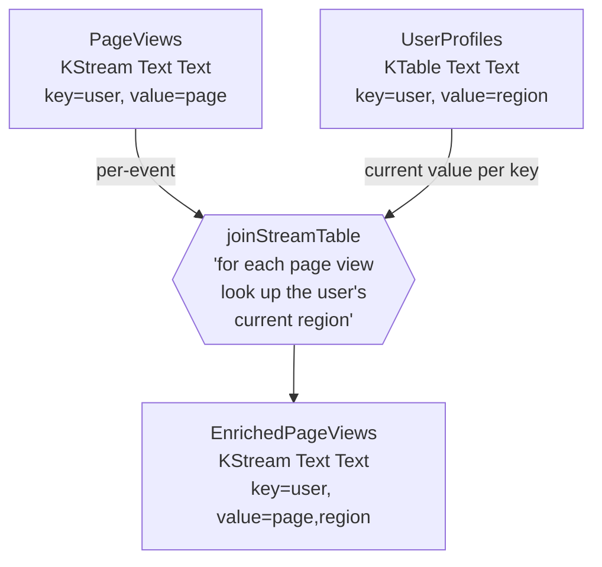

So far each tutorial has had one input stream. Real streaming
pipelines combine multiple. You'll often hear "I have an event,
and I need to enrich it with metadata that lives somewhere else."

That's a **join**. In this part you'll join a stream of page
views against a table of user profiles, so each enriched view
carries the user's region alongside the page they hit.

## What you'll learn

- The five join shapes Kafka Streams gives you.
- When to use each.
- The one rule both sides must obey (co-partitioning).
- How to handle "user appears before profile" race conditions.

## Build it

```haskell
{-# LANGUAGE OverloadedStrings #-}
module Kafka.Streams.Examples.MyPageViews (runDemo) where

import Control.Category ((>>>))
import qualified Data.ByteString.Char8 as BSC
import qualified Data.Text as T
import Data.Text (Text)
import Data.Void (Void)

import Kafka.Streams
import qualified Kafka.Streams.Topology as Topo
import qualified Kafka.Streams.Topology.Free as F

-- Topology Void (): reads from sources, writes to sinks. Self-contained pipeline.
-- Note: views and users below have different output types (not Void/()), showing intermediate topologies.
enrichedViewsTopology :: F.Topology Void ()
enrichedViewsTopology =
  F.joinStreamTable
      views                                  -- left: KStream
      users                                  -- right: KTable
      (\page region -> page <> "," <> region)
      (joined textSerde textSerde textSerde)
    >>> F.sink "EnrichedPageViews" textSerde textSerde
  where
    -- Topology Void (KStream Text Text): reads from source, produces a KStream.
    -- The KStream becomes input to joinStreamTable.
    views :: F.Topology Void (KStream Text Text)
    views = F.source "PageViews" textSerde textSerde

    -- Topology Void (KTable Text Text): reads from source, produces a KTable.
    -- The KTable becomes the lookup table for the join.
    users :: F.Topology Void (KTable Text Text)
    users = F.tableSource "UserProfiles" textSerde textSerde

runDemo :: IO ()
runDemo = do
  topo   <- F.buildTopologyFrom enrichedViewsTopology
  driver <- newDriver topo "page-views-app"

  -- Populate the user table first
  let user u r =
        pipeInput driver (topicName "UserProfiles")
          (Just (BSC.pack (T.unpack u)))
          (BSC.pack (T.unpack r))
          (Timestamp 0) 0
  user "alice" "us-east"
  user "bob"   "eu-west"
  user "carol" "ap-south"

  -- Send page views
  let view u page ts =
        pipeInput driver (topicName "PageViews")
          (Just (BSC.pack (T.unpack u)))
          (BSC.pack (T.unpack page))
          (Timestamp ts) 0
  view "alice" "/home"     1
  view "bob"   "/products" 2
  view "carol" "/checkout" 3
  view "dave"  "/home"     4  -- not in user table

  out <- readOutput driver (topicName "EnrichedPageViews")
  mapM_ (\cr ->
    putStrLn ((maybe "?" BSC.unpack (crKey cr))
              <> " -> " <> BSC.unpack (crValue cr))
    ) out
  closeDriver driver
```

Run it:

```
ghci> runDemo
alice -> /home,us-east
bob   -> /products,eu-west
carol -> /checkout,ap-south
```

Three records out, not four. `dave` doesn't appear in the
`UserProfiles` table, so the inner join drops his view.

## What's happening

Both sides feed into one operator:



The KStream side is "every page view as it happens". The KTable
side is "the latest known region for each user". The join asks,
**at the moment a view arrives**, what's the current value in the
table for that key.

## The five join shapes

Kafka Streams gives you five joins. You'll reach for the first
three most often:

| Shape | When |
| ----- | ---- |
| **Stream-Table** | "Enrich each event with current context." Your most common case. |
| **Stream-Stream** (windowed) | "Match an event on one stream to an event on another stream within X minutes." Trading, fraud, sessionisation. |
| **Table-Table** | "Two tables: for each pair of keys present in both, produce a derived value." Slowly-changing data combined into a denormalised view. |
| **Stream-GlobalKTable** | Same as stream-table but the table is replicated to every instance. Use for small reference data (currency rates, country lookups). |
| **Foreign-key Table-Table** | Join two tables by a key derived from the left's value, not the left's key. The library handles the subscription-token bookkeeping. |

Each has a Haskell function with a predictable name:

| | Inner | Left | Outer |
| --- | ----- | ---- | ----- |
| Stream-Stream | `joinKStreamKStream` | `leftJoinKStreamKStream` | `outerJoinKStreamKStream` |
| Stream-Table | `joinKStreamKTable` / `joinStreamTable` | `leftJoinKStreamKTable` | n/a |
| Table-Table | `joinKTableKTable` | `leftJoinKTableKTable` | `outerJoinKTableKTable` |
| Stream-Global | `joinKStreamGlobalKTable` | `leftJoinKStreamGlobalKTable` | n/a |
| Foreign-key | `foreignKeyJoinKTable` | `leftForeignKeyJoinKTable` | n/a |

The example above used `joinStreamTable`, the Free DSL helper for
stream-table joins. The imperative builder uses
`joinKStreamKTable`; the Free helpers re-skin the names for the
arrow-style composition.

## The one rule you can't break: co-partitioning

For any join other than `Global` and `ForeignKey`, **both sides
must be co-partitioned**:

- Same partition count.
- Same key partitioner.

The reason: each task owns one partition of each input. If `alice`
on the views side lands on partition 3 but `alice` on the users
side lands on partition 7, the task that holds the views will
never see the user record.

The library validates this at startup. A mismatch throws a topology
validation error before the runtime starts; you'll see something
like `CoPartitioningRequired { left = "PageViews", right =
"UserProfiles" }`.

How to satisfy it:

1. **Provision both topics with the same partition count up front.**
   The simplest fix.
2. **Repartition one side** to match the other. Use `repartition` or
   `through` to publish to an internal topic with the right partition
   count.
3. **Use `globalTable`** if the right side is small. A GlobalKTable
   replicates to every instance, so co-partitioning is irrelevant.

GlobalKTables are the easy way out for small reference data. If
your `UserProfiles` table is, say, 50k rows total, just use
`globalTable` and stop worrying about partitioning.

## Race conditions

Notice the demo populates `UserProfiles` *before* sending page
views. That's deliberate. The order matters.

Three scenarios for "view for alice arrives before alice's profile":

| Scenario | What you get |
| -------- | ------------ |
| Profile arrives first (our demo) | Inner join produces enriched record |
| View arrives first, profile never arrives | Inner join silently drops the view |
| View arrives first, profile arrives later | The earlier view is still dropped; subsequent views are enriched |

The last one is the surprise: **a stream-table join only sees the
table value at the time the stream record arrives**. It doesn't
"go back" and emit the missing record when the profile shows up.

Your options:

- **Use a `leftJoin`** to emit a `Nothing` for the right side when
  the table is empty. Downstream code decides what to do.
- **Sequence the producers** so profiles arrive before views.
  Works if you control both upstream.
- **Buffer the view**, look up the profile, retry if missing. Use
  the [Processor API](../../glossary/#processor-api) to keep a
  small "pending views" store keyed by user.

`leftJoin` is the standard answer:

```haskell
F.leftJoinKStreamKTable views users
  (\page mRegion -> page <> "," <> maybe "<unknown>" id mRegion)
```

Now `dave`'s view comes out as `/home,<unknown>` instead of being
dropped. You can decide downstream whether to drop, alert, or
backfill.

## Tables from streams and back again

A useful pattern: take a stream of events, build a KTable from it,
then join against it from elsewhere in the same topology.

```haskell
currentUserRegion :: F.Topology Void (KTable Text Text)
currentUserRegion =
  F.source "UserProfileChanges" textSerde textSerde
    >>> F.toTable userTableMat
  where
    userTableMat :: Materialized Text Text
    userTableMat =
      Mat.withValueSerde textSerde
        $ Mat.withKeySerde textSerde
        $ Mat.materializedAs (storeName "user-region")
```

`toTable` converts a `KStream` into a `KTable` by latest-write-wins
per key. The same idea works for any aggregation: `count`,
`aggregate`, `reduce` all produce `KTable`s you can join against.

## Why this matters

Joins are where streams stop being "fancy logs" and become a real
data-processing system. With joins you can:

- **Enrich** events with reference data (page views + user info).
- **Correlate** events across streams (orders + payments).
- **Detect** patterns (fraud: failed login on stream A, success on
  stream B within 30 seconds).
- **Aggregate** across denormalised tables (per-order total =
  order × line-items via foreign-key join).

The DSL operator is one line. The hard part is the
co-partitioning discipline and the race-condition handling.

## What you learned

- Five join shapes; pick by combining left/right "is-it-a-stream"
  and inner/left/outer.
- Stream-table joins enrich events with current state.
- Co-partitioning is the rule: same partition count and
  partitioner, both sides. The library validates at startup.
- Inner joins drop unmatched records; left joins emit `Nothing` so
  you can decide downstream.
- `globalTable` is the easy escape hatch for small reference data.

## Next up

You've now seen the three things Kafka Streams is good for:
moving records, computing per-key state, and combining streams.
The last part of the tutorial bridges to operations: what you
need to think about to run this in production.

[Continue to Tutorial 5: Going to production →](../going-to-production/)
