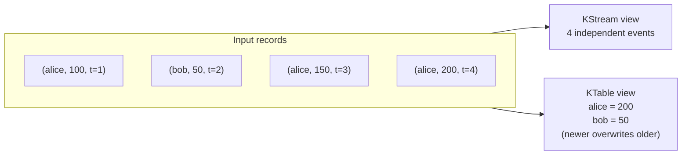
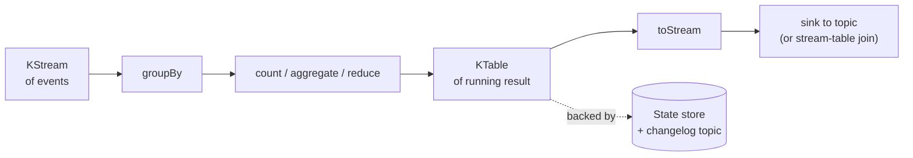

A pipe is fine, but the interesting thing about streams is what
you can compute *across* records. In this part you'll build a
running word count: every time a word arrives, the count for
that word goes up. The total per word lives in a **state store**
that survives restarts and rebalances.

## What you'll learn

- What a state store actually is.
- What a `KTable` is and how it relates to a `KStream`.
- Why you need to `groupBy` before you can count.
- How to look at the store from outside the topology.

## Build it

Drop this into a new file or paste it into the same one from
[Tutorial 2](../your-first-topology/):

```haskell
{-# LANGUAGE OverloadedStrings #-}
{-# LANGUAGE TypeApplications  #-}
module Kafka.Streams.Examples.MyWordCount (runDemo) where

import Control.Category ((>>>))
import qualified Data.ByteString.Char8 as BSC
import Data.Int (Int64)
import qualified Data.Text as T
import Data.Text (Text)
import Data.Void (Void)

import Kafka.Streams
import qualified Kafka.Streams.Materialized as Mat
import qualified Kafka.Streams.Topology as Topo
import qualified Kafka.Streams.Topology.Free as F

wordCountTopology :: F.Topology Void ()
wordCountTopology =
  F.source "lines" textSerde textSerde
    >>> F.concatMapValues (T.words . T.toLower)
    >>> F.groupBy (\r -> recordValue r) (grouped textSerde textSerde)
    >>> F.count countMat
    >>> F.toStream
    >>> F.sink "counts" textSerde int64Serde
  where
    countMat :: Materialized Text Int64
    countMat =
      Mat.withValueSerde int64Serde
        $ Mat.withKeySerde textSerde
        $ Mat.materializedAs (storeName "counts-store")

runDemo :: IO ()
runDemo = do
  topo   <- F.buildTopologyFrom wordCountTopology
  driver <- newDriver topo "word-count-app"

  mapM_ (\line ->
    pipeInput driver (topicName "lines")
      Nothing
      (BSC.pack (T.unpack line))
      (Timestamp 0) 0)
    [ "hello world"
    , "hello kafka streams"
    , "kafka summit kafka"
    ]

  out <- readOutput driver (topicName "counts")
  mapM_ (\cr ->
    let word = maybe "?" BSC.unpack (crKey cr)
        n    = either (const (-1)) id
                 (deserialize int64Serde (crValue cr) :: Either Text Int64)
    in putStrLn (word <> " = " <> show n)
    ) out
  closeDriver driver
```

Run it:

```
ghci> runDemo
hello = 1
world = 1
hello = 2
kafka = 1
streams = 1
kafka = 2
summit = 1
kafka = 3
```

The output is a **changelog**: every time a word's count changes,
the new value is emitted. `hello` shows up as `1` then `2` because
it appeared in two lines. `kafka` ends at `3` because it appeared
three times.

## Walk through the new operators

You've already seen `source` and `sink`. Three new ones do the
work:

### `concatMapValues`

```haskell
F.concatMapValues (T.words . T.toLower)
```

Turn each input value into a list, and emit each element as its
own record. The key is preserved (in this case, there isn't one).
A line "hello world" becomes two records: `hello` and `world`.

### `groupBy`

```haskell
F.groupBy (\r -> recordValue r) (grouped textSerde textSerde)
```

Re-key the stream so records with the same word land on the same
**task**. This is required before any aggregation: `count` needs
all "hello"s to be processed by the same worker so it can keep one
counter.

Behind the scenes, `groupBy` writes the re-keyed records to an
internal **repartition topic** and re-consumes them. That's why
group operations are more expensive than stateless ones.

### `count`

```haskell
F.count countMat
```

Maintain a count per key. The result is a `KTable Text Int64` —
a table keyed by word, valued by count.

The `Materialized` argument tells the library *how* to store the
table:

```haskell
countMat :: Materialized Text Int64
countMat =
  Mat.withValueSerde int64Serde
    $ Mat.withKeySerde textSerde
    $ Mat.materializedAs (storeName "counts-store")
```

The `storeName "counts-store"` is what you'll use to query the
store from outside the topology (next section).

### `toStream`

```haskell
F.toStream
```

Convert the `KTable` back into a `KStream` of updates so you can
sink it to a topic. Every change to the table becomes one record.

## KStream vs KTable

This is the single most important distinction in Kafka Streams.

| | KStream | KTable |
| --- | ------- | ------ |
| **Model** | A log of events | The current state of a key-value map |
| **Two records with same key** | Independent | The newer overwrites the older |
| **Delete** | Append a "delete" event | Send a record with value `null` (tombstone) |
| **Example** | Sensor readings, page views, orders | Current user profile, current account balance, current count |

A KTable is **derived state**. The truth lives in the Kafka topic
(or the changelog topic backing the store); the KTable is a
materialised view.

Same input stream, two interpretations:



The relationship in your topology:



Pattern: `KStream of events → groupBy → aggregate → KTable of
running result → toStream → sink to a topic`.

## What a state store actually is

A state store is a per-task local key-value structure. Two backends
ship in core:

| Backend | Where | When to use |
| ------- | ----- | ----------- |
| In-memory | Heap | Small state (≤ 10⁶ keys), tests, low-RAM-pressure pipelines |
| RocksDB | Local disk | Anything bigger; production default for stateful topologies |

(The Riffle layer adds snapshot, tiered, and remote backends. See
[Riffle](../riffle/#state-durability-decoupled-from-the-changelog).)

The store is **local to the task**. Each Kafka partition gets
its own copy. A topology consuming a 12-partition topic has 12
independent stores, each holding the counts for the keys hashed to
that partition.

Three things the library does for you to make stores durable:

1. **Writes go to a changelog topic** on Kafka, in addition to the
   local store.
2. **On restart**, the local store is rebuilt by replaying the
   changelog.
3. **Standby tasks** (opt-in via `numStandbyReplicas`) keep warm
   replicas on other instances so failover is fast.

You'll see all three in [Tutorial 5](../going-to-production/).

## Read the store from outside

The whole point of a state store is that you can ask it questions.
Add this to the demo, right before `closeDriver`:

```haskell
import qualified Kafka.Streams.InteractiveQueries as IQ

-- ...

ro <- IQ.queryEngineStore @Text @Int64
        (driverEngine driver)
        (storeName "counts-store")
case ro of
  Nothing  -> putStrLn "store missing"
  Just kvs -> do
    h <- IQ.roKvGet kvs "hello"
    k <- IQ.roKvGet kvs "kafka"
    putStrLn ("hello -> " <> show h)
    putStrLn ("kafka -> " <> show k)
```

Output:

```
hello -> Just 2
kafka -> Just 3
```

That's **Interactive Queries** (IQ): a read-only view of the live
state store from anywhere in your code (typically an HTTP handler).

The `Maybe` is the API being honest with you: a get against a key
that hasn't been seen returns `Nothing`. Tombstones (deletes) also
return `Nothing`.

In a real deployment, the store is partitioned across instances.
A query for key `hello` must route to whichever instance owns the
partition that `hello` hashes to. The library exposes
`StreamsMetadata` / `KeyQueryMetadata` to do that lookup; the
proxy layer is your code. See
[Observability — IQ](../../operating/observability/#interactive-queries)
for the routing details when you're ready.

## A note on visibility

IQ reads see the in-memory store the topology is writing to. They
see writes the topology has done; they don't necessarily see them
*atomically with the EOS commit cycle*.

That's a real difference from a SQL database. In Postgres, a read
after `COMMIT` always sees the write. In streams, a read after a
processor's `put` might see the new value before the commit cycle
makes it durable.

This is **fine** for most queries. It's a thing to know about for
queries where read-after-write atomicity matters; the full story
is in [Visibility versus ACID databases](../../operating/visibility/).

## Why this is harder than it looks

Stateful processing on a distributed log is a hard problem the
library is solving for you. To appreciate the magnitude, here's
what would go wrong if you tried to roll your own with a plain
consumer:

| Problem | What the library does |
| ------- | --------------------- |
| State lives in one process; it dies, state dies with it | Writes go to a changelog topic; replay rebuilds on restart |
| Two consumers in the same group could update the same key concurrently | The partitioner pins each key to one partition; only that partition's owner writes |
| A rebalance moves a partition mid-batch; new owner has stale state | Standby tasks keep warm replicas; under EOS, the in-flight batch aborts cleanly |
| Schema evolution breaks the changelog reader | Riffle's `SchemaVersioned` store migrates reads forward |
| Local disk grows without bound | TTL wrappers expire entries on a clock you pick |

You inherit all of this for free as long as you stay inside the
DSL.

## What you learned

- A state store is a per-task local KV structure backed by a
  changelog topic.
- `groupBy` re-keys via a repartition topic so aggregations land
  on the right task.
- `count`, `aggregate`, `reduce` build a KTable from a
  KGroupedStream.
- A KTable is derived state; the truth lives in the log.
- IQ is the read-only view of the store from outside the
  topology.
- The library handles durability, replay, and standby; you just
  declare the store.

## Next up

Stateful processing on one stream is half the job. The other half
is **combining** streams — joining a stream of events against a
table of context.

[Continue to Tutorial 4: Joins and tables →](../joins-and-tables/)
