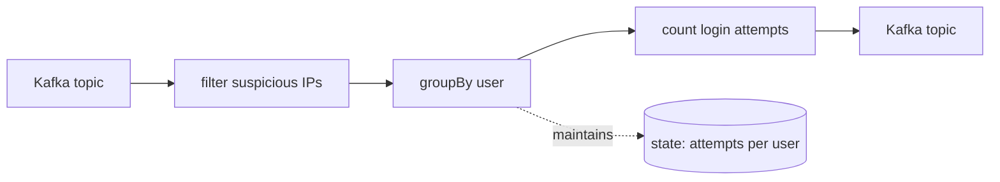

This is part one of five. By the end, you'll have written a stateful streaming app, queried its state directly, joined two streams, and seen the production checklist.

This part is conceptual. No code yet. Just the mental model.

## What problem does Kafka Streams solve?

Most web services follow a simple pattern: receive a request, do some work, send a response. But what if you need to process data that arrives continuously? Logs, events, sensor readings, user actions: these streams never end. And the processing itself may take time or depend on past data.

Streaming systems handle this. Instead of processing one request at a time, they process an unending sequence of records. The challenge is doing this reliably: handling failures without losing data, maintaining state across restarts, and keeping different processing steps coordinated.

Kafka Streams is a library that makes this manageable. It handles the hard parts (fault tolerance, state management, scaling) so you can focus on the processing logic.

## Core concepts explained

### Topics: the log of events

A Kafka **topic** is like a log file that many processes can write to and read from simultaneously. Each entry is a **record** with a key, value, and timestamp. Records are ordered and kept for a configurable time.

Think of it like a shared journal:
- Anyone can append a new entry
- Readers start from a position and read forward
- Old entries are eventually discarded (by time or size)
- The log is partitioned (split into independent streams) for parallelism

### Processing pipelines (topologies)

A **topology** is a chain of processing steps. Each step is an **operator** that transforms the stream:

- **Source**: Reads from a topic
- **map**: Transform each record (like `map` on lists)
- **filter**: Keep only matching records
- **groupBy**: Reorganize by a different key
- **count/aggregate**: Compute running totals
- **Sink**: Write to a topic



This example:
1. Reads login events
2. Filters to suspicious IPs
3. Groups by user
4. Counts attempts per user
5. Outputs counts to another topic

The **state store** (attempts per user) is maintained automatically. You don't write the storage code.

### Stateful vs stateless processing

**Stateless** operators see each record in isolation. A `filter` or `map` doesn't need to remember anything between records.

**Stateful** operators need memory. A `count` needs to remember previous counts. A windowed average needs to remember recent values.

The challenge with state: what happens when your process restarts? Kafka Streams solves this by:
- Writing state changes to a **changelog topic** (a hidden Kafka topic)
- Replaying the changelog on restart to rebuild state
- Maintaining **standby replicas** on other instances for fast failover

## How Kafka Streams differs from other approaches

### Plain Kafka consumer

You could write a loop that polls Kafka and processes records:

```haskell
-- Conceptual code
forever $ do
  records <- poll consumer
  forM_ records process
```

This works for simple cases. But you must handle:
- **Failures**: If `process` throws, what happens to the batch?
- **State**: Where do you store intermediate results?
- **Scaling**: How do you coordinate multiple instances?
- **Exactly-once**: How do you avoid double-processing on restart?

Kafka Streams handles all of this.

### Flink

Flink is a full streaming platform. You submit jobs to a cluster that manages them. This is powerful for large-scale analytics but adds operational complexity:
- Separate cluster to maintain
- Jobs are isolated from your service code
- Deployment is "submit a JAR to the cluster"

Kafka Streams keeps the processing in your service. Same binary, same deployment, same monitoring.

## What Kafka gives you

Three guarantees from Kafka that the library leverages:

1. **Durability.** Records are replicated across brokers. If your service dies mid-processing, the records are still there when you restart.

2. **Replay.** Each consumer tracks its position. Restart from where you left off, or rewind to reprocess old data.

3. **Ordering within partitions.** Records with the same key always land on the same partition and are consumed in order. This makes stateful processing predictable.

The library uses (1) for state recovery (state changes go to a changelog topic), and (2) + (3) to make processing consistent across restarts.

## What the library adds

| Capability | What you get |
| ---------- | ------------ |
| **State stores** | Local data structures (key-value, windowed, session) backed by Kafka |
| **Joins** | Combine streams and tables: stream-stream, stream-table, table-table |
| **Windows** | Time-based grouping: tumbling (fixed intervals), hopping (overlapping), session (activity gaps) |
| **Exactly-once** | Atomic processing: input, output, and state update together |
| **Standby tasks** | Hot replicas for fast failover |
| **Interactive queries** | Read your state stores directly from your service |

## Extended features

For advanced use cases, optional extensions are available:

- **Async I/O**: Call external APIs without blocking processing
- **Snapshot stores**: Fast recovery from large state
- **Two-phase commit sinks**: Exactly-once writes to databases, S3, etc.

Start with the base library; add extensions when you need them.

## Quick vocabulary

Terms you'll see throughout:

| Term | Plain English meaning |
| ---- | --------------------- |
| **Topology** | Your processing pipeline: a graph of operators that data flows through |
| **KStream** | A stream of records (append-only, like a log: new events keep getting added) |
| **KTable** | A table derived from a stream (each key keeps only its latest value) |
| **State store** | Local storage for stateful operators (in-memory or on disk) |
| **Partition** | One shard of a topic; the unit of parallelism |
| **Task** | One instance of your topology processing one partition |
| **Consumer group** | Multiple instances sharing the work |
| **Changelog topic** | Hidden Kafka topic that backs a state store |

## What you'll build

Next four parts:

1. **A pipe**: Copy records from one topic to another (the "hello world" of streaming)
2. **A word counter**: Count words and query the running totals
3. **A page-view enricher**: Join events with reference data
4. **A production checklist**: What changes between "works on my laptop" and "runs in production"

Each part is self-contained code you run without a Kafka broker.

## Ready?

[Continue to Tutorial 2: Your first topology →](../your-first-topology/)
