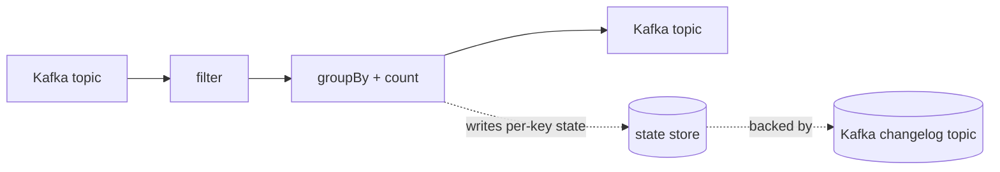
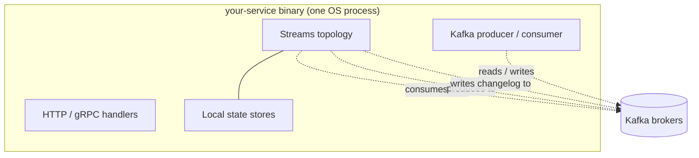

This is the first part of a five-part tutorial. By the end of all
five parts, you'll have written a stateful streaming app, queried
its state directly, joined two streams, and seen the checklist for
running it in production.

This part is conceptual. No code yet — just the mental model.

## In one sentence

Kafka Streams is a **library** that turns Kafka topics into a
**typed, stateful, fault-tolerant** processing pipeline that runs
**inside your service**.

Three words in that sentence do a lot of work:

| Word | What it means |
| ---- | ------------- |
| **Library** | You `import` it. No cluster, no JobManager, no submit step. It runs in the same process as the rest of your service. |
| **Stateful** | Each step can keep local state (counters, tables, windows). The library handles durability and replication. |
| **Fault-tolerant** | If your process dies, another picks up where it left off. Kafka is the source of truth. |

Compare with the alternatives:

| Tool | Deployment | State | Best for |
| ---- | ---------- | ----- | -------- |
| Plain Kafka consumer | Library | DIY | Simple "consume + react" services |
| Kafka Streams (this) | Library | Built-in (local + replicated) | Stateful pipelines that stay close to your service code |
| Flink | Separate cluster | Built-in (cluster-managed) | Heavy stateful processing, ML feature stores, large jobs |

If you want Flink's correctness story without the cluster, you're
in the right place. (The Riffle extensions described in
[Riffle: Flink-class extensions](../riffle/) close most of the gaps
that historically forced teams off Streams onto Flink.)

## The mental model

A **topology** is a graph. Nodes are operators (`map`, `filter`,
`groupBy`, `count`, `join`); edges are streams of typed records
flowing between them.

Three things the library does for you:

- **Reads** from the input topics, with the right partitioning.
- **Runs** your operators, scheduling work across threads.
- **Writes** outputs back to Kafka — both your sink topics and the
  hidden "changelog" topics that back local state.

You write the topology as Haskell. The library compiles it,
validates it, and runs it.

## Why "library, not cluster" matters

In Flink, you write a job, package it as a JAR, and submit it to a
cluster. The cluster owns the lifecycle.

In Kafka Streams, the topology is part of *your* service. You
deploy your service binary like any other:

Consequences:

- **Deploys are normal binary rollouts.** No "job submit" step.
- **Scale out by running more processes.** Each new process joins
  the consumer group and gets a share of the partitions.
- **State lives next to your service.** Local disk, with Kafka as
  the durable backup.
- **Your service's own libraries are right there.** Reach into
  your DB connection pool, your HTTP client, your auth code,
  whatever — without inter-service hops.

The trade-off: the operational story is different from a standard
HTTP service. The rest of these docs is mostly about that
operational story.

## What Kafka gives you that you don't have to build

Three guarantees come from Kafka itself; the library leans on
them:

1. **Durability.** Every record you produce is replicated across
   brokers. If your service dies, the record is still on Kafka.
2. **Replay.** Consumer offsets are saved per consumer group. A
   restarted service resumes from where it stopped.
3. **Ordering, per partition.** Records with the same key always
   land on the same partition and are consumed in order.

The library uses (1) to make state recoverable (each store's
updates are written to a Kafka topic; on restart, replay
rebuilds the store). It uses (2) and (3) to make processing
predictable across restarts.

## What the library adds on top

| Capability | What it gives you |
| ---------- | ----------------- |
| **State stores** | Per-key data structures (KV, window, session) backed by RocksDB or memory, replicated to Kafka |
| **Joins** | Stream-stream, stream-table, table-table, foreign-key, GlobalKTable |
| **Windows** | Time-based bucketing: tumbling, hopping, sliding, session |
| **Watermarks** | Event-time progress signals so windows know when to close |
| **Exactly-once** | Atomic commit of input offsets, output records, and state updates |
| **Standby tasks** | Warm replicas of state for fast failover |
| **Interactive queries** | Read your state stores from outside the topology |

You'll touch most of these in the tutorial. The rest of the docs
go deeper on each one.

## Two layers: parity and Riffle

The library has two layers. You can opt into the second one
per-feature, not as a whole.

- **Parity layer** — operator-for-operator port of Apache Kafka
  Streams 4.0. Everything the JVM client does, this does, with the
  same names and semantics. If you've used Kafka Streams in Java,
  the API will look familiar.
- **Riffle layer** — additive extensions that close the gaps
  people typically hit before they leave Streams for Flink. Things
  like async I/O with backpressure, snapshot-based state recovery,
  two-phase commit to external systems, cross-source watermarks,
  key-group rescaling.

You can ignore Riffle until you need it. Each Riffle feature is a
new module or a new constructor; selecting it doesn't change
anything else about your topology. See
[Riffle: Flink-class extensions](../riffle/) for the full tour.

## Quick vocabulary

You'll see these terms in every page. Skim now; the
[Glossary](../glossary/) has full definitions.

| Term | One-line meaning |
| ---- | ---------------- |
| **Topology** | The graph of operators you write |
| **KStream** | An append-only sequence of records |
| **KTable** | A changelog interpreted as a key-value table |
| **State store** | A keyed local data structure (in-memory or RocksDB) |
| **Partition** | One shard of a Kafka topic; the unit of parallelism |
| **Task** | One instance of one partition's worth of your topology |
| **Consumer group** | The set of processes sharing the load of one application |
| **Rebalance** | The act of reassigning tasks when members join or leave |
| **Changelog topic** | The hidden Kafka topic that backs a state store |
| **Standby task** | A warm replica of an active task's state |
| **Commit cycle** | The periodic batch that makes a chunk of work durable |

You don't need to memorise these. They'll show up in context as
you walk through the rest of the tutorial.

## What you'll build

In the next four parts you'll build, in order:

1. **A pipe** — copy records from one topic to another. Hello
   world for streams.
2. **A word counter** — group by word, count, write the running
   tally somewhere you can query.
3. **A page-view enricher** — join a stream of page views against
   a table of user profiles. Each output record carries both.
4. **A production checklist** — what changes between "it runs on
   my laptop" and "it runs in production".

Each part is self-contained code you can copy into a single
Haskell file and run against the in-process test driver. No
broker required at any stage.

## Ready?

[Continue to Tutorial 2: Your first topology →](../your-first-topology/)
