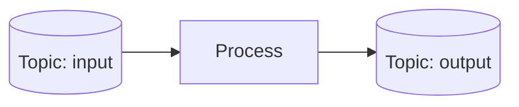

You'll write the simplest possible streaming topology: read from one topic, write to another. This is the "hello world" of streaming: it shows you how data flows without any complex processing.

## The goal

We want to build this:



Every record that arrives on "input" gets copied to "output".

In the test driver, there's no real Kafka cluster. The "topics" are in-memory queues that behave like Kafka topics.

## The complete code

Create a file at `wireform-kafka/streams/examples/Kafka/Streams/Examples/MyPipe.hs`:

```haskell
{-# LANGUAGE OverloadedStrings #-}
module Kafka.Streams.Examples.MyPipe (runDemo) where

import Control.Category ((>>>))
import qualified Data.ByteString.Char8 as BSC
import Data.Void (Void)

import Kafka.Streams
import qualified Kafka.Streams.Topology.Free as F

-- Our topology: read from "input", write to "output"
pipeTopology :: F.Topology Void ()
pipeTopology =
  F.source "input"  textSerde textSerde
    >>> F.sink   "output" textSerde textSerde

runDemo :: IO ()
runDemo = do
  -- Build and start the topology
  topo   <- F.buildTopologyFrom pipeTopology
  driver <- newDriver topo "my-pipe-app"

  -- Send a test record
  pipeInput driver (topicName "input")
    (Just (BSC.pack "user-123"))  -- key
    (BSC.pack "Hello, world!")    -- value
    (Timestamp 0)                  -- timestamp
    0                               -- partition

  -- See what came out
  out <- readOutput driver (topicName "output")
  mapM_ (\cr ->
    putStrLn ("Output: " <> show (crKey cr) <> " -> " <> BSC.unpack (crValue cr))
    ) out

  closeDriver driver
```

Run it:

```
cabal repl wireform-kafka-streams-examples
ghci> :load Kafka.Streams.Examples.MyPipe
ghci> runDemo
Output: Just "user-123" -> Hello, world!
```

The record went in one side and came out the other. Let's understand each piece.

## Breaking down the topology

### 1. The type: `Topology Void ()`

```haskell
pipeTopology :: F.Topology Void ()
```

This type signature has two type parameters: `Topology input output`. Think of a topology as a function that transforms a stream of `input` values into a stream of `output` values.

**Why two parameters?**

Just like a Haskell function `a -> b` takes type `a` and returns type `b`, a topology transforms one stream type into another. You can compose topologies where the output of one matches the input of the next:

```haskell
firstTopo  :: Topology Void Text      -- reads from Kafka, produces Text
secondTopo :: Topology Text Int64    -- takes Text, produces Int64
combined   :: Topology Void Int64     -- composed: reads from Kafka, produces Int64
combined = firstTopo >>> secondTopo
```

**What is `Void`?**

`Void` is the type with no values. We use it for the **input** because this topology does not receive data from another topology or from Haskell code. Instead, it pulls data from a **source** (a Kafka topic). The topology is self-contained at its entry point.

**What is `()`?**

`()` (unit) is the type with exactly one value (also written `()`). We use it for the **output** because this topology does not send data back to Haskell code or to another topology. Instead, it pushes data to a **sink** (another Kafka topic).

**Why `Topology Void ()` is common:**

Most topologies read from Kafka and write to Kafka, so they follow this pattern. But other shapes are possible:

```haskell
-- A topology that ends in a queryable state store
Topology Void (KTable Key Value)  -- reads from Kafka, produces a table you can query

-- A topology that takes a stream from another topology
Topology (KStream k v) ()          -- takes a stream, writes to Kafka
```

The two type parameters let you compose topologies like functions, ensuring the types match at each connection point.

### 2. Source and sink

```haskell
F.source "input" textSerde textSerde   -- read from topic "input"
  >>> F.sink "output" textSerde textSerde  -- write to topic "output"
```

**Source** pulls records from a Kafka topic. It needs:
- Topic name ("input")
- Key serde (how to deserialize the key)
- Value serde (how to deserialize the value)

**Serde** = Serializer/Deserializer. It knows how to turn bytes into Haskell values (when reading) and back (when writing). `textSerde` handles UTF-8 text.

**Sink** writes records to a topic. It needs the same three things.

### 3. Composition with `>>>`

The `>>>` operator (from `Control.Category`) means "and then".

```haskell
source >>> sink
-- "read from source, then write to sink"
```

This is how you chain operators. A longer pipeline:

```haskell
F.source "input" textSerde textSerde
  >>> F.filter (\r -> recordValue r /= "")
  >>> F.mapValues T.toUpper
  >>> F.sink "output" textSerde textSerde
```

This reads, filters out empty values, uppercases them, and writes.

## The test driver explained

You don't need a real Kafka cluster to develop or test. The `TopologyTestDriver` runs your topology in-process, using in-memory "topics" that behave like Kafka topics.

### Why this matters

Testing streaming code is usually hard because you need:
- A running Kafka cluster
- Test data setup
- Cleanup between tests

With the test driver:
- Tests run in milliseconds
- No external dependencies
- Each test starts fresh

### Key functions

| Function | Purpose |
| ---------- | ------- |
| `buildTopologyFrom` | Compile your topology to a runnable graph |
| `newDriver` | Create a test driver instance |
| `pipeInput` | Inject a record into a source topic |
| `readOutput` | Read records from a sink topic |
| `advanceWallClockTime` | Advance timestamps (for windowed processing) |
| `closeDriver` | Clean up |

### The record we sent

```haskell
pipeInput driver (topicName "input")
  (Just (BSC.pack "user-123"))  -- key: who sent this
  (BSC.pack "Hello, world!")    -- value: the payload
  (Timestamp 0)                  -- when this happened
  0                               -- which partition
```

Every Kafka record has these fields:
- **Key**: Optional identifier (used for partitioning)
- **Value**: The actual data
- **Timestamp**: When the event occurred (or when Kafka received it)
- **Partition**: Which shard of the topic (0 to N-1)

Keys matter because:
- Records with the same key go to the same partition
- This ensures order for related events
- Stateful operators use keys to group related records

## Writing tests

The real power is testing. Here's a full test with Hspec:

```haskell
import Test.Hspec

spec :: Spec
spec = describe "Pipe topology" $ do
  it "copies records unchanged" $ do
    topo   <- F.buildTopologyFrom pipeTopology
    driver <- newDriver topo "test"

    -- Send input
    pipeInput driver (topicName "input")
      (Just "key1") "value1" (Timestamp 0) 0

    -- Read output
    out <- readOutput driver (topicName "output")

    closeDriver driver

    -- Assert
    length out `shouldBe` 1
    crKey (head out) `shouldBe` Just "key1"
    crValue (head out) `shouldBe` "value1"
```

This is a **unit test** for a streaming topology. It runs in milliseconds and needs no external services.

## What you learned

- A **topology** is a typed value describing a processing pipeline
- `Topology Void ()` means "reads from sources, writes to sinks"
- **Source** reads from a topic; **sink** writes to a topic
- **Serde** converts between bytes and Haskell values
- `>>>` composes operators: "do this, then that"
- **Test driver** runs topologies in-process for fast testing
- Every record has a key, value, timestamp, and partition

## Next up

A pipe is useful, but Kafka Streams shines with **stateful** processing: counting, aggregating, joining. The next part introduces state stores.

[Continue to Tutorial 3: Stateful processing →](../stateful-processing/)
