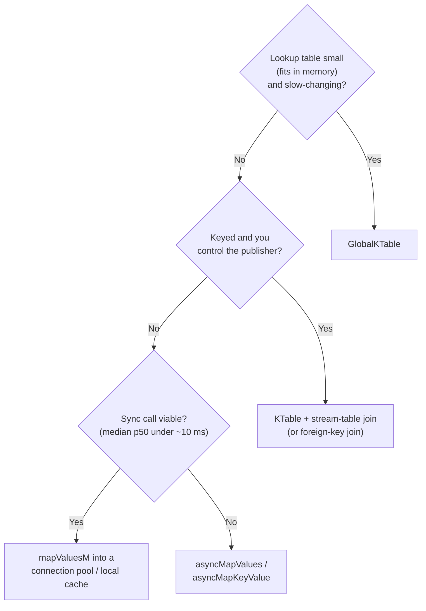
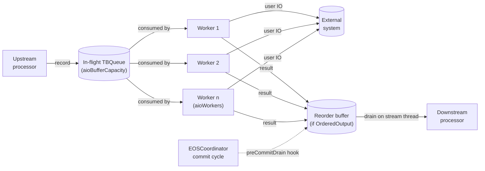

The single most-cited reason teams leave Kafka Streams for Flink is "we needed to enrich records from an external API and couldn't do it cleanly." The parity DSL gives you `mapValuesM`, which runs synchronously on the [stream thread](../../glossary/#stream-thread) — throughput collapses when the external call takes 50 ms. The Riffle [async-I/O operator](../../glossary/#async-io-operator) family in `Kafka.Streams.AsyncIO` fixes this.

This page walks through every enrichment pattern, when to use each, and how to size async I/O for your latency budget.

:::tip[Unfamiliar terms?]
Kafka, Streams, and Riffle terminology is defined in the [Glossary](../glossary/).
:::

:::note[TL;DR]
- Decision tree across six patterns: GlobalKTable (small reference data), KTable join, foreign-key join, sync `mapValuesM`, async I/O, idempotency-token state-store dedup.
- Async I/O gives you bounded backpressure, EOS-correct offsets, ordered or unordered output, per-request timeout + retry, explicit failure policy.
- Capacity sizing: `aioWorkers ≈ throughput × medianLatency` (Little's law); `aioBufferCapacity ≈ 4 × aioWorkers` so brief stalls don't immediately propagate.
- EOS-correct via the pre-commit drain hook — offsets only advance once every in-flight request has deposited a result.
- For external *writes* with strong consistency, use a [two-phase commit sink](../../operating/exactly-once/) instead.
:::

## Decision tree



The decision is throughput- and consistency-driven:

- **Small, slow-changing, fits in memory** — [GlobalKTable](../glossary/#globalktable). Every
  instance keeps a full local replica; the lookup is a hash-table
  read. Zero per-record I/O.
- **Keyed, partitionable, published as a Kafka topic** — KTable +
  stream-table join. Per-instance only the keys for the local
  partitions are materialised. Lookups are still local.
- **Synchronous, fast, infrequent failures** — `mapValuesM` with a
  bounded connection pool. Easiest pattern; backpressure works via
  the synchronous stream thread.
- **Synchronous, slow, or high p99** — `asyncMapValues`. Bounded
  in-flight, backpressure, EOS-correct, ordered or unordered
  output.

## Pattern 1: GlobalKTable for reference data

`globalTable` materialises a Kafka topic as a fully-replicated
KTable on every instance. Every instance gets every partition;
there's no consumer-group assignment. Use when:

- The dataset fits in memory across the entire fleet (e.g. <1 GB
  reference data on a 32 GB box).
- Lookups dominate, and you cannot tolerate per-record network
  latency.
- The data updates infrequently (seconds-to-minutes resolution is
  acceptable; the global topic's replication lag is the
  freshness bound).

```haskell
ref <- globalTable "currency-rates" stringSerde rateSerde
out <- joinKStreamGlobalTable orders ref keyExtract joinFn
```

`joinKStreamGlobalTable` is a non-windowed join: every order
record looks up the global table by `keyExtract order` and applies
`joinFn`. The lookup is O(1) against a local map.

Failure modes:

- **Memory growth.** GlobalKTables grow with the source topic's
  unique key count. If you forget to compact the source topic,
  it grows without bound.
- **Cross-instance skew.** Every instance replicates the whole
  table, so RAM cost scales with replica count, not with
  partitions. Three instances = 3× the storage.

## Pattern 2: KTable + stream-table join

`tableFromTopic` materialises a topic as a per-partition KTable.
Each instance gets the keys for the partitions it owns. Use when:

- The dataset is too large for a GlobalKTable.
- The stream and the table share the same key. (If they don't,
  use the foreign-key join in pattern 3.)
- You're already publishing the lookup table to Kafka — typically
  via Debezium CDC from the source database.

```haskell
prices <- tableFromTopic "prices"   stringSerde priceSerde
out    <- joinKStreamKTable orders prices joinFn
```

The runtime co-locates the stream's task with the table's task by
hashing both on the same key. State stays local; lookups are
local map reads.

Failure modes:

- **Co-partitioning.** Both topics must use the same partitioner
  and partition count, otherwise the join silently misses keys.
  The framework asserts this at startup; check
  `Kafka.Streams.Errors` for the relevant exception.
- **Snapshot timing.** A new key on the stream that hasn't yet
  arrived on the table side joins to nothing.
  `joinKStreamKTable` matches the JVM behaviour: skip the record.
  Use `leftJoinKStreamKTable` if you want a null-valued result
  instead.

## Pattern 3: Foreign-key KTable-KTable join

`foreignKeyJoinKTable` lets a stream / table join against another
table by a derived foreign key, even when the two tables don't
share a partitioning key. The framework handles the subscription-
token bookkeeping behind the scenes. Use when:

- The lookup key is a property of the value, not the record key.
- You can model both sides as KTables (i.e. the lookup data is
  already on a Kafka topic).
- Either side updates frequently and you want both sides'
  changes to propagate downstream.

The result is a KTable that updates whenever either side
changes. Implementation details and subscription-token
verification are in
[`Kafka.Streams.ForeignKeyJoin`](https://github.com/iand675/wireform-/blob/main/wireform-kafka/streams/src/Kafka/Streams/ForeignKeyJoin.hs).

## Pattern 4: Synchronous `mapValuesM`

For an external system that responds in single-digit milliseconds
median and where p99 is tolerable, the simplest answer is a
synchronous IO map:

```haskell
out <- mapValuesM (\v -> lookupExternal pool v) src
```

Properties:

- Runs on the stream thread; blocks downstream.
- [Backpressure](../glossary/#backpressure) is automatic — the consumer poll loop is naturally
  paced by the slowest processor.
- Per-key ordering is preserved.
- **Not** EOS-correct as a side effect — the external call replays
  on rewind. (The output record is in the producer transaction,
  but the external call that produced it is not.)

This is the right pattern when:

- The external system is co-located (e.g. a local Redis or an
  in-process cache).
- Median latency is small enough that the throughput hit is
  acceptable.
- The call is idempotent or read-only.

It is the wrong pattern when the call latency is the dominant
factor; you'll bottleneck on it. Move to async.

## Pattern 5: Async I/O for high-latency external calls

`Kafka.Streams.AsyncIO` adds `asyncMapValues` / `asyncMapKeyValue`
/ `asyncConcatMapValues` as first-class `Prim` constructors. The
operator owns:

- A bounded in-flight queue (`aioBufferCapacity`).
- A worker pool (`aioWorkers`) draining the queue.
- A reorder buffer (`OrderedOutput`) or direct forwarding
  (`UnorderedOutput`).
- Per-request timeout, retry, and failure policy.
- Integration with the EOS commit cycle via a pre-commit drain
  hook so offsets do not advance past in-flight requests.

The processor is a small system in its own right:



```haskell
import qualified Kafka.Streams.AsyncIO.Config as AIO

cfg :: AIO.AsyncIOConfig
cfg = AIO.defaultAsyncIOConfig
  { AIO.aioBufferCapacity = 256
  , AIO.aioWorkers        = 16
  , AIO.aioOutputMode     = AIO.OrderedOutput
  , AIO.aioTimeout        = millis 5_000
  , AIO.aioRetry          = AIO.retryFixed 3 (millis 200)
  , AIO.aioOnFailure      = AIO.LogAndContinue
  , AIO.aioName           = "geoip-lookup"
  }

out <- asyncMapValues cfg (\ip -> fetchGeoIP client ip) src
```

The default `AsyncIOConfig` (`defaultAsyncIOConfig`) is
deliberately conservative: 32 in-flight, 4 workers, ordered
output, 30 s timeout, no retries, fail-task on exception, drain on
entry plus a 25 ms wall-clock punctuator. Almost every production
deployment tunes at least `aioBufferCapacity` and `aioWorkers`.

### Picking `aioBufferCapacity` and `aioWorkers`

Per [Little's law](../glossary/#littles-law): `workers ≈ desiredThroughput × medianLatency`.
For 10 000 records/sec at 50 ms median latency, you want roughly
500 workers. `aioBufferCapacity` should be a small multiple of
`aioWorkers` so a brief bottleneck doesn't immediately backpressure
the consumer — `4 × aioWorkers` is a starting point.

### Ordered vs unordered output

| Mode | Throughput | Per-key ordering | When |
| ---- | ---------- | ---------------- | ---- |
| `OrderedOutput` | Slower (a slow request blocks the reorder buffer head) | Preserved end-to-end | When downstream relies on order (state stores, sequential aggregations) |
| `UnorderedOutput` | Higher (results forward as completed) | Lost across keys | When downstream is order-insensitive (counters, set-shaped state, idempotent writes) |

If you go `UnorderedOutput`, audit downstream operators: an
aggregator that uses `recordTimestampExtractor` and out-of-order
timestamps will see late records as "out-of-window", and an SSJ
will silently miss matches.

### Failure policies

`aioOnFailure` decides what happens after retries are exhausted. If you've done [railway-oriented programming](../concepts/railway-oriented-programming/) before, each arm is one of the standard ROP track-switches:

- `FailTask` — re-throw on the stream thread; the engine's
  uncaught-exception handler catches it; the task shuts down.
  **Default; matches JVM "strict" mode.**
- `DropAndContinue` — silently drop. Use only when the downstream
  semantics tolerate lossy enrichment.
- `LogAndContinue` — log + drop. Recommended for best-effort
  enrichment.
- `CustomFailure (SomeException -> IO ())` — your callback, on a
  worker thread. Wire to a custom dead-letter topic, a metric, or
  an out-of-band alert.

### Retry strategy

- `NoRetry` — first failure goes straight to `aioOnFailure`.
- `RetryFixed n d` — up to `n` retries, each separated by `d`.
- `RetryBackoff attempts initial multiplier` — exponential. The
  multiplier is an `Int` (integer-only math on the hot path);
  typical values are `2` (doubling) or `10` (decade).

A retried request still occupies one in-flight slot, so an
aggressive retry policy plus a small `aioBufferCapacity` deadlocks
quickly. Size `aioBufferCapacity` for the worst-case in-flight
including retries.

### How EOS works with async I/O

This is the key correctness story. The async operator hooks into
`runCommitCycle` via the `ProcessorContext.ctxRegisterPreCommitDrain`
mechanism. During `flushBody`:

1. The stream thread stops accepting new records into the
   async operator.
2. The drain blocks until every in-flight request has been
   deposited into the reorder buffer (success, failure-after-
   retries, or timeout).
3. All deposited results are forwarded downstream.
4. Offsets are then safe to commit: every record that came in
   either produced a downstream record or was deadlettered.

Result: under EOS-V2, the offset commit and the downstream output
of every async request are atomic with respect to the upstream
read. A rewind on rebalance only ever replays records whose
results haven't been forwarded yet.

### When NOT to use async I/O

- The external call is read-only and the data is already on
  Kafka. Use a GlobalKTable or KTable join instead — zero per-
  record network cost.
- The external call writes data. Async I/O is for read-side
  enrichment. For writes, use a two-phase commit sink
  ([Exactly-once across Kafka and other systems](../operating/exactly-once/))
  or accept best-effort semantics with `foreachStream`.
- You need per-record EOS for the side effect itself. Async I/O
  preserves EOS for the **output stream**, not for the external
  effect. The external call still replays on rewind in a fault
  scenario — the bounded drain just ensures the downstream view
  is consistent.

## Pattern 6: Idempotency tokens in a state store

For external writes where you need exactly-once and a 2PC sink is
too heavy:

1. Compute a stable token per record (typically the upstream
   `(topic, partition, offset)` tuple).
2. Inside a processor, check a state store for the token.
3. If present, skip — already done.
4. If absent, fire the side effect, then write the token to the
   store.

Under EOS-V2 the store write is part of the transactional drain
(`KIP-892`); it commits atomically with the consumer offset. On
replay, the processor sees the token and skips. This is the
pattern the JVM docs recommend for "exactly-once side effects on
top of EOS".

This pattern is **weaker** than a 2PC sink: between the side
effect and the store write you can crash, in which case replay
repeats the side effect. For idempotent side effects (e.g. an
HTTP PUT to an idempotent endpoint) that is fine. For
non-idempotent ones, you need the full 2PC.

## Throttling and backpressure to the external system

The external system you're calling will have its own rate limit.
Two ways to honour it:

1. **Cap `aioBufferCapacity` × `aioWorkers`** to the rate-limit
   ceiling. The stream thread blocks when the queue is full; the
   consumer naturally backs off.
2. **Use a token-bucket inside the worker function** (e.g. a
   `Data.Pool` connection pool with a fixed maximum). Workers
   wait on the bucket before issuing the call; same effect.

For HTTP APIs with 429 responses, treat 429 as `SinkRetryable`
in your worker and let the retry strategy back off.

## Schema Registry for the response payload

If the external API returns Avro / JSON-Schema / Protobuf with a
Schema Registry envelope, use the serdes in
`Kafka.Streams.Serde.SchemaRegistry`. The HTTP client is
transport-agnostic (`HttpRequester` record-of-IO), so you pin
your own `http-client` / `wreq` / `req`. The
`registrySerdeChecked` wrapper probes the registry's per-subject
compatibility policy once at construction and fails fast with
`IncompatibleSchema` before the runtime starts producing
unparseable data.

## A worked example: GeoIP enrichment

A request log enriched with GeoIP from a slow external API.

```haskell
import qualified Kafka.Streams as S
import qualified Kafka.Streams.AsyncIO.Config as AIO

geoipTopology :: S.Topology S.Void ()
geoipTopology =
  S.source "requests" S.textSerde S.requestSerde
    S.>>> S.asyncMapValues geoipCfg enrichRequest
    S.>>> S.filter (\r -> recordValue r /= droppedRequest)
    S.>>> S.sink "enriched-requests" S.textSerde S.enrichedSerde
  where
    geoipCfg = AIO.defaultAsyncIOConfig
      { AIO.aioBufferCapacity = 512
      , AIO.aioWorkers        = 32
      , AIO.aioOutputMode     = AIO.OrderedOutput
      , AIO.aioTimeout        = millis 2_000
      , AIO.aioRetry          = AIO.RetryBackoff 3 (millis 100) 2
      , AIO.aioOnFailure      = AIO.LogAndContinue
      , AIO.aioName           = "geoip-enrich"
      }
    enrichRequest req = do
      geo <- lookupGeoIP geoipClient (reqClientIp req)
      pure (req { reqGeo = geo })
```

The combination:

- 32 workers × 50 ms median latency = ~640 req/s steady-state
  throughput per task.
- 512-slot buffer absorbs short bursts up to 16× the steady-state.
- 3 retries with exponential backoff (100 ms, 200 ms, 400 ms)
  absorbs short upstream outages.
- `LogAndContinue` keeps the pipeline flowing through partial
  upstream failures; an SRE alerts on the metric counter for
  failed lookups.
- `OrderedOutput` keeps per-key ordering downstream, which matters
  if the downstream sink is an idempotent KV write keyed on
  client IP.

## Related reading

- [Exactly-once across Kafka and other systems](../operating/exactly-once/)
  — for write-side enrichment with strong consistency.
- [Visibility versus ACID databases](../operating/visibility/) —
  why "enrich from Postgres" has corner cases you wouldn't see in
  a SQL `JOIN`.
- [Scaling and rebalancing](../operating/scaling/) — async I/O
  capacity is per-worker, so it scales with `numStreamThreads` and
  instances.
