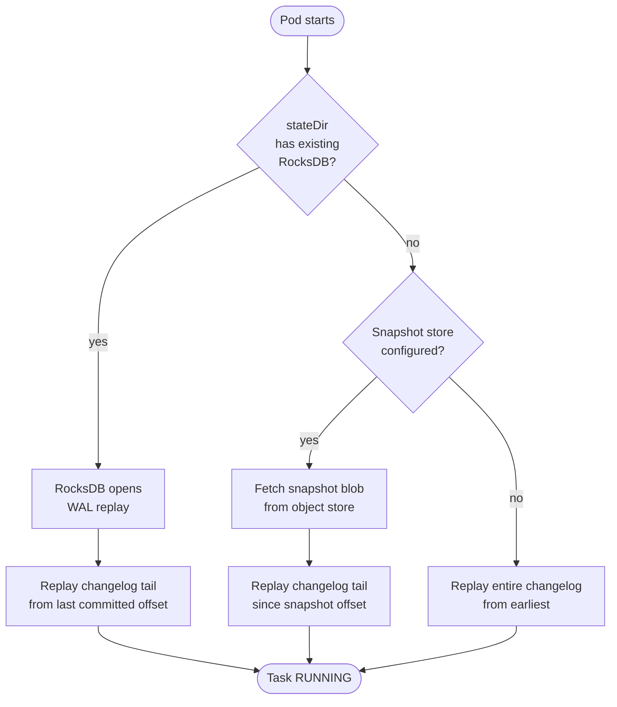

A `wireform-kafka-streams` process keeps its working state on local
disk. The RocksDB backend
(`Kafka.Streams.State.KeyValue.RocksDB`, built with the
`+rocksdb` Cabal flag) writes column-family files under
`<stateDir>/<storeName>/`; the WAL-backed
`Kafka.Streams.State.KeyValue.Persistent` backend does the same.
Either way, "the database lives in the container" is the model.

Containers break four assumptions that model relies on:

1. The filesystem outlives the process.
2. The hostname is stable across restarts.
3. Memory consumption is the JVM-style "heap plus a small constant".
4. There is time to flush state on shutdown.

This page covers how to put each one back.

:::tip[Unfamiliar terms?]
Kafka, Streams, and Riffle terminology is defined in the [Glossary](../glossary/).
:::

:::note[TL;DR]
- Mount a persistent volume at `stateDir` (default `/tmp/kafka-streams`) or pay the changelog-replay cost on every restart.
- One pod = one stable identity: `StatefulSet`-style ordinals + a stable `clientId` so the assignor reuses the same partition assignment across restarts. Combine with `numStandbyReplicas >= 1` for seconds-scale failover.
- RocksDB block cache and write buffers are **off-heap**. The container memory limit must cover heap + RocksDB + page-cache headroom, or the OOM-killer takes you mid-compaction.
- Give `closeKafkaStreams` enough wall-clock time to drain (`terminationGracePeriodSeconds` ≥ `commitIntervalMs + 30 s`).
- If you can't have persistent volumes, use the Riffle [snapshot-aware KV store](../riffle/#state-durability-decoupled-from-the-changelog) so cold-boot is bounded by snapshot cadence, not state size.
:::

## 1. State persistence

A streams instance owns RocksDB directories under
`stateDir`. On unclean shutdown, RocksDB's WAL replay on next open
handles partial-write recovery (this is why
`Kafka.Streams.State.KeyValue.RocksDB.rocksDBKeyValueStore`
sets `storeFlush = pure ()` — the WAL is the flush). The Kafka
**changelog topic** behind every store is independent durability;
the local copy is an optimisation.

You therefore have four strategies, in order of decreasing cost on
restart:

| Strategy | Cold-boot cost | When to pick |
| -------- | -------------- | ------------ |
| Persistent volume at `stateDir` | Near-zero: WAL replay only | Default for any non-trivial stateful topology |
| Ephemeral disk + `numStandbyReplicas >= 1` | Metadata flip on failover; full replay if every replica dies | When you'd rather pay 2× changelog bandwidth than mount a volume |
| Ephemeral disk + Riffle snapshot store | `O(time-since-last-snapshot)` replay from object store + tail | Multi-TB state where full changelog replay would gate rollouts |
| Ephemeral disk + plain changelog | `O(state-size / replay-bandwidth)` on every cold start | Small stores or recreatable workloads only |

### Persistent volume layout

The runtime opens one RocksDB directory per `(storeName, taskId)`
under `stateDir`. For a `StatefulSet` pod `app-0` with
`numStreamThreads = 4`, the layout is roughly:

```
/var/lib/wireform/state/
  view-counts/0_0/  -- task 0_0
  view-counts/0_1/  -- task 0_1
  ...
  user-profiles/1_0/
  ...
```

The volume must be writable by the process user, and the filesystem
must support `fsync` semantics RocksDB expects (ext4, xfs are fine;
NFS is **not** — RocksDB's WAL atomicity assumptions don't hold and
compaction throughput collapses).

### Cold-boot decision tree



The right branch is the one a container with no persistent
volume always takes. Sizing rollouts around it is the cause of
most "rolling deploys take three hours" incidents.

## 2. Stable identity across restarts

Three identities matter:

| Identity | Set by | Survival requirement |
| -------- | ------ | -------------------- |
| Consumer-group member | `applicationId` + member metadata | Stable across the group's lifetime; one per process |
| Task assignment | The assignor, based on member metadata | Cooperative-sticky **prefers** to keep the same tasks on the same member if its identity is stable |
| RocksDB directory | `stateDir` mount | Stable iff the volume is reattached to the same pod |

For the assignor to recognise a restarted pod as "the same member
who just left", its `clientId` and (when set) `applicationServer`
need to be stable across restarts:

```haskell
import qualified Kafka.Streams.Config as C
import qualified System.Environment as Env

mkCfg :: IO C.StreamsConfig
mkCfg = do
  hostname <- Env.getEnv "HOSTNAME"
  pure C.defaultStreamsConfig
    { C.applicationId     = "view-counter"
    , C.bootstrapServers  = ["broker:9092"]
    , C.clientId          = "view-counter-" <> T.pack hostname
    , C.applicationServer = Just (T.pack hostname <> ".view-counter.svc.cluster.local:8080")
    , C.numStreamThreads  = 4
    , C.numStandbyReplicas = 1
    , C.stateDir          = "/var/lib/wireform/state"
    }
```

A `StatefulSet` gives you `hostname` = `view-counter-0`,
`view-counter-1`, … and rebinds the same `PersistentVolumeClaim` to
the same ordinal on restart. The `clientId` derived from `HOSTNAME`
is then automatically stable.

For Kubernetes specifically: a `Deployment` does **not** give you
stable identity; pod names are random suffixes that change on every
restart. Use a `StatefulSet` whenever the topology has state.

### Why this matters in concert with KIP-848

The cooperative-sticky assignor in `Kafka.Streams.Runtime.RebalanceProtocol`
tries to keep tasks where they were. If the restarted member shows
up under a brand-new `clientId`, the assignor has no record of its
prior ownership and reassigns from scratch — which means task
reshuffles even though the underlying pod is "the same". Stable
identity makes the rebalance a metadata flip instead of a data
movement.

The full reconciliation walk is in
[Scaling and rebalancing → Processes across the group](./scaling/#processes-across-the-group).

## 3. Memory accounting

RocksDB allocates **off-heap**. Per store, a non-trivial slice of
memory goes to:

- The **block cache** (decompressed `.sst` block pages).
- The **memtable** (per-column-family write buffer).
- Index and filter blocks pinned in memory.
- Iterator-held pinned blocks during range scans.

A streams pod with `N` stores and `T` tasks holds `N × T`
RocksDB directories, each with its own buffers unless you've wired
a shared `Cache` and `WriteBufferManager` through a
`RocksDBConfig` customisation. Without that sharing, total RocksDB
memory grows linearly with the number of tasks the pod owns — and
the *peak* is hit during a rebalance, when tasks are being opened
on the gaining instance before the losing instance has fully
released them.

The container memory limit therefore needs:

```
container_limit =  haskell_rts_resident
                +  rocksdb_per_store * stores_per_task * tasks_per_pod
                +  page_cache_headroom
                +  per_record_inflight * commit_interval_records
```

The most common production failure mode is sizing the container to
"RTS resident + a small constant" and getting OOM-killed during the
first heavy compaction. Compaction can transiently double RocksDB
memory.

### Bounding RocksDB explicitly

`Kafka.Streams.State.KeyValue.RocksDB.RocksDBConfig` exposes the
options the underlying binding accepts. The practical pattern is to
build a single config in the boot path and reuse it for every store
the topology constructs:

```haskell
import qualified Kafka.Streams.State.KeyValue.RocksDB as RDB

bootRocksDBConfig :: FilePath -> RDB.RocksDBConfig
bootRocksDBConfig dir = (RDB.defaultRocksDBConfig dir)
  { RDB.rdbWriteSync = False
  }
```

For deployments with many tasks per pod, a wrapper that shares a
`Cache` across `R.open` calls is worth the bytes. Track the
[`rocksdb-haskell-kadena` API](https://hackage.haskell.org/package/rocksdb-haskell-kadena)
for the underlying `Options` you'd thread through.

## 4. Disk sizing

RocksDB's on-disk footprint is **not** the same shape as the
changelog topic on the broker. Budget the volume for:

- The steady-state size of every store on this task (sum across
  task assignments).
- Compaction headroom: at least 1× the largest column family, on
  top of steady state, so L0→Ln compactions have room to rewrite
  `.sst` files.
- The WAL, which is bounded but non-trivial in burst write
  workloads.
- A buffer for the next deploy's rebalance window, where the pod
  may transiently hold both its old and gaining-but-not-yet-released
  task directories.

A rule of thumb: provision **2× expected steady-state state size**
on fast local SSD. The Riffle [tiered KV
store](../riffle/#cold-state-spilling) (`Kafka.Streams.State.KeyValue.Tiered`)
can move cold keys to object storage, which is the right escape
hatch when state size grows past what's affordable on local SSD —
but it doesn't change the hot-tier sizing on the pod.

Watch the runbook for [unbounded state-dir
growth](./runbooks/#local-state-directory-grows-without-bound).

## 5. Graceful shutdown

`closeKafkaStreams` walks the shutdown path:
finish the in-flight commit cycle → flush memtables → close
RocksDB → leave the group. If the container is `SIGKILL`-ed before
that completes:

- Records in the transactional buffer are dropped (under EOS the
  next owner will reprocess from the last committed offset, so no
  data loss — just extra work).
- The pod leaves the group via session timeout instead of a clean
  `Leave`, so the rebalance starts later than it could.
- RocksDB recovers from its WAL on next open — but it's another
  full WAL replay cycle, which adds to startup time.

Kubernetes default is `terminationGracePeriodSeconds: 30`. For a
production stateful topology with `commitIntervalMs = 30_000`, that
is **not enough** — the in-flight cycle alone can take up to that
long. Set the grace period to at least `commitIntervalMs + 30 s`,
or to whatever bound your slowest `commit2PC` sink advertises plus
a safety margin.

Pair the grace period with a `preStop` hook that calls
`closeKafkaStreams` (typically by sending the process a SIGTERM
your runtime translates into the close call) and waits for the
internal state machine to reach `NOT_RUNNING` before exiting.

## 6. File handles and other ulimits

RocksDB opens many files. Per column family:

- The current memtable file.
- The WAL log file.
- Every live `.sst` at every level — count is determined by your
  compaction settings (`level0_file_num_compaction_trigger`,
  `max_bytes_for_level_base`, etc.).
- Iterators pin additional file descriptors for their lifetime.

A pod owning a few dozen tasks easily reaches several thousand open
files. Most container runtimes inherit a generous default `nofile`
soft limit, but explicit Pod-level overrides via `securityContext`
or `initContainers` are common and have been known to lower it.
Verify with `ulimit -n` inside the running container, not from the
manifest.

Set `nofile` to at least `65536` for any stateful streams pod.

## 7. A reference Kubernetes shape

The Kubernetes YAML is outside this library's scope, but the shape
deployments converge to looks like:

| Resource | Why |
| -------- | --- |
| `StatefulSet` | Stable pod hostnames (`app-0`, `app-1`, …) and stable PVC binding per ordinal |
| `volumeClaimTemplates` on a local-SSD `StorageClass` | Mount at `stateDir`; survives pod restarts |
| `applicationServer = $HOSTNAME.<svc>:<port>` | Cross-instance IQ routing finds the right pod after rebalance |
| `clientId = "<app>-$HOSTNAME"` | Stable assignor identity; cooperative-sticky reuses prior assignment |
| `terminationGracePeriodSeconds` ≥ `commitIntervalMs/1000 + 30` | Enough wall-clock to flush, commit, and leave cleanly |
| `resources.limits.memory` covers heap + RocksDB + headroom | Avoids OOM during compaction spikes |
| `readinessProbe` distinguishes `RUNNING` from `REBALANCING` | Don't take a pod out of rotation during a normal rebalance |
| `livenessProbe` triggers only on `ERROR` / hung commit cycle | Don't restart a healthy pod that's mid-replay |

The probes should consult `setStateListener` output (or equivalent
metric) rather than just "did the process start"; a pod can be
process-alive but partition-unowned for the full
`probingRebalanceIntervalMs` window during a rebalance, and you
don't want that to count as ready.

## 8. Which storage strategy for which workload

| You have… | Pick |
| --------- | ---- |
| Stateless topology (map / filter / branch only) | Ephemeral disk; nothing to persist |
| Small state (< 10 GB per task) you can afford to replay | Ephemeral disk + `numStandbyReplicas = 1` |
| Bounded state, want fast rollouts | Persistent volume + `numStandbyReplicas = 1` |
| Large state, can tolerate a snapshot-cadence-bound replay | Riffle snapshot store + ephemeral disk + `SnapshotPointer` standby |
| Multi-TB state where hot working set is small | [Tiered KV store](../riffle/#cold-state-spilling) (RocksDB hot + object-store cold) |
| You don't run on Kubernetes; Nomad / bare ECS / Fly volumes | Same principles: stable identity + persistent mount + grace period |

## Related reading

- [Tutorial 5: Going to production](../get-started/going-to-production/) — the
  config-level checklist that this page expands on for the deploy
  target.
- [Scaling and rebalancing](./scaling/) — what happens at the group
  level when a pod restarts or scales out.
- [Topology evolution](./topology-evolution/) — how a rolling
  deploy interacts with the state on the volume.
- [Runbooks → local state directory grows without bound](./runbooks/#local-state-directory-grows-without-bound) —
  the incident form of the disk-sizing discussion above.
- [Runbooks → rebalance storm](./runbooks/#rebalance-storm) —
  RocksDB compaction stalls as a cause of liveness flaps.
- [Riffle: state durability decoupled from the changelog](../riffle/#state-durability-decoupled-from-the-changelog) —
  the snapshot-aware store and pointer-mode standby that make
  ephemeral-disk deployments viable for large state.
