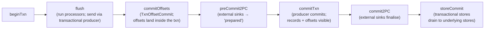
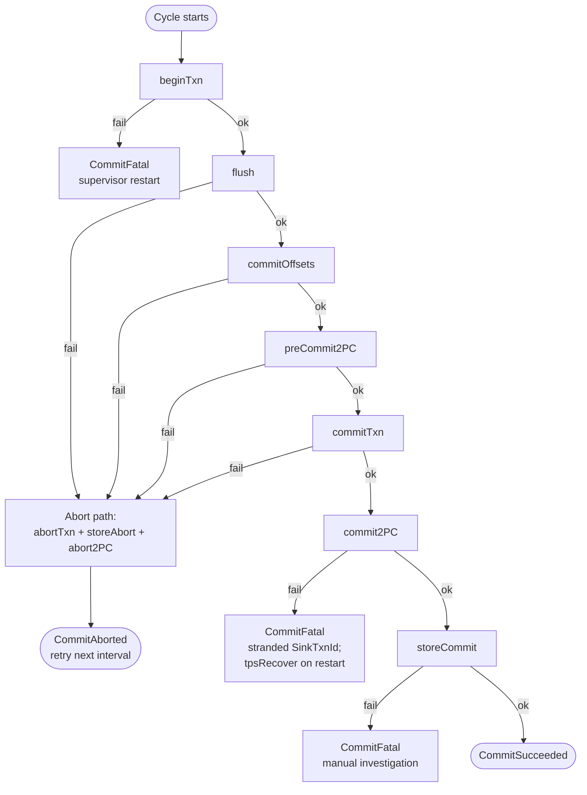
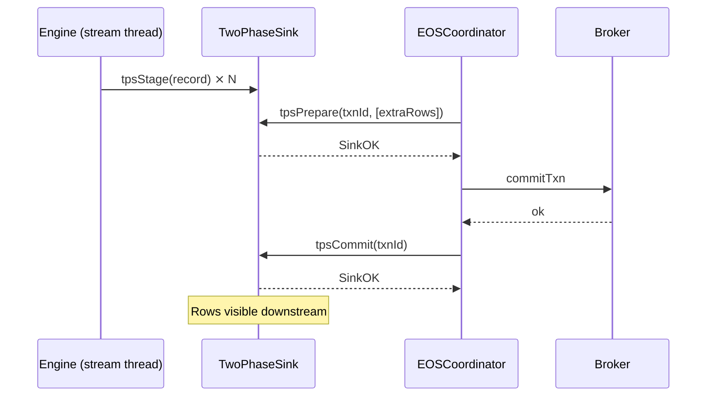
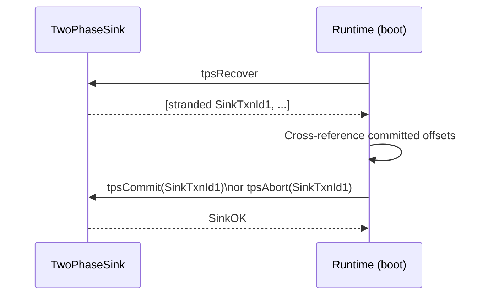

Exactly-once-semantics on Kafka itself is a known story: transactional producer, `TxnOffsetCommit`, KIP-892 transactional state stores. The library wires all of that for you behind `processingGuarantee = ExactlyOnceP`.

What that doesn't cover is any side effect that leaves Kafka — a write to Postgres, S3, Iceberg, or an HTTP endpoint. The Riffle [two-phase commit sink](../../glossary/#two-phase-commit-sink) contract closes that gap. This page covers both halves.

:::tip[Unfamiliar terms?]
Kafka, Streams, and Riffle terminology is defined in the [Glossary](../glossary/).
:::

:::note[TL;DR]
- The commit cycle is six ordered steps: `beginTxn → flush → commitOffsets → preCommit2PC → commitTxn → commit2PC → storeCommit`.
- A `TwoPhaseSink r` has five operations: `tpsStage`, `tpsPrepare`, `tpsCommit`, `tpsAbort`, `tpsRecover`. Every one must be idempotent.
- Failure at `commit2PC` (after the producer txn already committed) is the only `CommitFatal` case; the in-flight `SinkTxnId` is resolved by `tpsRecover` on next boot.
- Four reference sinks ship in core (in-memory, filesystem rename, HTTP echo); real adapters for JDBC / Iceberg / S3 live in separate packages.
- If you just need EOS for the output stream of an async-I/O operator, that comes for free — the pre-commit drain hook handles it.
:::

## The commit cycle

The orchestrator lives in `Kafka.Streams.Runtime.EOS.runCommitCycle`.
Every commit (default cadence: `commitIntervalMs = 30_000`) walks
through six ordered steps. The `EOSCoordinator` record is the
pluggable surface that production code wires to a real
transactional producer; tests wire it to a recorder. The shape:



The `runCommitCycle` source in `Kafka.Streams.Runtime.EOS` is the
ground truth for the failure semantics. The summary:

| Failure point | Outcome | Recovery |
| ------------- | ------- | -------- |
| `beginTxn` | `CommitFatal` | Runtime fails fast; supervisor restarts and re-initialises the producer |
| `flush` | `CommitAborted` | Producer txn aborted, state-store buffers discarded, 2PC sinks aborted, cycle retries next interval |
| `commitOffsets` | `CommitAborted` | Same |
| `preCommit2PC` | `CommitAborted` | Producer txn aborted, every sink that already prepared is aborted via `abort2PC` |
| `commitTxn` | `CommitAborted` | Sinks that prepared are aborted; the producer txn is aborted by the broker as well |
| `commit2PC` | **`CommitFatal`** | The producer txn is durable but at least one sink failed to finalise. Runtime is killed; on next start the sink's `tpsRecover` resolves the stranded transactions |
| `storeCommit` | `CommitFatal` | KIP-892 store-side commit failed after the wire commit succeeded. Runtime is killed; manual investigation |

The two `CommitFatal` cases are the only ones that put the runtime
into "operator must look" territory. Everything else is
auto-recoverable on the next cycle.

The same picture as a flow:



## The two-phase commit sink contract

The contract is defined in `Kafka.Streams.Sinks.TwoPhase` as the
`TwoPhaseSink r` record:

```haskell
data TwoPhaseSink r = TwoPhaseSink
  { tpsName    :: !Text
  , tpsStage   :: !(r -> IO ())
  , tpsPrepare :: !(SinkTxnId -> [r] -> IO SinkOutcome)
  , tpsCommit  :: !(SinkTxnId -> IO SinkOutcome)
  , tpsAbort   :: !(SinkTxnId -> IO SinkOutcome)
  , tpsRecover :: !(IO [SinkTxnId])
  }
```

The five operations map to a Flink-style two-phase-commit sink:

| Operation | When the runtime calls it | Sink must |
| --------- | ------------------------- | --------- |
| `tpsStage` | Per record, on the stream thread | Buffer or speculatively write; **never** make visible |
| `tpsPrepare` | Once per commit cycle, before the producer commit | Promote the buffered batch to a "prepared" state; do not commit yet |
| `tpsCommit` | Once per commit cycle, after the producer commit succeeds | Atomically make the prepared batch visible |
| `tpsAbort` | Once per commit cycle, on any abort path | Discard the prepared batch |
| `tpsRecover` | Once at startup | Return every `SinkTxnId` currently in the prepared-but-not-committed state on the external system |

`SinkOutcome` distinguishes three result classes:

- `SinkOK` — proceed.
- `SinkRetryable Text` — transient failure; the runtime aborts the
  whole cycle (`CommitAborted`) and retries on the next interval.
- `SinkFatal Text` — invariant broken; the runtime promotes the
  cycle to `CommitFatal` and waits for an operator.

Every operation must be **[idempotent](../glossary/#idempotent--idempotency)**: retries on `SinkRetryable`
or process restarts can replay any of them. Reference
implementations in the same module enforce idempotence by treating
"this txn is already done" as `SinkOK`.

## How prepare-then-commit actually keeps things atomic

The order of operations gives you atomicity even though the two
systems are separate:

1. The sink's `tpsPrepare` writes the batch to the external system
   in a state that no downstream reader sees. The reference
   `filesystemTwoPhaseSink` writes it to `prepared/<txn>.batch`;
   the JDBC adapter writes rows tagged with a "pending" flag; the
   Iceberg adapter writes data files but does not commit the
   manifest; the S3 adapter writes to a `__pending__/` prefix.
2. The producer commits. Once `commitTxn` returns, the consumer
   offsets + the produced records are durable. From this point on
   the system is committed to finalising every sink.
3. The sink's `tpsCommit` flips the visibility atomically. The
   `filesystemTwoPhaseSink` renames `prepared/<txn>.batch` to
   `committed/<txn>.batch` (atomic on POSIX). JDBC removes the
   pending flag; Iceberg commits the manifest; S3 renames out of
   `__pending__/`.

If the process crashes between (2) and (3), `tpsRecover` on the
next start surfaces the stranded `SinkTxnId`s. The runtime knows
from the consumer-group offsets whether the corresponding cycle
committed:

- If the producer txn for that `SinkTxnId` committed, run
  `tpsCommit` to finalise the sink (`RecoveryDecision = CommitFromToken`).
- If the producer txn aborted, run `tpsAbort` to roll back
  (`AbortFromToken`).
- If neither (because the runtime can't tell), log and leave it
  for a human (`UnknownLeaveAsIs`).

## Wiring a sink into the coordinator

Use `withTwoPhaseSinks` to compose a list of sinks onto an
existing `EOSCoordinator`. The signature:

The sink's lifecycle inside one commit cycle:



On restart after a crash between `commitTxn` and `tpsCommit`:




```haskell
withTwoPhaseSinks
  :: EOSCoordinator
  -> [TwoPhaseSink r]
  -> (SinkTxnId -> Text -> IO [r])
       -- fetch rows queued for tpsName under SinkTxnId
  -> IO Text
       -- generator for fresh SinkTxnId labels
  -> IO EOSCoordinator
```

Typical wiring:

```haskell
import qualified Kafka.Streams.Runtime.EOS as EOS
import qualified Kafka.Streams.Sinks.TwoPhase as TPS

withSinks :: Transaction -> [TPS.TwoPhaseSink Row] -> IO EOS.EOSCoordinator
withSinks txn sinks = do
  let base = EOS.newRealEOSCoordinator txn
  TPS.withTwoPhaseSinks base sinks rowsFor nextTxnLabel
  where
    rowsFor _txn _name = pure []        -- if all rows arrive via tpsStage
    nextTxnLabel       = newTxnLabel    -- e.g. <appId>-<instance>-<counter>
```

A `SinkTxnId` is the unit of recoverability. Make it stable across
restarts: derive it from `applicationId-instanceId-cycleCounter`
or any other persistent monotonic generator. If you reset the
generator on restart, the runtime can't correlate prepared txns
with their producer counterparts on recovery.

## The four reference sinks

Each ships in `Kafka.Streams.Sinks.TwoPhase` so the chaos suite
can drive them deterministically. They illustrate the four
canonical 2PC patterns:

### `inMemoryTwoPhaseSink`

Pure-IO sink that buffers prepared batches in an `IORef Map`.
`tpsCommit` atomically promotes a prepared batch to the committed
history. Used by property tests to assert invariants like "every
committed row corresponds to a prepared txn that returned `SinkOK`".

### `filesystemTwoPhaseSink`

Writes each prepared batch to `<root>/prepared/<txn>.batch`,
renames to `<root>/committed/<txn>.batch` on commit. The rename is
atomic on POSIX, so a crash leaves the system in either
"prepared" or "committed" state but never both. This is the same
protocol Iceberg uses at the manifest layer and S3 uses at the
object-naming layer.

### `httpEchoTwoPhaseSink`

Buffers in memory; `tpsCommit` fires a caller-supplied `onCommit`
callback with the full batch. This is the shape a 2PC HTTP sink
takes when the upstream endpoint supports prepare/commit
endpoints (e.g. `POST /prepare/{txn}` then `POST /commit/{txn}`).

### Production adapters (separate packages)

The real JDBC, Iceberg, S3, and HTTP adapters live outside the
core because each pulls in its own driver. The structure is the
same:

| Adapter | Prepare | Commit | Abort | Recover |
| ------- | ------- | ------ | ----- | ------- |
| JDBC (`wireform-jdbc`) | `INSERT` rows with `txn_id` column set | `UPDATE rows SET pending = false WHERE txn_id = ?` | `DELETE FROM rows WHERE txn_id = ?` | `SELECT DISTINCT txn_id FROM rows WHERE pending` |
| Iceberg (`wireform-iceberg`) | Write data files; defer manifest | Commit manifest pointing at data files | Delete the orphan data files | List pending data files not referenced by any manifest |
| S3 (`wireform-s3`) | Upload objects under `__pending__/<txn>/` | Rename / copy objects out of `__pending__/` | Delete `__pending__/<txn>/` | List `__pending__/` prefixes |
| HTTP | `POST /prepare/{txn}` with body | `POST /commit/{txn}` | `POST /abort/{txn}` | `GET /pending` returning prepared txn ids |

## Choosing the cadence

The 2PC overhead is one prepare + one commit roundtrip per
`commitIntervalMs`. Defaults:

| `commitIntervalMs` | Behaviour |
| ------------------ | --------- |
| 100 | EOS-V1 fast cadence — high overhead, low end-to-end latency. Each sink sees ~10 commits/sec, so commit cost matters |
| 30_000 (default) | Standard EOS-V2 cadence — one prepare/commit pair every 30 s. Batch sizes are large, per-record commit overhead is small |
| 300_000 | Long-tail cadence — useful when the sink's commit operation is expensive (e.g. Iceberg manifest commit). Trade off: a fault discards up to 5 minutes of in-flight work |

A sink whose `tpsCommit` takes a meaningful fraction of
`commitIntervalMs` is a sign that the cadence is too tight. Raise
`commitIntervalMs` and let batches accumulate.

## Common pitfalls

### Non-idempotent commit

If `tpsCommit` is not idempotent, a retry after a transient network
fault double-applies the batch. The contract is explicit: every
operation may be re-invoked. The reference sinks all encode
"already committed = no-op" by checking the prepared map / file
existence first.

### Forgetting to recover on startup

`tpsRecover` returning `[]` on every start is a sign you're not
actually checking the external system. A correct implementation
lists everything currently in the prepared state on the downstream
and asks the runtime to commit or abort each one.

### Side effects in `peek` / `foreach` under EOS

`peekStream`, `foreachStream`, `mapValuesM`, `mapKeyValueM`, and
`Punctuator` are **not** inside the producer transaction. Under
EOS-V2 the producer side is transactional and offsets commit
through `sendOffsetsToTransaction`, but these external effects
fire as the user code runs. A topology rewind on rebalance will
replay them.

If you need exactly-once for the side effect, you have three
choices, in order of strength:

1. **Two-phase commit sink.** `tpsStage` per record, prepare /
   commit per cycle. Strongest, most code.
2. **Idempotency token in a state store.** Compute a stable
   token per record (e.g. the upstream Kafka `(topic, partition,
   offset)` tuple), check the store inside the processor before
   firing the side effect, write the token to the store after.
   The store write is part of the EOS-V3 transactional drain so
   it commits atomically with the offsets. On a replay, the
   processor sees the token and skips. Same pattern the JVM
   docs recommend.
3. **Best-effort + reconciliation.** Accept that the side effect
   replays on rewind; design downstream to deduplicate. Lowest
   cost; weakest guarantee.

### Mixing transactional and non-transactional stores

If a topology has both an EOS-V2 transactional state store and a
side effect that is *not* under a 2PC sink, the store and the side
effect can drift on a fault. Either put everything under EOS
(transactional store + 2PC sink) or accept at-least-once for the
whole topology.

### `CommitFatal` after `commit2PC`

This is the "wire committed, sink failed to finalise" case. The
runtime does not retry — the in-flight `SinkTxnId` is stranded on
the external system, and the next startup is where it gets
resolved. If the sink's `tpsRecover` and recovery decision logic
are correct, the only operator action needed is to confirm the
recovery happened. If they're buggy, you may have a permanently
half-committed sink that needs manual fixing.

Watch for the `CommitFatal` outcome in metrics (via
`Kafka.Streams.Metrics`) and alert on it.

## Verifying EOS in tests

The integration test suite drives the commit cycle through the
`Kafka.Streams.Mock.Cluster` harness. The pattern:

1. Build a topology with a 2PC sink.
2. Schedule a fault injection at a specific commit-cycle step.
3. Run a deterministic sequence of records.
4. Assert that:
   - Every committed sink row corresponds to a producer txn that
     also committed.
   - No sink row appears without its producer txn.
   - On restart, `tpsRecover` is called and the half-committed
     state is resolved correctly.

The `Streams.Properties.EOSChaosSpec` suite drives every commit
step against a pure model, including the `getOffsets` exception
path, `abortTxn` returning Left, and `storeAbort` returning Left.
Use it as a template for your own sink's chaos tests.

## Related reading

- [Enrichment via external systems](../guides/enrichment/) —
  if the external system is read-only and you just want to look up
  data, async I/O is usually simpler than 2PC.
- [Visibility versus ACID databases](./visibility/) — how
  "exactly once into Kafka" differs from "atomic commit in
  Postgres".
- [Runbooks](./runbooks/) — what to do when `commit2PC` fails.
