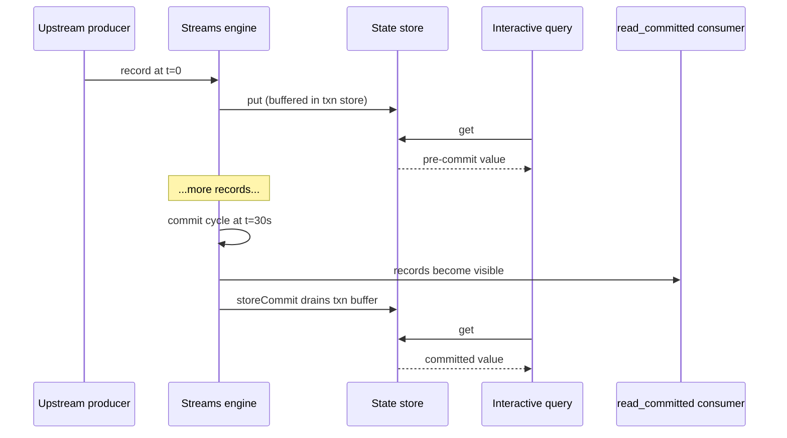

A Postgres `SELECT` after `INSERT ... COMMIT` always returns the inserted row. A streams app's view of its state is more nuanced. These differences are not bugs. They follow from using an append-only log as the source of truth and rebuilding derived state asynchronously.

This page maps ACID properties onto wireform-kafka-streams so you know which guarantees you get for free and which require explicit work.

:::tip[Unfamiliar terms?]
Kafka, Streams, and Riffle terminology is defined in the [Glossary](../glossary/).
:::

:::note[TL;DR]
- Commit boundary is `commitIntervalMs` (default 30 s), not a `COMMIT` statement. Downstream consumers see up to that much staleness.
- IQ reads see the live in-memory store, not necessarily atomically with the EOS commit cycle.
- State partitions across instances. Query routing uses `StreamsMetadata` + `KeyQueryMetadata`.
- Event time and processing time differ. Windowed aggregations use event-time; rate metrics use wall-clock.
- Side effects in `peek` / `foreach` / `mapValuesM` replay on rewind. Use two-phase commit sinks or idempotency tokens for exactly-once external effects.
:::

## A vs. ACID

| ACID property | Kafka Streams analogue |
| ------------- | ---------------------- |
| Atomicity | Per-record processing is atomic on a single task; per-commit-cycle atomicity is EOS |
| Consistency | **Eventual**: derived state catches up to the log |
| Isolation | Read-uncommitted by default; read-committed with `isolation.level = read_committed`; transactional stores buffer writes until commit |
| Durability | Kafka log is durable; derived state is durable after changelog flush |

Five operationally-interesting differences: **commit boundary**, **read path freshness**, **multi-instance distribution**, **event-time vs processing-time**, and **replay-on-failure**.

## 1. The commit boundary

In SQL, the commit boundary is `COMMIT`. Reads after see the write.

In Kafka Streams, the commit boundary is **`commitIntervalMs`** (or sooner if cache fills). Between commits:

- Producer accumulates records in its transactional batch
- State store buffers writes in memory and (under EOS) in its transactional buffer
- Consumer position moves forward but offset commit hasn't fired

A downstream consumer with `isolation.level = read_committed` sees nothing until commit. A consumer with `read_uncommitted` sees records as written, including potential aborts: `READ UNCOMMITTED` semantics.

Within a stream thread, a processor that writes then reads sees its own write immediately (read-your-writes-within-task). This does **not** extend to cross-task reads.

### Why this matters operationally

- 30 s `commitIntervalMs` (default) means downstream `read_committed` consumers see up to 30 s staleness.



If downstream SLAs are tight, shorten the interval or accept the staleness budget.

- Interactive queries read from the **uncommitted** store view by default. See "Read path freshness" below.

## 2. Read path freshness

Interactive queries hit `IORef`-backed maps for in-memory stores and the persistent shadow map for RocksDB. Writes use `atomicModifyIORef'`; reads use `readIORef`.

Semantics:

- **Linearisable** reads at `readIORef` time. A query thread sees a consistent snapshot.
- **Eager** iterators (`queryRange` / `queryAll`): materialized at creation time; concurrent writes are not visible.

What you don't get:

- **Read-after-write across threads.** A processor's `put` is immediate, but query thread visibility depends on IORef ordering. In practice this is microseconds, but not a contract.
- **Read-committed semantics under EOS.** Transactional stores buffer writes until `storeCommit`. IQ through the underlying store sees pre-commit values; through the overlay sees buffered values. Default `queryKVStore` exposes the underlying store (committed-only).

For **strict** committed-only semantics, query through the transactional overlay's `getCommitted` after confirming `commitTotal` advanced.

For **fresh** reads including in-flight writes, accept the EOS abort risk: the value might roll back on next cycle abort. Most consumers tolerate this.

## 3. Multi-instance distribution

A SQL database is a logical singleton. You connect to it, and you read whatever the latest committed value is, regardless of which backend was the writer.

A Kafka Streams state store is **partitioned and replicated**. A
key lives on exactly one instance's active task; standbys hold a
warm replica. A query for that key must route to the active
instance.

The routing primitives:

- `Kafka.Streams.Discovery.StreamsMetadata` advertises per-instance
  ownership.
- `Kafka.Streams.Discovery.KeyQueryMetadata` answers "for this
  (store, key), which instance is the active and which are the
  standbys".
- `Kafka.Streams.Discovery.HostInfo` is the `host:port` an instance
  advertises via `application.server`.

A query against the wrong instance returns `StoreNotFound`. There
is no automatic redirect within the library: the query proxy is
your code.

### Standby reads

A standby's state lags the active by up to `acceptableRecoveryLag`
records. Reading from a standby gives you:

- **Lower contention** with the stream thread on the active.
- **Stale data** bounded by lag.

Whether that trade-off is worth it depends on the use case. Read
queries that are part of a user-visible request flow usually go to
the active; bulk analytical scans usually go to standbys.

The library doesn't enforce a routing policy: you decide.
`KeyQueryMetadata.standbyHosts` returns every standby for a key;
pick by your own policy (round-robin, latency-aware, freshness-
preferring).

### Rebalance-window unavailability

During a rebalance, the partition (and therefore its state) is in
flux. KIP-848's incremental reconciliation guarantees no
double-ownership but does mean there's a window where the task is
owned by no member. IQ during that window returns either
`StoreNotFound` or a stale read from a standby.

A robust query layer handles this:

```
on IQ:
  fetch StreamsMetadata
  route to KeyQueryMetadata.activeHost
  on StoreNotFound or rebalance-error:
    fall back to KeyQueryMetadata.standbyHosts in order
    if all fail:
      backoff + refresh metadata
      retry up to N times
```

## 4. Event-time vs processing-time

A SQL `INSERT` has one timestamp: when the row was inserted. A
Kafka record has two: the **event time** (when the underlying
business event happened, carried in the record's timestamp or
embedded in its value) and the **processing time** (when the
runtime saw the record).

This is the single biggest mental shift coming from databases. A
windowed aggregation is defined over event time. A late record
(event time before the current `StreamTime`) lands in a window
that may already have closed, depending on `withGracePeriod`. The
result is **correct** in event-time terms but **surprising** to a
caller who expected processing-time semantics.

The pieces:

| Concept | Where it lives |
| ------- | -------------- |
| Record timestamp extraction | `TimestampExtractor` family in `Kafka.Streams.Time` |
| Per-task event-time clock | `engineStreamTime`: running max of extracted timestamps on this task |
| Cross-source coordination | `Kafka.Streams.Watermark.WatermarkCoordinator` |
| Window grace period | `withGracePeriod` / `withSessionGracePeriod` on window builders |
| Out-of-order handling | `BoundedOutOfOrderness` watermark generator |
| Idle-source handling | `IdleAfter` in `IdlenessConfig` |

### Why per-task StreamTime is not enough

The Phase-1 `engineStreamTime` is the running max of extracted
timestamps on **this task**. A topology that joins two streams
whose source partitions are consumed by different tasks must wait
for the laggard, but per-task `StreamTime` doesn't know about the
laggard. Three failure modes:

1. **Idle source stall.** One partition stops receiving records;
   its `StreamTime` stops advancing; a downstream window stalls
   waiting for it.
2. **Cross-source skew.** Source A is at event time `t`; source B
   is at `t + 1h`. A join's window expiry uses one side's
   `StreamTime` and misses or admits records depending on which
   side fires first.
3. **Replay race.** During a rebalance the new owner's
   `StreamTime` starts at zero until the first record arrives.

The Riffle `WatermarkCoordinator` fixes all three by computing the
**effective watermark = min of live, non-idle sources**, and by
optionally backpressuring fast sources via alignment groups. See
`Kafka.Streams.Watermark` for the API.

### Operational reading: don't conflate the two clocks

- A dashboard showing "records per second" is processing-time.
- A windowed aggregate emitting `windowEnd` is event-time.
- The two diverge during catch-up after an outage: processing rate
  is high (catching up), event time is also moving fast (replaying
  old records), but neither is wall-clock.

`punctuateTotal` on the wall-clock punctuator and on the
stream-time punctuator are different metrics. The wall-clock one
tells you "scheduled effects fired"; the stream-time one tells you
"event time advanced past this trigger". A wall-clock punctuator
that fires at the expected rate while the stream-time one is
stalled is a sign that an idle source is holding back event time.

## 5. Replay-on-failure

A SQL transaction either commits or doesn't. There is no scenario
in which a row is committed twice.

Kafka Streams **may [replay](../glossary/#replay) records on failure**:

- At-least-once: any unrecoverable error rewinds the consumer to
  the last committed offset and replays from there. Side effects
  in `peek` / `foreach` / `mapValuesM` happen again.
- Exactly-once-V2: the producer transaction either commits or
  aborts atomically. State-store writes drain in step with the
  producer commit. **External side effects that aren't inside a
  two-phase-commit sink replay on abort.**

This is the right model for a streaming pipeline. The alternative is dropping records on partial failure, but this approach has consequences
for code that thinks in database terms:

- **No "commit-then-act" pattern.** You cannot "commit, then call
  the external API knowing the commit is durable" because the
  commit boundary is implicit and the runtime can rewind.
- **Idempotency is non-negotiable for external side effects.**
  Either the side effect is naturally idempotent (a PUT to a
  versioned URL, an UPSERT keyed on a stable id) or you make it
  idempotent (token in a state store, 2PC sink).
- **`PROCESSING_GUARANTEE = AT_LEAST_ONCE` is the default**, and
  it does what it says: every record is processed *at least
  once*, which means *possibly more than once*. Plan for it.

## A worked comparison

The user-facing question "did this transfer go through?" mapped to
both worlds:

### Postgres

```sql
BEGIN;
INSERT INTO transfers (id, amount, status) VALUES (?, ?, 'pending');
UPDATE accounts SET balance = balance - ? WHERE id = ?;
UPDATE accounts SET balance = balance + ? WHERE id = ?;
UPDATE transfers SET status = 'complete' WHERE id = ?;
COMMIT;

-- Then:
SELECT status FROM transfers WHERE id = ?;
-- → 'complete'. Guaranteed.
```

### Kafka Streams (EOS)

```
[transfers topic] → process → updates [accounts changelog] + [transfers-out topic]
                                                                  ↓
                              [external read service] ← IQ ← [transfers-out KTable]
```

A read on `[transfers-out KTable]` for the transfer id may return:

- The current value, if the commit cycle has fired since the
  record was processed.
- The previous value (or "not found"), if processing happened but
  the commit cycle hasn't fired yet.
- The previous value, if a rebalance is in flight and the active
  is mid-transfer.
- Inconsistent values across instances during a brief rebalance
  window.

For "did the transfer go through?" semantics you typically:

1. Process the transfer atomically in Streams.
2. Sink the final state to a downstream system the user reads
   from: Postgres, a key-value store, or a separate IQ-fronted
   service.
3. The downstream system is the source of truth for the user's
   read; it just lags Kafka by a bounded amount.

This is the same architectural pattern as CQRS: and the same
trade-off. You give up read-your-writes in exchange for unlimited
horizontal write throughput, replayability, and the ability to
materialise the same source data into many downstream views.

## Mental-model tips

- **Treat the Kafka log as the source of truth.** Everything else
  is a materialised view.
- **Treat the commit cycle as the consistency boundary.** Within
  a cycle, things are in flux; between cycles, things are
  durable.
- **Don't expect a query to see what a write-then-read pair would
  return.** Use IQ as a *debugger* or as a *bounded-staleness
  cache*, not as a replacement for a query layer.
- **Event time and processing time are different clocks.** Pick
  one per concern and stick with it.
- **For external-system effects, design idempotently or use 2PC.**

## Related reading

- [Exactly-once across Kafka and other systems](./exactly-once/) -
  the commit cycle in detail.
- [Enrichment via external systems](../guides/enrichment/) -
  the idempotency-token pattern for external writes.
- [Observability](./observability/): IQ as a debugging surface
  and what its iterators actually show you.
