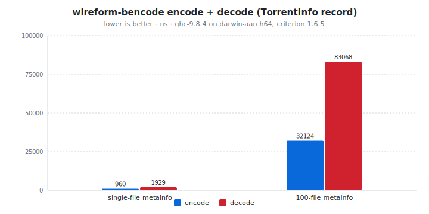

# wireform-bencode

[](https://opensource.org/licenses/BSD-3-Clause)


> [!CAUTION]
> wireform is in heavy development and has not been published to Hackage yet. APIs may change.

[Bencode](https://www.bittorrent.org/beps/bep_0003.html#bencoding) for
Haskell. Encode and decode the dynamic
[`Bencode.Value`](src/Bencode/Value.hs), and derive typeclass instances
generically or via Template Haskell.

Bencode is the encoding the BitTorrent protocol uses for `.torrent`
metainfo files, peer-to-tracker messages, DHT routing tables, and
basically every wire-level structure in the BitTorrent ecosystem. Four
shapes only: byte strings (length-prefixed), integers, lists, and
dictionaries (always sorted by key). The grammar is small enough that
you can hold the whole encoding in your head once you've used it for
an afternoon.

This package is part of the [wireform](https://github.com/iand675/wireform-)
monorepo and shares its allocation primitives, annotation deriver, and
testing discipline with every other format.

## Install

```cabal
build-depends:
  base,
  wireform-bencode,
  wireform-derive,    -- only if you want the cross-format annotation deriver
```

The package is part of the [wireform](https://github.com/iand675/wireform-)
monorepo. Clone the repo and `cabal build wireform-bencode` to compile
locally. Compiling with the LLVM backend (`-fllvm`) adds compile time
but measurably improves runtime performance.

## Hello world

```haskell
{-# LANGUAGE DeriveAnyClass #-}
{-# LANGUAGE DerivingStrategies #-}

import GHC.Generics (Generic)
import Data.Text (Text)
import Bencode.Class (ToBencode, FromBencode, encodeBencode, decodeBencode)

data TorrentFile = TorrentFile
  { announce  :: !Text
  , createdBy :: !Text
  , pieceLen  :: !Int
  } deriving stock (Show, Eq, Generic)
    deriving anyclass (ToBencode, FromBencode)

main :: IO ()
main = do
  let t     = TorrentFile "http://tracker.example.com/announce" "wireform" 16384
      bytes = encodeBencode t
  case decodeBencode bytes of
    Right (decoded :: TorrentFile) -> print decoded
    Left  err                      -> putStrLn err
```

## What's in here

| Module             | Role                                                      |
|--------------------|-----------------------------------------------------------|
| `Bencode.Value`    | Dynamic untyped `Value` ADT (`VInt`, `VString`, `VList`, `VDict`) |
| `Bencode.Encoding` | The `Encoding` builder type used by `ToBencode` instances |
| `Bencode.Encode`   | Low-level encoding primitives building straight onto `wireform-core`'s `Builder` |
| `Bencode.Decode`   | Low-level decoding primitives over the strict `ByteString` input |
| `Bencode.Class`    | Public `ToBencode` / `FromBencode` typeclasses + `encodeBencode` / `encodeBencodeDirect` / `decodeBencode` |
| `Bencode.Derive`   | `deriveBencode` / `deriveToBencode` / `deriveFromBencode` Template Haskell entry points |

## Encode and decode

The typeclass entry points are the usual shape:

```haskell
encodeBencode       :: ToBencode   a => a          -> ByteString
encodeBencodeDirect :: ToBencode   a => a          -> ByteString  -- direct-write path
decodeBencode       :: FromBencode a => ByteString -> Either String a
```

For dynamic values without a Haskell type to mirror them, work with
[`Bencode.Value`](src/Bencode/Value.hs) directly via `Bencode.Encode` /
`Bencode.Decode`. Bencode dictionaries are always sorted by key on the
wire, which the encoder enforces; the decoder also rejects unsorted or
duplicate-keyed dictionaries, so a successful round trip is good
evidence of a well-formed input.

## Annotation-driven deriving

`Bencode.Derive` consumes the cross-format `Wireform.Derive.Modifier`
vocabulary from [`wireform-derive`](../wireform-derive/README.md), so
the same annotated record can produce Bencode, JSON, and any other
backend's instances:

```haskell
{-# LANGUAGE TemplateHaskell #-}

import qualified Bencode.Derive       as DBenc
import qualified Wireform.Derive.Aeson as DAeson

data TorrentFile = TorrentFile
  { announce  :: !Text
  , createdBy :: !Text
  } deriving stock (Show, Eq, Generic)

{-# ANN type TorrentFile ("TorrentFile" :: String) #-}

DBenc.deriveBencode ''TorrentFile
DAeson.deriveJSON   ''TorrentFile
```

## Testing

The per-format Hedgehog suite lives in `test/`:

```bash
cabal test wireform-bencode:wireform-bencode-derive-test
```

It covers the typeclass instances, the deriver, generic and
TH-derived round-trips, and the dynamic `Value` ADT, including the
sorted-keys invariant that BitTorrent's info-hash relies on.

## Benchmarks

A criterion harness in [`bench/Bench.hs`](bench/Bench.hs):

```bash
cabal bench wireform-bencode:wireform-bencode-bench
```

<!-- BEGIN_AUTOGEN bench:bencode-encode-decode -->
<picture>
  <source media="(prefers-color-scheme: dark)" srcset="bench-results/charts/bencode-encode-decode-dark.svg">
  
</picture>

| Operation            |   encode |   decode | ratio |
| :------------------- | -------: | -------: | ----: |
| single-file metainfo |   960 ns |  1929 ns | 2.01x |
| 100-file metainfo    | 32124 ns | 83068 ns | 2.59x |

<sub>Last run 2026-05-13 11:38:00 UTC. ghc-9.8.4 on darwin-aarch64, criterion 1.6.5.</sub>
<!-- END_AUTOGEN bench:bencode-encode-decode -->

For cross-language comparisons:

- Haskell:
  [`bencoding`](https://hackage.haskell.org/package/bencoding) (the
  most-used Hackage Bencode library) and
  [`bencode`](https://hackage.haskell.org/package/bencode).
- Rust: [`bendy`](https://crates.io/crates/bendy) and
  [`serde_bencode`](https://crates.io/crates/serde_bencode).
- C: [libtorrent-rasterbar's bencode](https://www.libtorrent.org/reference-Bencoding.html).

## License

BSD-3-Clause.

## References

- [BEP 3: The BitTorrent Protocol Specification (Bencoding)](https://www.bittorrent.org/beps/bep_0003.html#bencoding)
- [BEP 5: DHT Protocol](https://www.bittorrent.org/beps/bep_0005.html) (one of the larger consumers of bencode beyond `.torrent` files)
