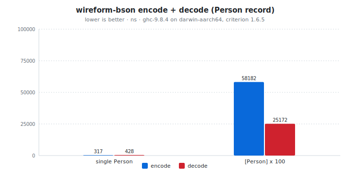

# wireform-bson

[](https://opensource.org/licenses/BSD-3-Clause)


> [!CAUTION]
> wireform is in heavy development and has not been published to Hackage yet. APIs may change.

[BSON](https://bsonspec.org/) for Haskell. Encode and decode the
dynamic [`BSON.Value`](src/BSON/Value.hs), and derive typeclass
instances generically or via Template Haskell. Covers the full BSON
type set: ObjectIDs, both binary subtype families, datetimes, regex,
JavaScript code, Decimal128, MinKey / MaxKey.

BSON ("Binary JSON") is a length-prefixed tagged binary format
originally designed by 10gen for MongoDB document storage and wire
protocol. The data model extends JSON with explicit ObjectID,
Decimal128, Date, Regex, and JavaScript-code types, plus subtypes for
binary blobs (generic, UUID, MD5, encrypted, ...). It's the right
choice when you're talking to MongoDB; uncommon elsewhere.

This package is part of the [wireform](https://github.com/iand675/wireform-)
monorepo and shares its allocation primitives, annotation deriver, and
testing discipline with every other format.

## Install

```cabal
build-depends:
  base,
  wireform-bson,
  wireform-derive,    -- only if you want the cross-format annotation deriver
```

The package is part of the [wireform](https://github.com/iand675/wireform-)
monorepo. Clone the repo and `cabal build wireform-bson` to compile
locally. Compiling with the LLVM backend (`-fllvm`) adds compile time
but measurably improves runtime performance.

## Hello world

```haskell
{-# LANGUAGE DeriveAnyClass #-}
{-# LANGUAGE DerivingStrategies #-}

import GHC.Generics (Generic)
import Data.Text (Text)
import BSON.Class (ToBSON, FromBSON, encodeBSON, decodeBSON)

data User = User
  { username :: !Text
  , score    :: !Int
  , active   :: !Bool
  } deriving stock (Show, Eq, Generic)
    deriving anyclass (ToBSON, FromBSON)

main :: IO ()
main = do
  let user  = User "alice" 42 True
      bytes = encodeBSON user
  case decodeBSON bytes of
    Right (decoded :: User) -> print decoded
    Left  err               -> putStrLn err
```

The runnable version lives in [`examples/BSONExample.hs`](../examples/BSONExample.hs).

## What's in here

| Module           | Role                                                      |
|------------------|-----------------------------------------------------------|
| `BSON.Value`     | Dynamic untyped `Value` ADT covering every BSON type code (ObjectID, Decimal128, BinaryGeneric, BinaryUuid, JS, Regex, MinKey, MaxKey, ...) |
| `BSON.Encode`    | Low-level encoding primitives building straight onto `wireform-core`'s `Builder` |
| `BSON.Encoding`  | The `Encoding` builder type used by `ToBSON` instances    |
| `BSON.Decode`    | Low-level decoding primitives over the strict `ByteString` input |
| `BSON.Class`     | Public `ToBSON` / `FromBSON` typeclasses + `encodeBSON` / `decodeBSON` |
| `BSON.Derive`    | `deriveBSON` / `deriveToBSON` / `deriveFromBSON` Template Haskell entry points |

## Encode and decode

The typeclass entry points are the usual shape:

```haskell
encodeBSON :: ToBSON   a => a          -> ByteString
decodeBSON :: FromBSON a => ByteString -> Either String a
```

For dynamic values without a Haskell type to mirror them, work with
[`BSON.Value`](src/BSON/Value.hs) directly. The `Value` ADT carries
the full set of BSON type codes, so MongoDB-specific types like
`ObjectID`, `Decimal128`, and the various `Binary` subtypes survive
round-tripping without lossy coercion.

## Annotation-driven deriving

`BSON.Derive` consumes the cross-format `Wireform.Derive.Modifier`
vocabulary from [`wireform-derive`](../wireform-derive/README.md), so
the same annotated record can produce BSON, JSON, and any other
backend's instances without redefining the field shapes:

```haskell
{-# LANGUAGE TemplateHaskell #-}

import qualified BSON.Derive          as DBSON
import qualified Wireform.Derive.Aeson as DAeson
import Wireform.Derive (rename, renameStyle, SnakeCase, forBackend, backendJSON)

data Person = Person
  { personFullName :: !Text
  , personAge      :: !Word32
  } deriving stock (Show, Eq, Generic)

{-# ANN type Person ("Person" :: String) #-}
{-# ANN personFullName (renameStyle SnakeCase) #-}
{-# ANN personAge      (renameStyle SnakeCase) #-}
{-# ANN personFullName (forBackend backendJSON (rename "fullName")) #-}

DBSON.deriveBSON  ''Person
DAeson.deriveJSON ''Person
```

`personFullName` lands as `full_name` on the BSON wire and `fullName`
in JSON. The MongoDB driver and your HTTP handler see the same data
under the keys each one expects.

## Testing

The per-format Hedgehog suite lives in `test/`:

```bash
cabal test wireform-bson:wireform-bson-derive-test
```

It covers the typeclass instances, the deriver, generic and
TH-derived round-trips, and the dynamic `Value` ADT including the
MongoDB-specific type codes.

## Benchmarks

A criterion harness in [`bench/Bench.hs`](bench/Bench.hs):

```bash
cabal bench wireform-bson:wireform-bson-bench
```

<!-- BEGIN_AUTOGEN bench:bson-encode-decode -->
<picture>
  <source media="(prefers-color-scheme: dark)" srcset="bench-results/charts/bson-encode-decode-dark.svg">
  
</picture>

| Operation      |   encode |   decode | ratio |
| :------------- | -------: | -------: | ----: |
| single Person  |   317 ns |   428 ns | 1.35x |
| [Person] x 100 | 58182 ns | 25172 ns | 0.43x |

<sub>Last run 2026-05-13 11:38:00 UTC. ghc-9.8.4 on darwin-aarch64, criterion 1.6.5.</sub>
<!-- END_AUTOGEN bench:bson-encode-decode -->

For cross-language comparisons:

- Haskell: [`bson`](https://hackage.haskell.org/package/bson) (the
  established Haskell BSON library used by `mongoDB`).
- C: [libbson](https://mongoc.org/libbson/current/index.html), part
  of the official MongoDB C driver.
- Rust: [`bson`](https://crates.io/crates/bson) crate.

## License

BSD-3-Clause.

## References

- [BSON specification](https://bsonspec.org/spec.html)
- [MongoDB extended JSON](https://www.mongodb.com/docs/manual/reference/mongodb-extended-json/) (for the JSON bridge convention used by most other BSON libraries)
