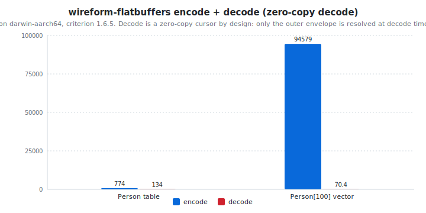

# wireform-flatbuffers

[](https://opensource.org/licenses/BSD-3-Clause)


> [!CAUTION]
> wireform is in heavy development and has not been published to Hackage yet. APIs may change.

[Google FlatBuffers](https://flatbuffers.dev/) for Haskell. Encode and
decode the dynamic [`FlatBuffers.Value`](src/FlatBuffers/Value.hs),
derive typeclass instances generically or via Template Haskell, parse
`.fbs` schema files, generate Haskell types from them, and access
buffers in zero-copy cursor style via the
[`FlatBuffers.View`](src/FlatBuffers/View.hs) typeclass.

FlatBuffers is the format Google designed when "deserializing the
whole message before reading a single field" turned out to be too
much overhead for game engines, mobile apps, and real-time inference
serving. The wire format is a directly-mappable buffer: tables are
made of vtables that index field offsets, scalars live inline, and
strings and sub-tables live by indirection. You can read a 1 GB
buffer and only pay for the fields you actually touch.

This package is part of the [wireform](https://github.com/iand675/wireform-)
monorepo and shares its allocation primitives, annotation deriver, and
testing discipline with every other format.

## Install

```cabal
build-depends:
  base,
  wireform-flatbuffers,
  wireform-derive,    -- only if you want the cross-format annotation deriver
```

The package is part of the [wireform](https://github.com/iand675/wireform-)
monorepo. Clone the repo and `cabal build wireform-flatbuffers` to
compile locally. Compiling with the LLVM backend (`-fllvm`) adds
compile time but measurably improves runtime performance.

## Hello world

Working directly with `FlatBuffers.Value`, building a small table and
round-tripping it:

```haskell
import qualified Data.ByteString as BS
import qualified Data.Vector     as V
import qualified FlatBuffers.Value  as FB
import qualified FlatBuffers.Encode as FBE
import qualified FlatBuffers.Decode as FBD

main :: IO ()
main = do
  let table = FB.VTable $ V.fromList
        [ Just (FB.VString "wireform")
        , Just (FB.VInt32 42)
        , Just (FB.VDouble 2.718)
        , Just (FB.VBool True)
        , Nothing                       -- absent slot
        ]
      bytes = FBE.encode table
  case FBD.decode bytes of
    Right val -> print val
    Left  err -> putStrLn err
```

The runnable version (which also demonstrates a vector-bearing root)
lives in [`examples/FlatBuffersExample.hs`](../examples/FlatBuffersExample.hs).

## What's in here

| Module                  | Role                                                      |
|-------------------------|-----------------------------------------------------------|
| `FlatBuffers.Value`     | Dynamic untyped `Value` ADT (`VBool`, `VInt8` ... `VInt64`, `VFloat`, `VDouble`, `VString`, `VTable`, `VStruct`, `VVector`, `VUnion`) |
| `FlatBuffers.Builder`   | Low-level vtable / offset / inline-data builder           |
| `FlatBuffers.Encode`    | High-level encoder: `encode :: Value -> ByteString`       |
| `FlatBuffers.Decode`    | High-level decoder: `decode :: ByteString -> Either String Value` |
| `FlatBuffers.Reader`    | Low-level cursor / pointer-walking decoder                |
| `FlatBuffers.View`      | Typeclass-driven zero-copy cursor reader (`View`, `Table`, `Struct`, `FBVector`, `decodeRoot`) |
| `FlatBuffers.Derive`    | `deriveFlatBuffers` Template Haskell entry point          |
| `FlatBuffers.Schema`    | `.fbs` schema AST                                         |
| `FlatBuffers.Parser`    | `parseFlatBuffers :: Text -> Either String FBSchema` for `.fbs` files |
| `FlatBuffers.CodeGen`   | Generate Haskell types and `View` instances from a schema |
| `FlatBuffers.QQ`        | `[fbs| ... |]` quasiquoter                                |
| `FlatBuffers.Registry`  | Runtime table-schema registry                             |

## Encode and decode

Two layers, both exposed.

The high-level path materialises a `Value` and round-trips through it:

```haskell
FlatBuffers.Encode.encode :: Value      -> ByteString
FlatBuffers.Decode.decode :: ByteString -> Either String Value
```

The zero-copy path uses `FlatBuffers.View`. You declare a `View`
instance that reads only the fields you actually want:

```haskell
import qualified Data.ByteString as BS
import           FlatBuffers.View

data Position = Position
  { posName :: !Text
  , posX    :: !Int32
  , posY    :: !Int32
  }

instance View Position where
  view t = Position
    <$> viewSlot t 0
    <*> viewSlot t 1
    <*> viewSlot t 2

decodePosition :: BS.ByteString -> Either String Position
decodePosition = decodeRoot
```

`view` is called against a `Table` cursor; `viewSlot` reads a vtable
slot lazily, so unused fields cost nothing. This is the API you reach
for when the buffer is the working representation, not when you want
a fully-materialised Haskell record.

## Annotation-driven deriving

`FlatBuffers.Derive` consumes the cross-format
`Wireform.Derive.Modifier` vocabulary from
[`wireform-derive`](../wireform-derive/README.md):

```haskell
{-# LANGUAGE TemplateHaskell #-}

import qualified FlatBuffers.Derive as DFB

data Position = Position
  { posName :: !Text
  , posX    :: !Int32
  , posY    :: !Int32
  } deriving stock (Show, Eq, Generic)

{-# ANN type Position ("Position" :: String) #-}

DFB.deriveFlatBuffers ''Position
```

## FlatBuffers schema and code generation

`.fbs` schema files go through `FlatBuffers.Parser.parseFlatBuffers`
to produce an `FBSchema`, and through `FlatBuffers.CodeGen` to emit
Haskell types + `View` instances:

```haskell
{-# LANGUAGE TemplateHaskell #-}
import FlatBuffers.QQ (fbs)

[fbs|
  table Person {
    name : string;
    age  : int;
  }
|]
-- Generates: data Person = Person { name :: Text, age :: Int32 }
--            instance View Person
```

For external `.fbs` files, the `wireform-gen` CLI in the umbrella
package wraps the same codegen:

```bash
wireform-gen flatbuffers -i schema.fbs -o src/Gen/
```

## Testing

The per-format Hedgehog suite lives in `test/`:

```bash
cabal test wireform-flatbuffers:wireform-flatbuffers-derive-test
```

It covers the typeclass instances, the deriver, the dynamic `Value`
ADT, the schema parser, the codegen output, and a separate `View`
test suite that exercises the zero-copy cursor path.

## Benchmarks

A criterion harness in [`bench/Bench.hs`](bench/Bench.hs):

```bash
cabal bench wireform-flatbuffers:wireform-flatbuffers-bench
```

<!-- BEGIN_AUTOGEN bench:flatbuffers-encode-decode -->
<picture>
  <source media="(prefers-color-scheme: dark)" srcset="bench-results/charts/flatbuffers-encode-decode-dark.svg">
  
</picture>

| Operation          |   encode |  decode | ratio |
| :----------------- | -------: | ------: | ----: |
| Person table       |   774 ns |  134 ns | 0.17x |
| Person[100] vector | 94579 ns | 70.3 ns | 0.00x |

<sub>Last run 2026-05-13 11:44:00 UTC. ghc-9.8.4 on darwin-aarch64, criterion 1.6.5. Decode is a zero-copy cursor by design: only the outer envelope is resolved at decode time. Per-field reads happen lazily..</sub>
<!-- END_AUTOGEN bench:flatbuffers-encode-decode -->

For cross-language comparisons:

- Haskell:
  [`flatbuffers`](https://hackage.haskell.org/package/flatbuffers)
  (the existing Hackage FlatBuffers library).
- C++: [Google's reference flatc compiler](https://github.com/google/flatbuffers),
  the canonical implementation.
- Rust: [`flatbuffers`](https://crates.io/crates/flatbuffers) crate.
- Python: [`flatbuffers`](https://pypi.org/project/flatbuffers/) on
  PyPI.

## License

BSD-3-Clause.

## References

- [FlatBuffers project](https://flatbuffers.dev/)
- [FlatBuffers internals (binary format)](https://flatbuffers.dev/internals.html)
- [Schema language reference](https://flatbuffers.dev/flatbuffers_guide_writing_schema.html)
