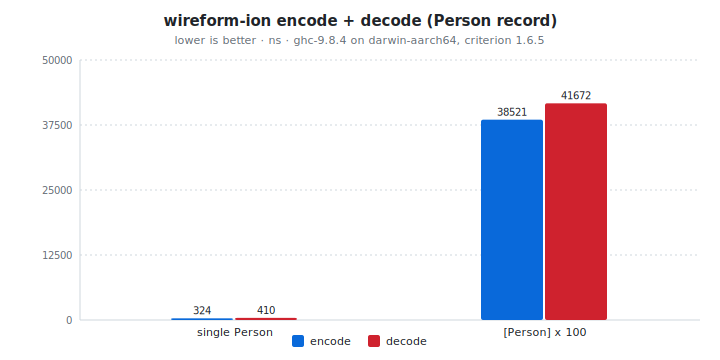

# wireform-ion

[](https://opensource.org/licenses/BSD-3-Clause)


> [!CAUTION]
> wireform is in heavy development and has not been published to Hackage yet. APIs may change.

[Amazon Ion](https://amazon-ion.github.io/ion-docs/) for Haskell. The
binary wire format, the dynamic [`Ion.Value`](src/Ion/Value.hs), the
annotation-driven Template Haskell deriver, the
[Ion Schema Language](https://amazon-ion.github.io/ion-schema/) (ISL)
parser and code generator, plus a `[isl| ... |]` quasiquoter for inline
schemas.

Ion is Amazon's open-source data format. The data model is a strict
superset of JSON: it adds timestamps with full timezone preservation,
arbitrary-precision decimals, symbols, blobs, clobs, S-expressions,
and value-level annotations. Two serializations exist (a text form
and a binary form) and round-trip 1:1; this package implements the
binary form. Ion is used internally at AWS for QLDB, AppSync, and a
number of other services, with official client libraries for Java,
Python, JavaScript, C, C++, Go, .NET, and Rust.

This package is part of the [wireform](https://github.com/iand675/wireform-)
monorepo and shares its allocation primitives, annotation deriver, and
testing discipline with every other format.

## Install

```cabal
build-depends:
  base,
  wireform-ion,
  wireform-derive,    -- only if you want the cross-format annotation deriver
```

The package is part of the [wireform](https://github.com/iand675/wireform-)
monorepo. Clone the repo and `cabal build wireform-ion` to compile
locally. Compiling with the LLVM backend (`-fllvm`) adds compile time
but measurably improves runtime performance.

## Hello world

```haskell
{-# LANGUAGE DeriveAnyClass #-}
{-# LANGUAGE DerivingStrategies #-}

import GHC.Generics (Generic)
import Data.Text (Text)
import Ion.Class (ToIon, FromIon, encodeIon, decodeIon)

data Event = Event
  { eventType :: !Text
  , timestamp :: !Int
  , payload   :: !Text
  } deriving stock (Show, Eq, Generic)
    deriving anyclass (ToIon, FromIon)

main :: IO ()
main = do
  let evt   = Event "click" 1700000000 "button-submit"
      bytes = encodeIon evt
  case decodeIon bytes of
    Right (decoded :: Event) -> print decoded
    Left  err                -> putStrLn err
```

The runnable version lives in [`examples/IonExample.hs`](../examples/IonExample.hs).

## What's in here

| Module             | Role                                                      |
|--------------------|-----------------------------------------------------------|
| `Ion.Value`        | Dynamic untyped `Value` ADT covering every Ion type (`VNull`, `VInt`, `VDecimal`, `VTimestamp`, `VSymbol`, `VString`, `VBlob`, `VClob`, `VList`, `VSExp`, `VStruct`, `VAnnotated`, ...) |
| `Ion.Encoding`     | The `Encoding` builder type used by `ToIon` instances     |
| `Ion.Encode`       | Low-level encoding primitives building straight onto `wireform-core`'s `Builder` |
| `Ion.Decode`       | Low-level decoding primitives over the strict `ByteString` input |
| `Ion.Class`        | Public `ToIon` / `FromIon` typeclasses + `encodeIon` / `decodeIon` |
| `Ion.Derive`       | `deriveIon` / `deriveToIon` / `deriveFromIon` Template Haskell entry points |
| `Ion.SchemaLang`   | ISL parser (`parseISL :: Text -> Either String ISLSchema`) |
| `Ion.ISLSchema`    | ISL AST types (`ISLSchema`, `ISLType`, `ISLConstraint`, `ISLImport`, ...) |
| `Ion.ISLCodeGen`   | Generate Haskell types and `ToIon` / `FromIon` instances from an ISL schema |
| `Ion.QQ`           | `[isl| ... |]` quasiquoter                                |

## Encode and decode

The typeclass entry points are the usual shape:

```haskell
encodeIon :: ToIon   a => a          -> ByteString
decodeIon :: FromIon a => ByteString -> Either String a
```

For dynamic values without a Haskell type to mirror them, work with
[`Ion.Value`](src/Ion/Value.hs) directly. The `Value` ADT carries
Ion-specific shapes that JSON has no equivalent for (annotated
values, symbol tables, decimals, timestamps with timezone offset),
so you don't lose information by routing through it.

## Annotation-driven deriving

`Ion.Derive` consumes the cross-format `Wireform.Derive.Modifier`
vocabulary from [`wireform-derive`](../wireform-derive/README.md), so
the same annotated record can produce Ion, JSON, and any other
backend's instances without redefining the field shapes:

```haskell
{-# LANGUAGE TemplateHaskell #-}

import qualified Ion.Derive            as DIon
import qualified Wireform.Derive.Aeson as DAeson
import Wireform.Derive (rename, renameStyle, SnakeCase, forBackend, backendJSON)

data Person = Person
  { personFullName :: !Text
  , personAge      :: !Word32
  } deriving stock (Show, Eq, Generic)

{-# ANN type Person ("Person" :: String) #-}
{-# ANN personFullName (renameStyle SnakeCase) #-}
{-# ANN personAge      (renameStyle SnakeCase) #-}
{-# ANN personFullName (forBackend backendJSON (rename "fullName")) #-}

DIon.deriveIon    ''Person
DAeson.deriveJSON ''Person
```

## ISL: schema and code generation

[Ion Schema Language](https://amazon-ion.github.io/ion-schema/) is the
schema dialect for Ion. wireform-ion parses it with
`Ion.SchemaLang.parseISL` and generates Haskell types + `ToIon` /
`FromIon` instances with `Ion.ISLCodeGen`:

```haskell
{-# LANGUAGE TemplateHaskell #-}
import Ion.QQ (isl)

[isl|
  type::{
    name: person,
    type: struct,
    fields: { name: string, age: int }
  }
|]
-- Generates: data Person = Person { name :: Text, age :: Int }
--            instance ToIon Person ; instance FromIon Person
```

For external `.isl` files, the `wireform-gen` CLI in the umbrella
package wraps the same codegen.

## Testing

The per-format Hedgehog suite lives in `test/`:

```bash
cabal test wireform-ion:wireform-ion-derive-test
```

It covers the typeclass instances, the deriver, generic and
TH-derived round-trips, the dynamic `Value` ADT, the ISL parser, and
the code generator output.

## Benchmarks

A criterion harness in [`bench/Bench.hs`](bench/Bench.hs):

```bash
cabal bench wireform-ion:wireform-ion-bench
```

<!-- BEGIN_AUTOGEN bench:ion-encode-decode -->
<picture>
  <source media="(prefers-color-scheme: dark)" srcset="bench-results/charts/ion-encode-decode-dark.svg">
  
</picture>

| Operation      |   encode |   decode | ratio |
| :------------- | -------: | -------: | ----: |
| single Person  |   324 ns |   410 ns | 1.27x |
| [Person] x 100 | 38521 ns | 41672 ns | 1.08x |

<sub>Last run 2026-05-13 11:42:00 UTC. ghc-9.8.4 on darwin-aarch64, criterion 1.6.5.</sub>
<!-- END_AUTOGEN bench:ion-encode-decode -->

For cross-language comparisons:

- Haskell: no comparable Ion library on Hackage; the natural baseline
  is the wireform-ion `Value`-level round trip.
- Java: [ion-java](https://github.com/amazon-ion/ion-java), the
  reference implementation.
- Rust: [`ion-rs`](https://crates.io/crates/ion-rs).
- C: [ion-c](https://github.com/amazon-ion/ion-c).

## License

BSD-3-Clause.

## References

- [Amazon Ion data model](https://amazon-ion.github.io/ion-docs/docs/spec.html)
- [Ion binary encoding](https://amazon-ion.github.io/ion-docs/docs/binary.html)
- [Ion Schema Language 2.0](https://amazon-ion.github.io/ion-schema/docs/isl-2-0/spec)
