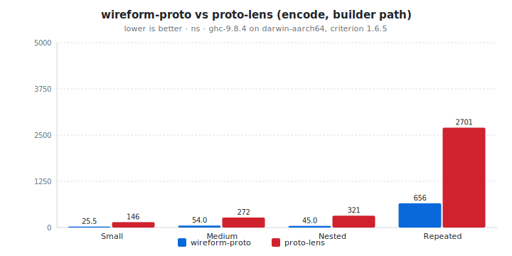
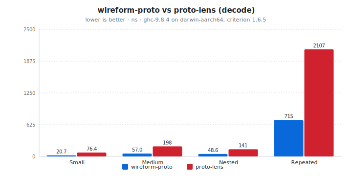

# wireform-proto

[](https://opensource.org/licenses/BSD-3-Clause)


> [!CAUTION]
> wireform is in heavy development and has not been published to Hackage yet. APIs may change.

A fully conformant, extremely high-performance Protocol Buffer implementation
for Haskell. Supports proto2 and proto3 with its own IDL parser, so
no `protoc` binary is needed.

Encode and decode performance is roughly as fast as the official
C++ implementation.

Part of the [`wireform`][wireform] project.

[wireform]: https://github.com/iand675/wireform-

---

## Example: `loadProto`

The usual workflow is: point Template Haskell at a `.proto` file,
get a `data` type plus wire and JSON-related instances. The splice
runs wireform's own parser (no `protoc`).

```haskell
{-# LANGUAGE TemplateHaskell #-}
import Proto.TH     (loadProto)
import Proto.Encode (encodeMessage)
import Proto.Decode (decodeMessage)

$(loadProto "proto/person.proto")
```

For the schema above, you get something along these lines:

```haskell
data Person = Person
  { personName :: !Text
  , personAge  :: {-# UNPACK #-} !Int32
  } deriving stock (Show, Eq, Generic)
```

Use normal record syntax and pattern matching on the generated type;
`encodeMessage` / `decodeMessage` are the straightforward binary
path.

```haskell
let alice = Person { personName = "Alice", personAge = 30 }
let bytes = encodeMessage alice
case decodeMessage bytes of
  Right p  -> print (personName p)
  Left err -> print err
```

For the other entry points, you can use inline `Proto.QQ`, Haskell-first
`Proto.Derive`, on-disk output via `Proto.Setup`, the `protoc`
plugin, or direct `Proto.CodeGen`.

---

## Ways to use it

There are six entry points into the same codegen machinery, depending on your development style. All produce identical wire-format instances; they differ only in where and
when code generation happens.

### `loadProto`: TH splice from a `.proto` file

Simplest path. Point it at a file, get types and instances.

```haskell
{-# LANGUAGE TemplateHaskell #-}
import Proto.TH (loadProto)

$(loadProto "proto/messages.proto")
```

Messages and enums land in scope. No build system setup, no
generated files to commit. wireform's own parser handles the
`.proto`; `protoc` is not involved.

`loadProtoWith` accepts a `LoadOpts` for customising field
representations (see
[Custom field representations](#custom-field-representations)).

### `Proto.QQ`: inline quasi-quoter

For one-off messages or quick prototyping:

```haskell
{-# LANGUAGE QuasiQuotes #-}
{-# LANGUAGE TemplateHaskell #-}
import Proto.QQ (proto)

[proto|
  syntax = "proto3";
  message SearchRequest {
    string query = 1;
    int32 page_number = 2;
    int32 result_per_page = 3;
  }
|]
```

`SearchRequest` is now a regular Haskell type with
encode/decode/JSON instances.

### `Proto.Derive`: annotation-driven, no `.proto` file

Define your Haskell types first, derive the wire format from
annotations:

```haskell
{-# LANGUAGE TemplateHaskell #-}
import Proto.Derive (deriveProto, tag)

data Measurement = Measurement
  { sensorId    :: !Text
  , temperature :: !Double
  , timestamp   :: {-# UNPACK #-} !Int64
  } deriving stock (Show, Eq, Generic)

{-# ANN type Measurement ("Measurement" :: String) #-}
{-# ANN sensorId    (tag 1) #-}
{-# ANN temperature (tag 2) #-}
{-# ANN timestamp   (tag 3) #-}

deriveProto ''Measurement
```

Useful when the Haskell types are the source of truth and protobuf
is just the serialisation format. You get `MessageEncode` /
`MessageDecode` / `MessageSize` instances like every other path.

### `Proto.Setup`: Cabal pre-build hook

For projects that prefer generated `.hs` files on disk (reviewable,
committable, visible to HLS without a TH rebuild):

```haskell
-- Setup.hs
import Distribution.Simple
import Proto.Setup

main :: IO ()
main = defaultMainWithHooks simpleUserHooks
  { preBuild = \args flags -> do
      protoGenPreBuildHook defaultProtoGenConfig
        { pgcProtoDir     = "proto"
        , pgcOutputDir    = "gen"
        , pgcModulePrefix = "Proto.Gen"
        }
      preBuild simpleUserHooks args flags
  }
```

```yaml
# in your .cabal file
build-type: Custom

custom-setup
  setup-depends: base, wireform-proto, Cabal, directory, filepath, text

library
  hs-source-dirs: src, gen
```

Incremental: only regenerates when a `.proto` file is newer than
its `.hs` output.

### `protoc-gen-wireform`: protoc plugin

If your build system already runs `protoc` (Bazel, Nix, Make,
polyglot monorepo):

```bash
protoc --plugin=protoc-gen-wireform=$(cabal list-bin protoc-gen-wireform) \
       --wireform_out=gen/ \
       proto/*.proto
```

Reads `CodeGeneratorRequest` from stdin, writes Haskell source via
the same codegen machinery.

### `Proto.CodeGen`: pure-text code generator

Lowest-level entry point. `generateModuleText` takes a parsed
`ProtoFile` AST and returns the Haskell module source as `Text`.
No TH, no IO, just a pure function:

```haskell
import Proto.Parser  (parseProtoFile)
import Proto.CodeGen (generateModuleText, defaultGenerateOpts)
import qualified Data.Text.IO as TIO

main :: IO ()
main = do
  src <- TIO.readFile "message.proto"
  case parseProtoFile "message.proto" src of
    Left err -> print err
    Right pf -> do
      let code = generateModuleText
                   defaultGenerateOpts { genModulePrefix = "MyApp.Proto" }
                   mempty "message.proto" pf
      TIO.writeFile "gen/MyApp/Proto/Message.hs" code
```

This backs `Proto.Setup`, `protoc-gen-wireform`, and `loadProto`.
Useful for custom CLI tools, non-Cabal build systems, or generation
as part of a larger pipeline.

### Which one should I use?

| Method | When to use it |
|:---|:---|
| `loadProto` | Most projects. Simple, no build setup. |
| `Proto.QQ` | Quick prototyping, one-off messages, tests. |
| `Proto.Derive` | Haskell types are the source of truth. |
| `Proto.Setup` | You want generated `.hs` files on disk. |
| `protoc-gen-wireform` | Your build system already runs `protoc`. |
| `Proto.CodeGen` | Custom tooling, full pipeline control. |

All six produce identical wire-format instances.

---

## Custom field representations

String, bytes, repeated, and map fields can be overridden to use
different Haskell types. Overrides apply per-field, per-message,
or globally.

### `loadProtoWith` (Haskell-side)

```haskell
$(loadProtoWith (defaultLoadOpts
    { loRepConfig = defaultRepConfig
        { configFieldOverrides = Map.fromList
            [ (("BlobMsg","data"),     defaultFieldRep { fieldBytes = lazyBytesAdapter })
            , (("IdMsg","identifier"), defaultFieldRep { fieldBytes = shortBytesAdapter })
            ]
        , configMessageOverrides = Map.fromList
            [ ("ConfigEntry", defaultFieldRep { fieldRepeated = listAdapter })
            ]
        }
    })
  "proto/my_service.proto")
```

`BlobMsg` gets a lazy `ByteString` data field (large payloads you
might not fully consume). `IdMsg` gets a `ShortByteString`
identifier (unpinned, GC-friendly for small IDs). `ConfigEntry`
gets `[Text]` instead of `Vector Text` (small collections where
list overhead doesn't matter).

### `.proto` field options

Overrides specified directly in the schema so the intent is visible
to anyone reading the `.proto`:

```protobuf
message BlobMsg {
  string name = 1;
  bytes data = 2 [(wireform.haskell_bytes) = "lazy"];
}

message ConfigEntry {
  string key = 1;
  string value = 2;
  repeated string tags = 3 [(wireform.haskell_repeated) = "list"];
}
```

Option names: `wireform.haskell_string` (`"strict"`, `"lazy"`,
`"short"`, `"string"`), `wireform.haskell_bytes` (`"strict"`,
`"lazy"`, `"short"`), `wireform.haskell_repeated` (`"vector"`,
`"unboxed"`, `"list"`, `"seq"`), `wireform.haskell_map` (`"ord"`,
`"hash"`). Haskell-side overrides take precedence when both are
present.

Custom adapter names can be registered via `AdapterRegistry` in
`RepConfig`:

```haskell
myConfig = defaultRepConfig
  { configAdapterRegistry = defaultAdapterRegistry
      { arStringAdapters = Map.insert "url" urlAdapter
          (arStringAdapters defaultAdapterRegistry)
      }
  }
```

Then use them from `.proto`: `[(wireform.haskell_string) = "url"]`.

### Built-in adapters

| Category | Adapters |
|:---------|:---------|
| **String** | `strictTextAdapter` (default), `lazyTextAdapter`, `shortTextAdapter`, `hsStringAdapter` |
| **Bytes** | `strictBytesAdapter` (default), `lazyBytesAdapter`, `shortBytesAdapter` |
| **Repeated** | `vectorAdapter` (default), `listAdapter`, `seqAdapter` |
| **Map** | `ordMapAdapter` (default), `hashMapAdapter` |

Each adapter bundles TH splices for encoding, decoding, sizing, and
empty/null checks. You can define custom adapters for newtypes,
unboxed vectors, or other containers.

See [`examples/CustomReprExample.hs`](../examples/CustomReprExample.hs)
for a working example covering all adapter types, including
`map<K, bytes>` value overrides.

---

## Multi-format

Because wireform-proto generates plain records, the same type
participates in the broader `wireform` annotation system. A single
`{-# ANN ... #-}` pragma on a record can drive instance generation
for protobuf, CBOR, MessagePack, and JSON simultaneously. Details
in [`wireform-derive`](../wireform-derive/).

---

## Performance

Numbers from `cabal bench compare-bench`, encoding and decoding
identical messages through wireform-proto and proto-lens. Four
message shapes: a 3-field scalar, an 8-field mixed, a nested
submessage, and a repeated message with 50 packed ints, 20 strings,
and 10 nested items.

#### Encode

| Message    | wireform | wireform (LLVM) | proto-lens | speedup |
|:-----------|----------:|----------------:|-----------:|--------:|
| Small      |    26 ns  |      **23 ns**  |    145 ns  | **6.3x** |
| Medium     |    54 ns  |      **52 ns**  |    280 ns  | **5.4x** |
| Nested     |    45 ns  |      **42 ns**  |    320 ns  | **7.6x** |
| Repeated   |   657 ns  |     **500 ns**  |  2,646 ns  | **5.3x** |

#### Decode

| Message    | wireform | wireform (LLVM) | proto-lens | speedup |
|:-----------|----------:|----------------:|-----------:|--------:|
| Small      |    21 ns  |      **20 ns**  |     77 ns  | **3.9x** |
| Medium     |    57 ns  |      **61 ns**  |    201 ns  | **3.3x** |
| Nested     |    49 ns  |      **50 ns**  |    144 ns  | **2.9x** |
| Repeated   |   694 ns  |     **623 ns**  |  2,067 ns  | **3.3x** |

#### Roundtrip

| Message    | wireform | wireform (LLVM) | proto-lens | speedup |
|:-----------|----------:|----------------:|-----------:|--------:|
| Small      |    76 ns  |      **75 ns**  |    218 ns  | **2.9x** |
| Medium     |   201 ns  |     **191 ns**  |    472 ns  | **2.5x** |
| Nested     |   156 ns  |     **140 ns**  |    450 ns  | **3.2x** |

*Criterion, GHC 9.8.4, `-O2`, Apple Silicon (M-series). Schema and
runner in [`compare-bench/`](../compare-bench/). Run with
`cabal bench compare-bench`. LLVM column uses `-fllvm` on wireform
packages; proto-lens stays NCG. LLVM helps most on repeated fields
(up to 27%).*

<!-- BEGIN_AUTOGEN bench:proto-vs-proto-lens-encode -->
<picture>
  <source media="(prefers-color-scheme: dark)" srcset="bench-results/charts/proto-vs-proto-lens-encode-dark.svg">
  
</picture>

| Operation | wireform-proto | proto-lens | ratio |
| :-------- | -------------: | ---------: | ----: |
| Small     |        25.5 ns |     146 ns | 5.71x |
| Medium    |       53.10 ns |     272 ns | 5.04x |
| Nested    |       44.10 ns |     321 ns | 7.13x |
| Repeated  |         656 ns |    2701 ns | 4.12x |

<sub>Last run 2026-05-13 10:45:00 UTC. ghc-9.8.4 on darwin-aarch64, criterion 1.6.5.</sub>
<!-- END_AUTOGEN bench:proto-vs-proto-lens-encode -->

<!-- BEGIN_AUTOGEN bench:proto-vs-proto-lens-decode -->
<picture>
  <source media="(prefers-color-scheme: dark)" srcset="bench-results/charts/proto-vs-proto-lens-decode-dark.svg">
  
</picture>

| Operation | wireform-proto | proto-lens | ratio |
| :-------- | -------------: | ---------: | ----: |
| Small     |        20.7 ns |    76.5 ns | 3.69x |
| Medium    |        57.0 ns |     198 ns | 3.48x |
| Nested    |        48.6 ns |     141 ns | 2.91x |
| Repeated  |         715 ns |    2107 ns | 2.95x |

<sub>Last run 2026-05-13 10:45:00 UTC. ghc-9.8.4 on darwin-aarch64, criterion 1.6.5.</sub>
<!-- END_AUTOGEN bench:proto-vs-proto-lens-decode -->

Encode and decode cost about the same. A 3-field message encodes
in ~23 ns and decodes in ~20 ns with LLVM. A 50-element
packed-repeated field with nested submessages round-trips in about
1 us. Builder output can be streamed directly to a `Handle` without
materialising a `ByteString`.

---

## Also included

### Proto3 canonical JSON

Generated types get `ToJSON` / `FromJSON` instances that follow the
[proto3 JSON mapping](https://protobuf.dev/programming-guides/proto3/#json).
`json_name` overrides, base64-encoded bytes, string-encoded 64-bit
integers, and `NaN`/`Infinity` sentinels are handled automatically.

```haskell
import Data.Aeson (encode, eitherDecode)

let json = encode alice                 -- proto3 JSON
case eitherDecode json of
  Right p  -> print (p :: Person)
  Left err -> putStrLn err
```

### Well-known types

`Timestamp`, `Duration`, `Any`, `FieldMask`, `Struct`, `Value`,
`ListValue`, `NullValue`, all `Wrappers`, `Empty`, and
`SourceContext` ship with supplementary utilities:

```haskell
import Proto.Google.Protobuf.Timestamp.Util (fromUTCTime, toUTCTime)
import Proto.Google.Protobuf.Duration.Util (fromNominalDiffTime)
import Proto.Google.Protobuf.Any.Util (packAny, unpackAny)
import Proto.Google.Protobuf.FieldMask.Util (intersect, merge)

let ts   = fromUTCTime now              -- UTCTime -> Timestamp
let dur  = fromNominalDiffTime 3.5      -- NominalDiffTime -> Duration
let any_ = packAny registry alice       -- pack into Any
case unpackAny registry any_ of
  Just (p :: Person) -> print p
  Nothing            -> putStrLn "unknown type"
```

### Streaming and incremental decoders

For length-delimited message streams (gRPC, Kafka, log files):

```haskell
import Proto.Decode.Stream (decodeStream)
import Proto.Decode.Streaming (streamDecode, StreamStep(..))

-- Strict: decode all messages from a ByteString
let msgs = decodeStream @LogEntry bytes

-- Incremental: decode one message at a time
case streamDecode @LogEntry of
  StreamNeedMore feed -> feed chunk >>= \case
    StreamYield entry k -> process entry >> continue k
    StreamDone          -> pure ()
```

### Proto2 extensions and dynamic messages

```haskell
import Proto.Extension (getExtension, setExtension)

-- Typed extensions (proto2)
let deadline = getExtension deadlineField request

-- Dynamic messages (schema not known at compile time)
import Proto.Dynamic (decodeDynamic, encodeDynamic)
let dyn = decodeDynamic registry "my.package.Person" bytes
```

### Lens access

`Proto.Lens` provides optional van Laarhoven lenses for generated
message fields. No dependency on `lens` or `microlens` — the lenses
use the van Laarhoven encoding directly:

```haskell
import Proto.Lens (field)

view (field @"name") person        -- get
set  (field @"name") "Bob" person  -- set
```

### gRPC codegen

`Proto.GRPC` generates service/method type metadata. Wire framing
and transport live in [`wireform-grpc`](../wireform-grpc/).

```haskell
import Proto.GRPC (ServiceDef(..), MethodDef(..))

-- Generated:
-- grpcGreeterService :: ServiceDef
-- grpcSayHelloMethod :: MethodDef
```

---

## Conformance

**2675 / 2675** tests pass against the official [upstream protobuf
conformance suite][upstream-conformance] (`protocolbuffers/protobuf@v28.2`),
covering proto3 and proto2 binary and JSON. Zero unexpected failures.

[upstream-conformance]: https://github.com/protocolbuffers/protobuf/tree/main/conformance

---

## Comparison to proto-lens

[proto-lens][proto-lens] has been around since 2016 and covers the
full proto2/proto3 surface.

[proto-lens]: https://github.com/google/proto-lens

| | wireform-proto | proto-lens |
|:---|:---|:---|
| **Record style** | Plain records, direct field access | Opaque constructors, lens-only access |
| **Construction** | Record syntax; missing fields are compile errors | `defMessage & field .~ val`; missing fields silent |
| **Pattern matching** | Yes | No (lens getters only) |
| **Type inference** | Concrete field types | Lens chains often need annotations |
| **Schema evolution** | New fields break call sites (good) | New fields get silent defaults |
| **Encode speed** | 5-8x faster | Baseline |
| **Decode speed** | 3-4x faster | Baseline |
| **Field representation** | Configurable per-field | Fixed |

**Optics integration:** wireform-proto generates plain records, so
`OverloadedRecordDot` and pattern matching work out of the box.
For lens-style access, `Proto.Lens` provides van Laarhoven lenses
via a `field @"name"` combinator — compatible with both `lens` and
`microlens` with no dependency on either:

```haskell
import Proto.Lens (field)

view (field @"seconds") timestamp
set  (field @"seconds") 42 timestamp
over (field @"seconds") (+1) timestamp

-- Compose into nested messages:
view (field @"inner" . field @"name") nested
```

---

## License

BSD-3-Clause. See [`LICENSE`](LICENSE) for the full text and
third-party attributions.
