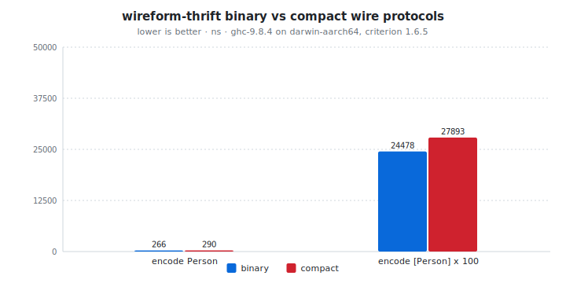

# wireform-thrift

[](https://opensource.org/licenses/BSD-3-Clause)


> [!CAUTION]
> wireform is in heavy development and has not been published to Hackage yet. APIs may change.

[Apache Thrift](https://thrift.apache.org/) for Haskell. Both wire
protocols (binary and compact), the IDL parser and code generator, RPC
message framing, the dynamic [`Thrift.Value`](src/Thrift/Value.hs), an
inline `[thrift| ... |]` quasiquoter, the runtime registry, and a JSON
mapping for cases where the wire payload needs to be rendered as text.

Thrift originated at Facebook in 2007. It's the wire format used by
Apache Hadoop, Apache Cassandra, Apache Parquet's file footer,
Evernote's API, and a number of high-throughput storage and trading
systems. The IDL is similar in spirit to protobuf's: structs with
numbered fields, enums, services, primitive types. Two wire formats
are in use: binary (older, tag-prefixed, larger) and compact
(variable-length, smaller, the recommended choice for new code).

This package is part of the [wireform](https://github.com/iand675/wireform-)
monorepo and shares its allocation primitives, annotation deriver, and
testing discipline with every other format.

## Install

```cabal
build-depends:
  base,
  wireform-thrift,
  wireform-derive,    -- only if you want the cross-format annotation deriver
```

The package is part of the [wireform](https://github.com/iand675/wireform-)
monorepo. Clone the repo and `cabal build wireform-thrift` to compile
locally. Compiling with the LLVM backend (`-fllvm`) adds compile time
but measurably improves runtime performance.

## Hello world

```haskell
{-# LANGUAGE DeriveAnyClass #-}
{-# LANGUAGE DerivingStrategies #-}

import GHC.Generics (Generic)
import Data.Text (Text)
import Thrift.Class
  ( ToThrift, FromThrift
  , encodeThriftBinary,  decodeThriftBinary
  , encodeThriftCompact, decodeThriftCompact
  )

data LogEntry = LogEntry
  { level   :: !Text
  , message :: !Text
  , code    :: !Int
  } deriving stock (Show, Eq, Generic)
    deriving anyclass (ToThrift, FromThrift)

main :: IO ()
main = do
  let entry = LogEntry "ERROR" "disk full" 507
  case decodeThriftCompact (encodeThriftCompact entry) of
    Right (decoded :: LogEntry) -> print decoded
    Left  err                   -> putStrLn err
```

The runnable version (with both binary and compact protocols side by
side) lives in [`examples/ThriftExample.hs`](../examples/ThriftExample.hs).

## What's in here

| Module              | Role                                                      |
|---------------------|-----------------------------------------------------------|
| `Thrift.Value`      | Dynamic untyped `Value` ADT keyed by Thrift type tags     |
| `Thrift.Wire`       | Wire-level type tags, field IDs, and TType constants      |
| `Thrift.Encoding`   | Builder used by `ToThrift` instances                      |
| `Thrift.Encode`     | Low-level encode primitives (binary + compact)            |
| `Thrift.Decode`     | Low-level decode primitives (binary + compact)            |
| `Thrift.Class`      | Public `ToThrift` / `FromThrift` typeclasses + `encodeThriftBinary` / `decodeThriftBinary` / `encodeThriftCompact` / `decodeThriftCompact` |
| `Thrift.Derive`     | `deriveThrift` / `deriveToThrift` / `deriveFromThrift` Template Haskell entry points |
| `Thrift.Schema`     | IDL AST (`ThriftSchema`, `ThriftStruct`, `ThriftEnum`, `ThriftService`, ...) |
| `Thrift.Parser`     | `parseThrift :: Text -> Either String ThriftSchema` for `.thrift` files |
| `Thrift.CodeGen`    | `generateThriftTypes` and friends: emit Haskell types + `ToThrift` / `FromThrift` instances |
| `Thrift.QQ`         | `[thrift| ... |]` quasiquoter                             |
| `Thrift.Registry`   | Runtime registry of struct schemas (used by JSON + dynamic decoders) |
| `Thrift.Message`    | RPC message envelope (`ThriftMessage`, `ThriftMessageType`, framed and unframed transports) |
| `Thrift.Transport`  | Transport-layer helpers (framed-message length prefix, etc.) |
| `Thrift.JSON`       | Bridge to and from `aeson`'s `Value` for self-describing scenarios |

## Encode and decode

The typeclass entry points cover both wire protocols:

```haskell
encodeThriftBinary  :: ToThrift  a => a          -> ByteString
decodeThriftBinary  :: FromThrift a => ByteString -> Either String a
encodeThriftCompact :: ToThrift  a => a          -> ByteString
decodeThriftCompact :: FromThrift a => ByteString -> Either String a
```

Compact is the default for new work. Binary is the one you reach for
when interop matters, since it's what the older Apache Thrift
generators emit.

For dynamic values without a Haskell type to mirror them, work with
[`Thrift.Value`](src/Thrift/Value.hs) directly via `Thrift.Encode` /
`Thrift.Decode`.

## Annotation-driven deriving

`Thrift.Derive` consumes the cross-format `Wireform.Derive.Modifier`
vocabulary from [`wireform-derive`](../wireform-derive/README.md). The
field IDs that Thrift requires come from the same `tag N` annotation
proto / Bond / Iceberg use:

```haskell
{-# LANGUAGE TemplateHaskell #-}

import qualified Thrift.Derive as DThrift
import Wireform.Derive (tag)

data User = User
  { userId   :: !Int64
  , userName :: !Text
  } deriving stock (Show, Eq, Generic)

{-# ANN type User ("User" :: String) #-}
{-# ANN userId   (tag 1) #-}
{-# ANN userName (tag 2) #-}

DThrift.deriveThrift ''User
```

## IDL: parser and code generator

`.thrift` IDL files go through `Thrift.Parser.parseThrift` to produce
a `ThriftSchema`, and through `Thrift.CodeGen.generateThriftTypes` to
emit Haskell types + `ToThrift` / `FromThrift` instances:

```haskell
{-# LANGUAGE TemplateHaskell #-}
import Thrift.QQ (thrift)

[thrift|
  struct Person {
    1: required string name
    2: optional i32    age
  }
|]
-- Generates: data Person = Person { name :: Text, age :: Maybe Int32 }
--            instance ToThrift Person ; instance FromThrift Person
```

For external `.thrift` files, the `wireform-gen` CLI in the umbrella
package wraps the same codegen:

```bash
wireform-gen thrift -i service.thrift -o src/Gen/
```

The generated code uses the same `Thrift.Encoding` builder primitives
the hand-derived path does, so the encode hot path stays identical
between IDL-bridged and annotation-derived types.

## RPC message framing

`Thrift.Message` ships the message envelope that Apache Thrift's RPC
flavor uses on top of the wire protocol: a `ThriftMessage` carries a
method name, a sequence ID, a `ThriftMessageType` (call / reply /
exception / oneway), and the encoded payload. Both the strict and
old-style binary framings are supported, plus the compact framing.

`Thrift.Transport` covers the framed-transport length prefix that
most production Thrift servers use.

## JSON bridge

`Thrift.JSON` round-trips between `Thrift.Value` (paired with a
`Thrift.Registry` of struct schemas) and `Data.Aeson.Value`. Useful
for surfacing Thrift payloads in HTTP debug endpoints, logging, or any
other place where the audience is human and the wire format isn't.

## Testing

The per-format Hedgehog suite lives in `test/`:

```bash
cabal test wireform-thrift:wireform-thrift-derive-test
```

It covers both wire protocols, the typeclass instances, the IDL
parser, the code generator output, and the dynamic `Value` ADT.

## Benchmarks

A criterion harness in [`bench/Bench.hs`](bench/Bench.hs):

```bash
cabal bench wireform-thrift:wireform-thrift-bench
```

<!-- BEGIN_AUTOGEN bench:thrift-binary-vs-compact -->
<picture>
  <source media="(prefers-color-scheme: dark)" srcset="bench-results/charts/thrift-binary-vs-compact-dark.svg">
  
</picture>

| Operation             |   binary |  compact | ratio |
| :-------------------- | -------: | -------: | ----: |
| encode Person         |   266 ns |   290 ns | 1.09x |
| encode [Person] x 100 | 24478 ns | 27893 ns | 1.14x |

<sub>Last run 2026-05-13 11:38:00 UTC. ghc-9.8.4 on darwin-aarch64, criterion 1.6.5.</sub>
<!-- END_AUTOGEN bench:thrift-binary-vs-compact -->

For cross-language comparisons:

- Haskell: [`thrift`](https://hackage.haskell.org/package/thrift)
  (the Apache Thrift Haskell binding).
- C++: [Apache Thrift's libthrift](https://github.com/apache/thrift),
  the reference implementation.
- Rust: [`thrift`](https://crates.io/crates/thrift) crate.

## License

BSD-3-Clause.

## References

- [Apache Thrift specification](https://thrift.apache.org/static/files/thrift-20070401.pdf) (the original Facebook white paper)
- [Thrift binary protocol](https://github.com/apache/thrift/blob/master/doc/specs/thrift-binary-protocol.md)
- [Thrift compact protocol](https://github.com/apache/thrift/blob/master/doc/specs/thrift-compact-protocol.md)
- [Thrift IDL grammar](https://thrift.apache.org/docs/idl)
