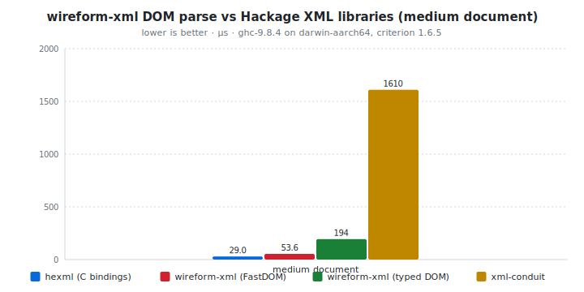
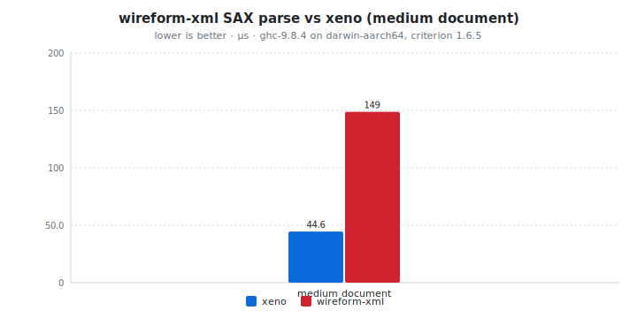

# wireform-xml

[](https://opensource.org/licenses/BSD-3-Clause)


> [!CAUTION]
> wireform is in heavy development and has not been published to Hackage yet. APIs may change.

XML 1.0 for Haskell. SIMD-accelerated SAX, a typed dynamic
[`XML.Value`](src/XML/Value.hs) DOM, a zero-copy span-based DOM
([`XML.FastDOM`](src/XML/FastDOM.hs)), an incremental chunk-fed parser
with optional concurrent producer / consumer threading, an XPath-lite
query language ([`XML.Path`](src/XML/Path.hs) and the
[`XML.DSL`](src/XML/DSL.hs) combinator surface), an XSD schema parser
and code generator, an XSLT 1.0 subset
([`XML.XSLT`](src/XML/XSLT.hs)), the `[xml| ... |]` and
`[xsd| ... |]` quasiquoters, and an annotation-driven Template Haskell
deriver that maps Haskell records straight onto XML elements and
attributes.

XML is the format every other format tries to overthrow, yet XML still
reigns supreme in many contexts. The wire format itself is straightforward enough
(angle brackets, attributes, text, character data, comments, processing
instructions, an optional doctype), but the surrounding ecosystem is
large: SAX vs DOM, XPath, XSLT, XSD, and the times you need to stream
10 GB of news article markup off a socket without buffering it. This
package covers all of those layers behind one shared C scanning
backend in [`cbits/fast_xml.c`](cbits/fast_xml.c) so the same SIMD
fast path serves the SAX iterator, the typed DOM, the zero-copy DOM,
and the typeclass encoder.

This package is part of the [wireform](https://github.com/iand675/wireform-)
monorepo and shares its allocation primitives, annotation deriver, and
testing discipline with every other format.

## Install

```cabal
build-depends:
  base,
  wireform-xml,
  wireform-derive,    -- only if you want the cross-format annotation deriver
```

The package is part of the [wireform](https://github.com/iand675/wireform-)
monorepo. Clone the repo and `cabal build wireform-xml` to compile
locally. The C scanner builds with `-O3 -march=native` to pick up
SSE2 / AVX2 / NEON automatically. Compiling Haskell with the LLVM
backend (`-fllvm`) adds compile time but measurably improves runtime
performance.

## Hello world

The typeclass entry points work the same way as every other wireform
format: derive `ToXML` and `FromXML`, then encode / decode straight
from records.

```haskell
{-# LANGUAGE DeriveAnyClass #-}
{-# LANGUAGE DerivingStrategies #-}

import GHC.Generics (Generic)
import Data.Text (Text)
import qualified Data.ByteString.Char8 as BS8
import XML.Class (ToXML, FromXML, encodeXML, decodeXML)

data Book = Book
  { title  :: !Text
  , author :: !Text
  , year   :: !Int
  } deriving stock (Show, Eq, Generic)
    deriving anyclass (ToXML, FromXML)

main :: IO ()
main = do
  let book  = Book "The Art of War" "Sun Tzu" (-500)
      bytes = encodeXML book
  BS8.putStrLn bytes
  case decodeXML bytes of
    Right (decoded :: Book) -> print decoded
    Left  err               -> putStrLn err
```

`encodeXML book` renders to:

```xml
<Book><title>The Art of War</title><author>Sun Tzu</author><year>-500</year></Book>
```

The runnable version lives in [`examples/XMLExample.hs`](../examples/XMLExample.hs).

## What's in here

| Module           | Role                                                      |
|------------------|-----------------------------------------------------------|
| `XML.Value`      | Dynamic untyped DOM (`Document`, `Node`, `Element`, `Attribute`, `Name`) |
| `XML.Encoding`   | The `Encoding` builder type used by `ToXML` instances     |
| `XML.Encode`     | Low-level encoder that produces canonical XML bytes       |
| `XML.Decode`     | Low-level decoder, parses bytes into `XML.Value` `Node`s  |
| `XML.Class`      | Public `ToXML` / `FromXML` typeclasses + `encodeXML` / `encodeXMLDirect` / `decodeXML` |
| `XML.Derive`     | Annotation-driven Template Haskell entry points (`deriveXML` / `deriveToXML` / `deriveFromXML`) |
| `XML.Generic`    | Re-exports of the `Generic`-derived defaults from `XML.Class` |
| `XML.SAX`        | Event-driven parser (`parseSAX`, `parseSAXStream`, `foldSAX`); the C scanner powers all three |
| `XML.FastDOM`    | Zero-copy span-based DOM (`FastDoc`, `FastNode`, `FastAttr`); read-only views into the original `ByteString` with no per-node allocation |
| `XML.Incremental`| Chunk-fed incremental parser (`newParser`, `feedChunk`, `feedEnd`) plus a concurrent producer / consumer mode (`parseToChan`) |
| `XML.Path`       | XPath-lite query engine (`fromNode`, `children`, `descendants`, `query :: Path -> Node -> Vector Node`, `attr`, `textContent`) |
| `XML.DSL`        | Combinator-style query language built on top of `XML.Path` (`child`, `descendant`, `parent`, `followingSibling`, `precedingSibling`, `textContent`) |
| `XML.XSLT`       | XSLT 1.0 subset (`parseStylesheet`, `transform`, `applyStylesheet`) |
| `XML.Schema`     | XSD schema AST (`XSDSchema`, `XSDType`, `XSDElement`, `XSDAttribute`, `Occurrence`); `parseXSD :: Text -> Either String XSDSchema` |
| `XML.CodeGen`    | `generateXMLTypes :: XSDSchema -> Text` produces Haskell types + `ToXML` / `FromXML` instances |
| `XML.QQ`         | `[xml| ... |]` (literal nodes) and `[xsd| ... |]` (codegen from inline schemas) quasiquoters |

## Encode and decode

The typeclass entry points are the usual shape:

```haskell
encodeXML       :: ToXML   a => a          -> ByteString
encodeXMLDirect :: ToXML   a => a          -> ByteString  -- direct-write path
decodeXML       :: FromXML a => ByteString -> Either String a
```

For dynamic XML without a Haskell type, work with
[`XML.Value`](src/XML/Value.hs) directly via `XML.Encode` /
`XML.Decode`. The `Node` ADT distinguishes elements, text, CDATA,
comments, and processing instructions, with namespace-aware `Name`s
on every element and attribute.

## Annotation-driven deriving

`XML.Derive` consumes the cross-format `Wireform.Derive.Modifier`
vocabulary from [`wireform-derive`](../wireform-derive/README.md). XML
also needs a per-field "is this an attribute or a child element?"
choice, which lives under the `XmlFieldOpt` `BackendModifier`
extension:

```haskell
{-# LANGUAGE TemplateHaskell #-}

import qualified XML.Derive as DXML
import Wireform.Derive (extension)
import XML.Derive (XmlFieldOpt (..))

data Book = Book
  { bookId    :: !Text
  , bookTitle :: !Text
  } deriving stock (Show, Eq, Generic)

{-# ANN type Book ("Book" :: String) #-}
{-# ANN bookId    (extension AsAttribute) #-}
{-# ANN bookTitle (extension AsElement) #-}

DXML.deriveXML ''Book
```

`bookId` becomes an attribute on `<Book>`; `bookTitle` becomes a child
element. `AsElement` is the default; `AsAttribute` is the override.

## SAX

`XML.SAX` is the event-driven entry point. It walks the input via the
`fast_xml.c` SIMD scanner and produces a `Vector SAXEvent`, calls back
per event for streaming consumers, or folds with a user accumulator.

```haskell
import qualified XML.SAX as SAX

case SAX.parseSAX bytes of
  Right events -> V.mapM_ print events
  Left  err    -> putStrLn err

-- streaming:
SAX.parseSAXStream bytes (\evt -> doSomething evt)

-- fold:
let countElements = SAX.foldSAX
      (\n e -> case e of SAX.StartElement {} -> n + 1; _ -> n) 0 bytes
```

`SAXEvent` distinguishes start / end elements, text, CDATA, comments,
processing instructions, and the XML declaration / doctype.

## FastDOM

`XML.FastDOM` is the zero-copy DOM. Nodes carry `Span` offsets into
the original `ByteString` instead of decoded `Text`, so the parse
phase doesn't allocate per node and individual fields can be decoded
lazily as they're touched:

```haskell
import qualified XML.FastDOM as FD

case FD.parseFastDoc bytes of
  Right doc ->
    -- traverse children without forcing per-node allocations
    let title = FD.nodeTag (FD.docRoot doc) bytes
    in print title
  Left err -> putStrLn err
```

The right tool when the document is large, you only need a few
fields, and you don't want a full materialised DOM in the heap.
`XML.FastDOM` exposes the same `findLtP`, `findByteP`, `findAttrEndP`,
`findCDataEndP`, `findCommentEndP` C primitives that the typed DOM
uses, so the lazy-decode path stays SIMD-accelerated end to end.

## XPath and the query DSL

`XML.Path` is an XPath-lite query engine. Build a `Path`
declaratively, run it against a `Node`, get back a `Vector Node`:

```haskell
import qualified XML.Path as P

let allTitles = P.query path doc
      where
        path = P.descendantsByName "title" -- ... etc.
```

`XML.DSL` is the combinator surface on top: `child name`,
`descendant name`, `parent`, `self`, `followingSibling`,
`precedingSibling`, `textContent`. Useful when you want to compose
queries instead of building `Path` ASTs by hand.

## XSLT 1.0

`XML.XSLT` covers the XSLT 1.0 subset most stylesheets actually use:
templates, `xsl:apply-templates`, `xsl:value-of`, `xsl:choose` /
`xsl:when` / `xsl:otherwise`, `xsl:if`, `xsl:for-each`,
`xsl:variable`, attribute value templates.

```haskell
import qualified XML.XSLT as XSLT

case XSLT.parseStylesheet stylesheetNode of
  Right ss -> case XSLT.transform ss inputDoc of
    Right outputDoc -> ...
    Left err        -> putStrLn err
  Left err -> putStrLn err
```

The full XSLT 2.0 / 3.0 surface (FLWOR, regex functions, schema-aware
mode) is intentionally out of scope; for those, you're better off
shelling out to Saxon-HE.

## Incremental / streaming parse

`XML.Incremental` is the chunk-fed parser. Suitable for inputs that
arrive over a socket or that don't fit in memory:

```haskell
import qualified XML.Incremental as Inc

p   <- Inc.newParser
es1 <- Inc.feedChunk p chunk1   -- returns SAX events for everything closed off so far
es2 <- Inc.feedChunk p chunk2
end <- Inc.feedEnd   p          -- returns Either String (Vector SAXEvent)
```

`parseToChan` is the concurrent variant: it spawns a producer thread
that walks the input and a consumer thread that reads `SAXEvent`s
through a STM channel, useful when the SAX event handler does real
work and you want to overlap parsing with downstream computation.

## XSD schema and code generation

`XML.Schema.parseXSD` parses XML Schema (XSD 1.0) into the AST in
`XML.Schema`. `XML.CodeGen.generateXMLTypes` consumes that AST and
emits Haskell types + `ToXML` / `FromXML` instances. The
`[xsd| ... |]` quasiquoter combines both:

```haskell
{-# LANGUAGE TemplateHaskell #-}
import XML.QQ (xsd)

[xsd|
  <xs:schema xmlns:xs="http://www.w3.org/2001/XMLSchema">
    <xs:complexType name="Person">
      <xs:sequence>
        <xs:element name="name" type="xs:string"/>
        <xs:element name="age"  type="xs:integer"/>
      </xs:sequence>
    </xs:complexType>
  </xs:schema>
|]
-- Generates: data Person = Person { name :: !Text, age :: !Integer }
--            instance ToXML Person ; instance FromXML Person
```

For external `.xsd` files, the `wireform-gen` CLI in the umbrella
package wraps the same codegen:

```bash
wireform-gen xsd -i schema.xsd -o src/Gen/
```

## Testing

The per-format Hedgehog suite lives in `test/`:

```bash
cabal test wireform-xml:wireform-xml-derive-test
```

<!-- BEGIN_AUTOGEN tests -->
_No data yet. Run `cabal test wireform-xml:all --test-show-details=streaming --xml=dist-stats/test-results/wireform-xml.junit.xml` to populate._
<!-- END_AUTOGEN tests -->

It covers the typeclass instances, the deriver, both DOM
representations, the SAX iterator, the incremental parser, the XPath
query engine, the XSLT subset, the XSD schema parser, and the code
generator output.

## Benchmarks

A criterion harness in [`bench/XMLBench.hs`](../bench/XMLBench.hs) (in
the umbrella package) compares wireform-xml's parser against the three
established Haskell XML libraries:

- [`xml-conduit`](https://hackage.haskell.org/package/xml-conduit), the
  Yesod / persistent-style streaming XML library.
- [`xeno`](https://hackage.haskell.org/package/xeno), a hand-tuned
  pull parser focused on speed.
- [`hexml`](https://hackage.haskell.org/package/hexml), the
  C-bindings-to-`pugixml` library.

```bash
cabal bench xml-bench
```

<!-- BEGIN_AUTOGEN bench:dom-parse-medium -->
<picture>
  <source media="(prefers-color-scheme: dark)" srcset="bench-results/charts/dom-parse-medium-dark.svg">
  
</picture>

| Operation       | hexml (C bindings) | wireform-xml (FastDOM) | wireform-xml (typed DOM) | xml-conduit | ratio |
| :-------------- | -----------------: | ---------------------: | -----------------------: | ----------: | ----: |
| medium document |            29.0 µs |                53.6 µs |                   194 µs |     1610 µs | 0.28x |

<sub>Last run 2026-05-13 10:35:00 UTC. ghc-9.8.4 on darwin-aarch64, criterion 1.6.5.</sub>
<!-- END_AUTOGEN bench:dom-parse-medium -->

<!-- BEGIN_AUTOGEN bench:sax-parse-medium -->
<picture>
  <source media="(prefers-color-scheme: dark)" srcset="bench-results/charts/sax-parse-medium-dark.svg">
  
</picture>

| Operation       |    xeno | wireform-xml | ratio |
| :-------------- | ------: | -----------: | ----: |
| medium document | 44.6 µs |       149 µs | 1.00x |

<sub>Last run 2026-05-13 10:35:00 UTC. ghc-9.8.4 on darwin-aarch64, criterion 1.6.5.</sub>
<!-- END_AUTOGEN bench:sax-parse-medium -->

For cross-language comparisons:

- C: [libxml2](http://xmlsoft.org/), the canonical reference;
  [pugixml](https://pugixml.org/), the C++ DOM that `hexml` wraps.
- Rust: [`quick-xml`](https://crates.io/crates/quick-xml) (pull /
  iterator) and [`roxmltree`](https://crates.io/crates/roxmltree)
  (zero-copy DOM, the closest analogue to `XML.FastDOM`).

> Numbers TBD: run `cabal bench xml-bench` and drop a results table in.

## License

BSD-3-Clause.

## References

- [Extensible Markup Language (XML) 1.0 (Fifth Edition)](https://www.w3.org/TR/xml/)
- [XML Path Language (XPath) 1.0](https://www.w3.org/TR/1999/REC-xpath-19991116/)
- [XSL Transformations (XSLT) Version 1.0](https://www.w3.org/TR/1999/REC-xslt-19991116)
- [XML Schema Part 1: Structures (XSD 1.0)](https://www.w3.org/TR/xmlschema-1/)
