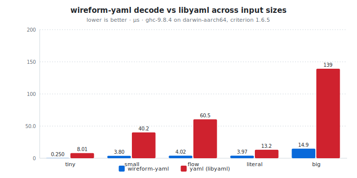
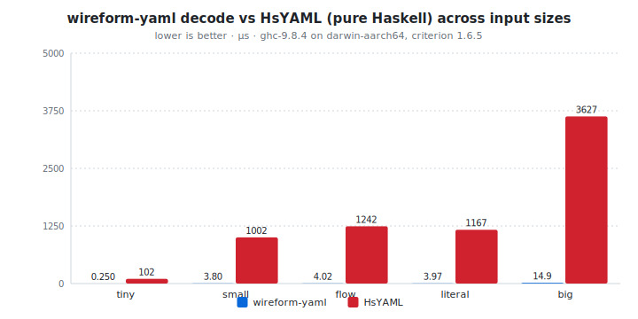

# wireform-yaml

[](https://opensource.org/licenses/BSD-3-Clause)


> [!CAUTION]
> wireform is in heavy development and has not been published to Hackage yet. APIs may change.

[YAML 1.2](https://yaml.org/spec/1.2.2/) for Haskell. Encode and
decode the dynamic [`YAML.Value`](src/YAML/Value.hs), derive typeclass
instances generically or via Template Haskell, work with an annotated
AST that preserves source spans / comments / scalar style,
pretty-print back to YAML, bridge to JSON, and pass the official
[yaml-test-suite](https://github.com/yaml/yaml-test-suite) when you
point the test harness at a clone of it.

YAML 1.2 covers block-style and flow-style scalars, sequences, and
mappings; anchors and aliases (with merge-key semantics); explicit
tags; the four scalar styles (plain, single-quoted, double-quoted,
literal-folded); multi-document streams; and the JSON-compatible flow
subset. wireform-yaml implements the spec close enough to read and
write the corner cases that show up in Kubernetes manifests, CI
configs, and Ansible playbooks without surprising round-trip
behavior. It also exposes a separate annotated AST for tooling that
needs to preserve source positions and trivia (comments, blank
lines, scalar style) across a load / save cycle.

This package is part of the [wireform](https://github.com/iand675/wireform-)
monorepo and shares its allocation primitives, annotation deriver, and
testing discipline with every other format.

## Install

```cabal
build-depends:
  base,
  wireform-yaml,
  wireform-derive,    -- only if you want the cross-format annotation deriver
```

The package is part of the [wireform](https://github.com/iand675/wireform-)
monorepo. Clone the repo and `cabal build wireform-yaml` to compile
locally. Compiling with the LLVM backend (`-fllvm`) adds compile time
but measurably improves runtime performance.

## Hello world

```haskell
{-# LANGUAGE DeriveAnyClass #-}
{-# LANGUAGE DerivingStrategies #-}

import GHC.Generics (Generic)
import Data.Text (Text)
import qualified Data.Text as T
import YAML.Class (ToYAML, FromYAML, encodeYAML, decodeYAML)

data Service = Service
  { name     :: !Text
  , replicas :: !Int
  , image    :: !Text
  } deriving stock (Show, Eq, Generic)
    deriving anyclass (ToYAML, FromYAML)

main :: IO ()
main = do
  let svc  = Service "api" 3 "ghcr.io/example/api:1.4.2"
      text = encodeYAML svc
  putStrLn (T.unpack text)
  case decodeYAML text of
    Right (decoded :: Service) -> print decoded
    Left  err                  -> putStrLn err
```

`encodeYAML svc` renders to:

```yaml
name: api
replicas: 3
image: ghcr.io/example/api:1.4.2
```

## What's in here

| Module                 | Role                                                      |
|------------------------|-----------------------------------------------------------|
| `YAML.Value`           | Dynamic untyped `Value` ADT (scalars, sequences, mappings, tags, anchors) plus the `Document` and `Stream` wrappers for multi-document inputs |
| `YAML.Encode`          | Loader: `ByteString` / `Text` to `Value` / `Document` / `Stream`, with full anchor and alias resolution |
| `YAML.Decode`          | The typed-decoder side that lifts `Value` into Haskell records |
| `YAML.Encoding`        | Builder used by `ToYAML` instances                        |
| `YAML.Pretty`          | Render `Value` / `Document` / `Stream` back to YAML text with configurable scalar style, indent, and flow / block preference (`render`, `renderBS`, `renderDocument`, `renderStream`, `defaultOptions`, `compactOptions`) |
| `YAML.Class`           | Public `ToYAML` / `FromYAML` typeclasses + `encodeYAML` / `encodeYAMLBS` / `decodeYAML` / `decodeYAMLBS` |
| `YAML.Derive`          | `deriveYAML` / `deriveToYAML` / `deriveFromYAML` Template Haskell entry points |
| `YAML.Annotated`       | Annotated AST (`AValue`, `ADocument`, `AStream`) that preserves source spans, comments, scalar style, and chomping indicators |
| `YAML.Decode.Annotated`| Loader for the annotated AST                              |
| `YAML.JSON`            | Lossy bridge to and from `aeson`'s `Value` (mapping keys are stringified, tags and anchors are dropped) |

## Encode and decode

The typeclass entry points cover both `Text` and `ByteString` I/O:

```haskell
encodeYAML   :: ToYAML   a => a          -> Text
encodeYAMLBS :: ToYAML   a => a          -> ByteString
decodeYAML   :: FromYAML a => Text       -> Either String a
decodeYAMLBS :: FromYAML a => ByteString -> Either String a
```

For dynamic values without a Haskell type to mirror them, work with
[`YAML.Value`](src/YAML/Value.hs) directly. The `Value` ADT carries
the explicit YAML tag on each node (`!!str`, `!!int`, `!!seq`,
custom tags), so type information that JSON would discard survives
the round-trip.

For multi-document YAML streams (`---` separated), use the `Document`
and `Stream` wrappers in `YAML.Value` plus the corresponding loader
entry points in `YAML.Encode`.

## Annotated AST

The annotated AST in `YAML.Annotated` is the surface to use when you
need to preserve more than the data model: source spans for error
reporting, scalar style for round-trip preservation, comments and
blank lines (trivia) for tooling that has to round-trip a file
without rewriting unrelated lines.

```haskell
import qualified YAML.Decode.Annotated as YDA
import qualified YAML.Pretty           as YP

case YDA.decodeAnnotated input of
  Right doc -> putStrLn (T.unpack (YP.renderAnnotatedDocument YP.defaultOptions doc Nothing))
  Left  err -> putStrLn err
```

Common consumers: language servers, schema-driven config editors,
formatters, and any tool that has to make a small change to a YAML
file without touching the rest.

## Annotation-driven deriving

`YAML.Derive` consumes the cross-format `Wireform.Derive.Modifier`
vocabulary from [`wireform-derive`](../wireform-derive/README.md), so
the same annotated record can produce YAML, JSON, and any other
backend's instances:

```haskell
{-# LANGUAGE TemplateHaskell #-}

import qualified YAML.Derive          as DYAML
import qualified Wireform.Derive.Aeson as DAeson
import Wireform.Derive (rename, renameStyle, KebabCase)

data DeploymentSpec = DeploymentSpec
  { deploymentReplicas       :: !Int
  , deploymentImagePullPolicy :: !Text
  } deriving stock (Show, Eq, Generic)

{-# ANN type DeploymentSpec ("DeploymentSpec" :: String) #-}
{-# ANN deploymentReplicas        (renameStyle KebabCase) #-}
{-# ANN deploymentImagePullPolicy (renameStyle KebabCase) #-}

DYAML.deriveYAML  ''DeploymentSpec
DAeson.deriveJSON ''DeploymentSpec
```

## JSON bridge

`YAML.JSON` round-trips between `YAML.Value` and `Data.Aeson.Value`.
The bridge is intentionally lossy: YAML's data model is a strict
superset of JSON's, so non-string mapping keys are stringified, and
explicit tags and anchors are dropped. See the module haddock for the
exact mapping table.

## Testing

The per-format Hedgehog suite lives in `test/`:

```bash
cabal test wireform-yaml:wireform-yaml-test
```

<!-- BEGIN_AUTOGEN tests -->
_No data yet. Run `cabal test wireform-yaml:all --test-show-details=streaming --xml=dist-stats/test-results/wireform-yaml.junit.xml` to populate._
<!-- END_AUTOGEN tests -->

It covers the parser, the emitter, the typeclass instances, the
annotated AST, security-relevant edge cases (billion-laughs anchor
expansion, deep nesting), and round-trip property tests against
`Value`.

### Conformance against `yaml-test-suite`

The test binary also runs an opt-in conformance harness against the
official [yaml/yaml-test-suite](https://github.com/yaml/yaml-test-suite).
Point `YAML_TEST_SUITE` at a local clone and the harness will walk
every case it finds:

```bash
git clone https://github.com/yaml/yaml-test-suite /tmp/yaml-test-suite
YAML_TEST_SUITE=/tmp/yaml-test-suite \
  cabal test wireform-yaml:wireform-yaml-test
```

When the env var is unset the harness reports a no-op skip group so
CI stays green out of the box. A built-in mini-suite drawn from the
YAML 1.2 spec examples always runs, so core compliance is exercised
even without the external clone.

## Benchmarks

A criterion harness in [`bench/Bench.hs`](bench/Bench.hs) compares
wireform-yaml's parser and emitter against the two established Haskell
YAML libraries:

- [`HsYAML`](https://hackage.haskell.org/package/HsYAML), pure
  Haskell, prioritises spec compliance.
- [`yaml`](https://hackage.haskell.org/package/yaml), bindings to
  libyaml.

```bash
cabal bench wireform-yaml:wireform-yaml-bench
```

<!-- BEGIN_AUTOGEN bench:yaml-decode-vs-libyaml -->
<picture>
  <source media="(prefers-color-scheme: dark)" srcset="bench-results/charts/yaml-decode-vs-libyaml-dark.svg">
  
</picture>

| Operation | wireform-yaml | yaml (libyaml) |  ratio |
| :-------- | ------------: | -------------: | -----: |
| tiny      |       0.25 µs |        8.01 µs | 32.04x |
| small     |       3.80 µs |        40.2 µs | 10.57x |
| flow      |       4.02 µs |        60.5 µs | 15.05x |
| literal   |       3.97 µs |        13.2 µs |  3.32x |
| big       |       14.9 µs |         139 µs |  9.36x |

<sub>Last run 2026-05-13 10:40:00 UTC. ghc-9.8.4 on darwin-aarch64, criterion 1.6.5.</sub>
<!-- END_AUTOGEN bench:yaml-decode-vs-libyaml -->

<!-- BEGIN_AUTOGEN bench:yaml-decode-vs-hsyaml -->
<picture>
  <source media="(prefers-color-scheme: dark)" srcset="bench-results/charts/yaml-decode-vs-hsyaml-dark.svg">
  
</picture>

| Operation | wireform-yaml |  HsYAML |   ratio |
| :-------- | ------------: | ------: | ------: |
| tiny      |       0.25 µs |  102 µs | 408.24x |
| small     |       3.80 µs | 1002 µs | 263.77x |
| flow      |       4.02 µs | 1242 µs | 308.91x |
| literal   |       3.97 µs | 1167 µs | 293.93x |
| big       |       14.9 µs | 3627 µs | 243.90x |

<sub>Last run 2026-05-13 10:40:00 UTC. ghc-9.8.4 on darwin-aarch64, criterion 1.6.5.</sub>
<!-- END_AUTOGEN bench:yaml-decode-vs-hsyaml -->

For cross-language comparisons:

- C: [libyaml](https://github.com/yaml/libyaml). The Hackage
  [`yaml`](https://hackage.haskell.org/package/yaml) package is a
  thin binding around it, so the Haskell-vs-Haskell number above is
  already partly cross-language.
- Rust: [`serde_yaml`](https://crates.io/crates/serde_yaml) (the
  established library) and [`saphyr`](https://crates.io/crates/saphyr)
  (a newer, faster alternative).

> Numbers TBD: run the harness above and drop a results table in.

## License

BSD-3-Clause.

## References

- [YAML 1.2.2 specification](https://yaml.org/spec/1.2.2/)
- [yaml/yaml-test-suite](https://github.com/yaml/yaml-test-suite) (the official conformance suite)
- [YAML 1.2 core schema](https://yaml.org/spec/1.2.2/#103-core-schema)
